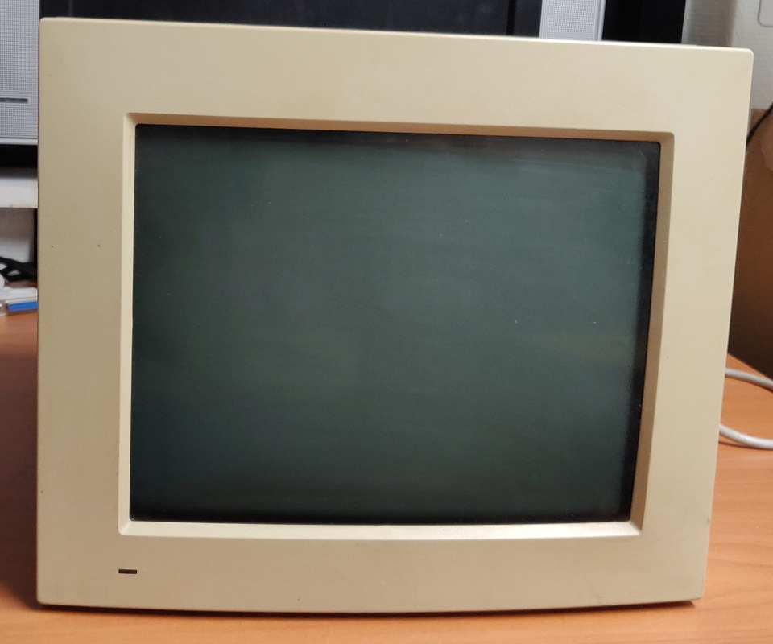

# Apple 12" Monochrome monitor

I bought this about 20-25 years ago together with the Macintosh II/ci. Before putting it into storage it worked perfect, but when I first powered it on the screen had a severe jitter, and it would start vertically compressed and then grow slowly to the full size.

## Work done so far: 

* Exterior clean-up
* Repaired cracked solder joints

## Planned work: 

* Replace capacitors
* De-yellowing the plastic

# Repairing the jitter:

When I opened up the monitor and inspected the back of the board, it had a few cracked solder joints. Unfortunately I don't have any pictures of this, but once I touched up those, the jitter was completely resolved.

# Repairing the vertical compression

I'm expecting this will be resolved once I replace the electrolytic capacitors on the board.