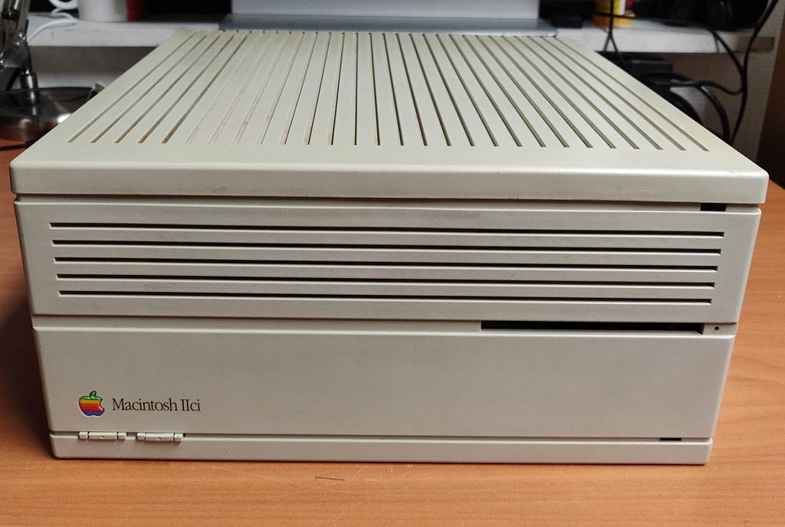
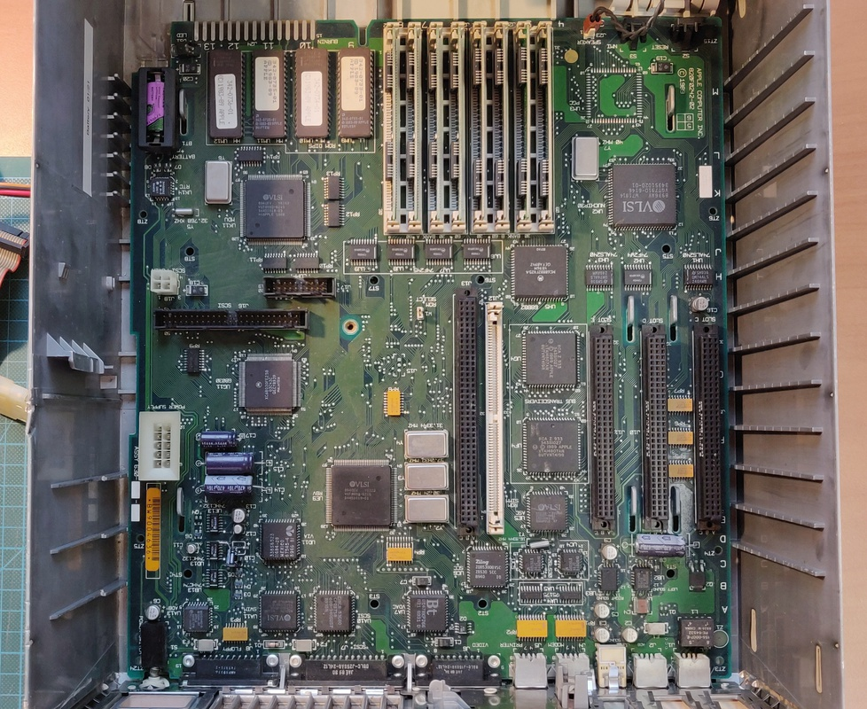
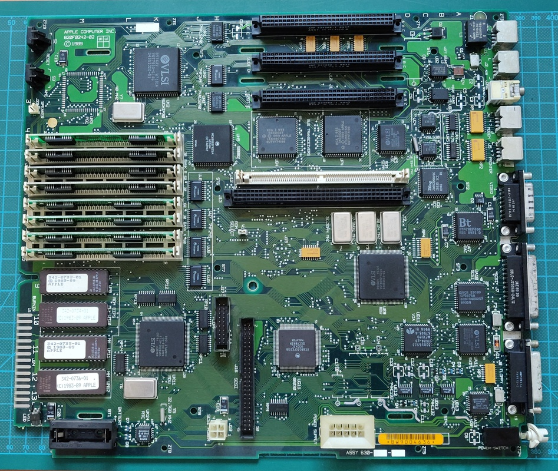
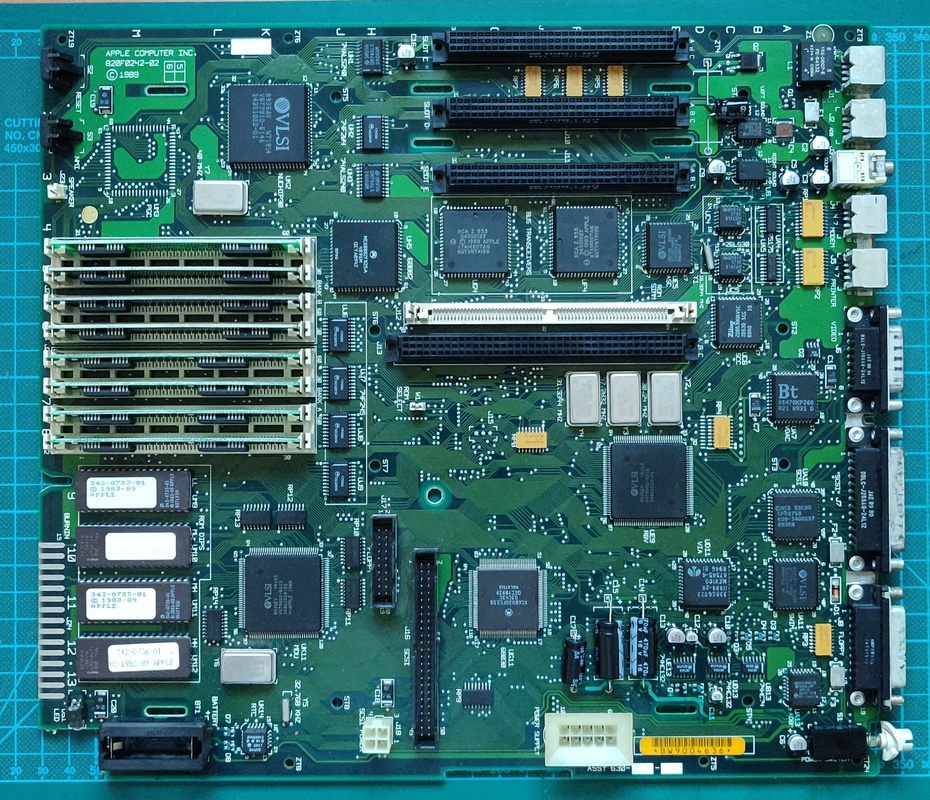
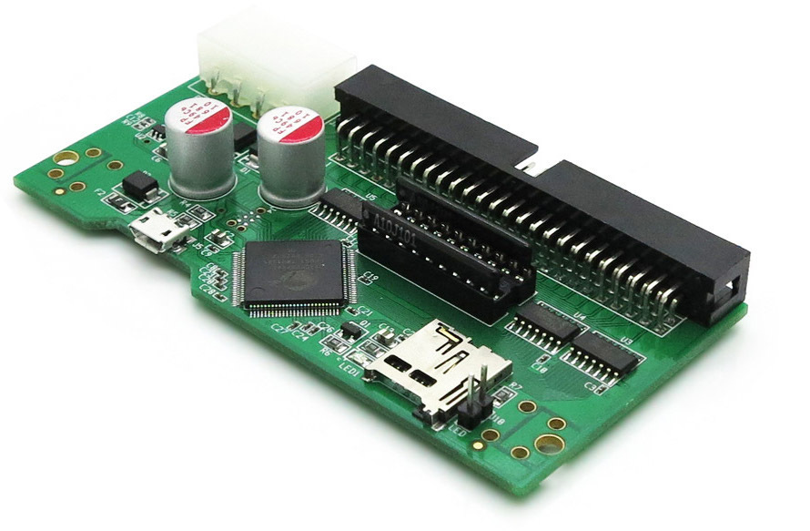

# Macintosh II/ci

I bought this Macintosh about 20-25 years ago, played with it for a while, but without more applications for it, it wasn't much fun. I ended up putting it into storage and decided recently to take it out and finally do some work on it.

The original specs:
 
+ 25mhz Motorola 68030 CPU and 68882 FPU
+ 20 MB hard drive
+ 8 MB RAM

Right now my plan is to turn it into a high spec machine with the following upgrades:

+ SCSI2SD hard drive replacement (not so much better performance, but much more capacity)
+ 32 MB RAM (8x 4 MB)

And depending on what kind of hardware I'm able to find:

+ Network card (10BASE-T)
+ Graphics card
+ Accelerator card

## Work done so far: 

+ Full deep clean inside and out
+ Floppy drive cleaning and lubrication
+ Replace electrolytic capacitors

## Planned work: 

+ SCSI2SD conversion
+ RAM upgrades

# Exterior and interior inspection:

Here are some quick pictures I took a while back. More will follow.

Here is the huge logic board, with the drive tray and power supply removed:

# Capacitor replacement

The capacitors had leaked quite badly on this board, damaging several traces. The computer was still booting and generally usable, except for the serial ports and audio.

Here is the board fully cleaned up, all elecrolytic capacitors removed and traces repaired.

And here it is with all of the capacitors replaced:

# SCSI2SD conversion

I'm planning on ordering a SCSI2SD 5.0 card soon, with a small SD card (probably 16 GB or so) and 3D print a suitable bracket for it.

