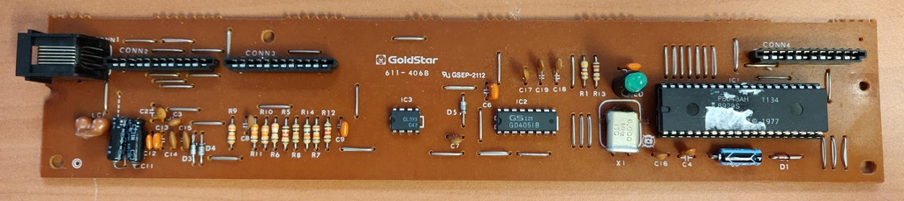
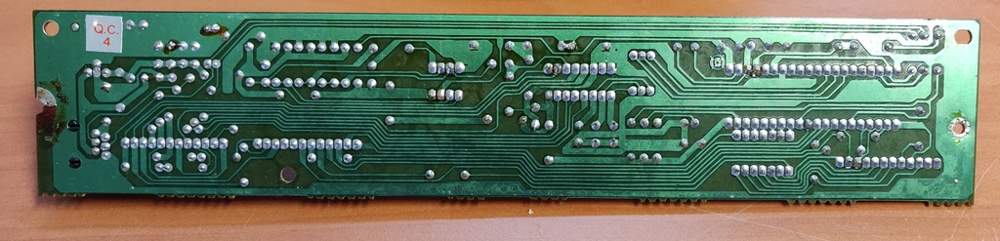
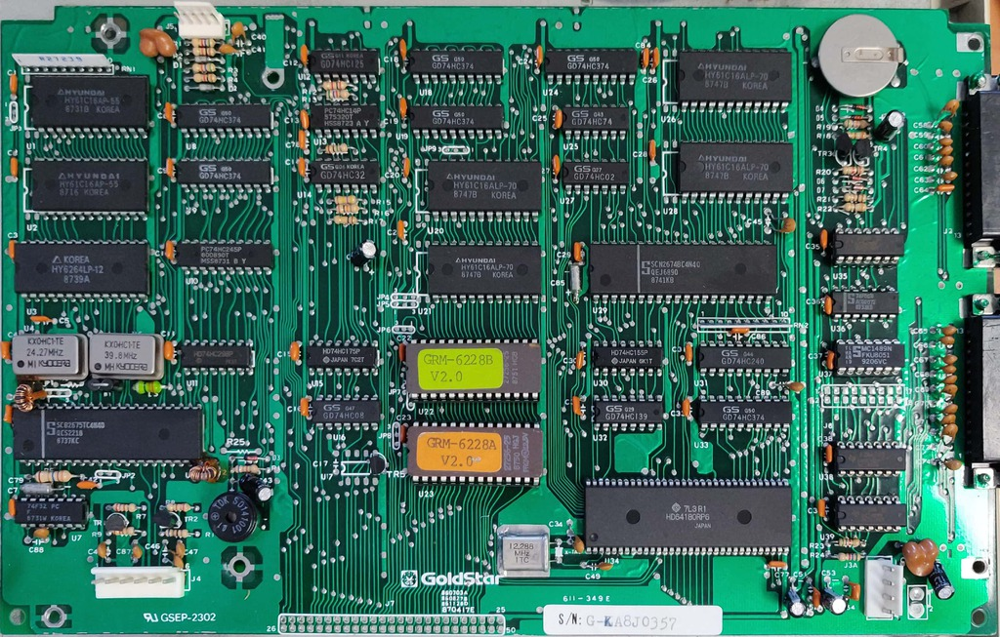

# Unisys UVT-1224

I picked up this terminal about 20 years ago at a recycling centre and had it stored for most of its life after that. 

After all this time I decided it was finally time to start doing something with it, although I'm still not entirely sure.

One option I'm considering is to connect it to a Raspberry Pi or similar device with NetBSD and actually use it as a day-to-day terminal.
Although it will definitely need a new keyboard for that. The current one functions perfectly but is not very comfortable to type on,
not to mention its size.

Another option would be adapting the ESP32 based PDP11 emulator made by [Spritesmods](http://spritesmods.com/?art=minipdp11)
to use the serial port again, or going the easier route and just run the [SimH](http://simh.trailing-edge.com/) PDP11 emulator on a
Raspberry Pi.

Here I'm watching the ASCII version of Star Wars: A new Hope from [towel.blinkenlights.nl](telnet://towel.blinkenlights.nl) (telnet)
through a serial link to my laptop:

## Work done so far: 

* Initial clean-up and inspection
* Battery removal
* Keyboard reverse engineering
* Performance testing

## Planned work: 

* De-yellowing
* Replace the keyboard
* Add a suitable host

## Keyboard reverse engineering:

More details and the code used can be found on my [GitHub](https://github.com/number42net/uvt-1224)

After doing some general reading on how keyboard interfaces generally work and confirming the keyboard uses 5v logic levels
I went ahead and attached my logic analyser to the keyboard interface and started capturing. 

With the logic analyser I found pretty quickly that there is a (semiregular) clock signal coming from the keyboard
when no key is pressed it arrives randomly, but the minimum interval is 10ms. When a key is pressed or released it's sent
straight away.

The signal consists of 9 bits, the first is a start bit, the remaining 8 indicate the scan code. 

Using this information I wrote a small [Arduino program](https://github.com/number42net/uvt-1224/blob/main/source/read_keyboard.ino) 
to read and display the scan codes. Resulting in a [map](https://github.com/number42net/uvt-1224/blob/main/scancodes.md) of all scan codes.

Once done I wrote another small Arduino program to generate the clock signal and test sending some strings to the terminal 
which succeeded. I'm now ready to build an interface for a replacement keyboard.

Unfortunately I didn't save the last program, but it would be pretty easy to recreate.

And here are some pictures of the keyboard controller PCB:

## Battery replacement

Here is a picture of the PCB with the battery still installed:

I have already removed the battery and the plan is to place the new battery away from the PCB to prevent corosion in the future.