# Macintosh Classic II

I purchased this Macintosh in a lot together with a Macintosh SE. It was sold as faulty / spares. After removing the logic board, I found that the electrolytic capacitors had leaked all over the logic board, damaging several components.

## Work done so far: 

* Partial inspection and testing
* Recap and repair work

## Planned work: 

* Deep cleaning inside and out
* Floppy drive cleaning and lubrication
* Colour restoration of the plastic
* Fully reversible external battery modification
* Hard disk replacement
* Re-installation

## Exterior inspection:

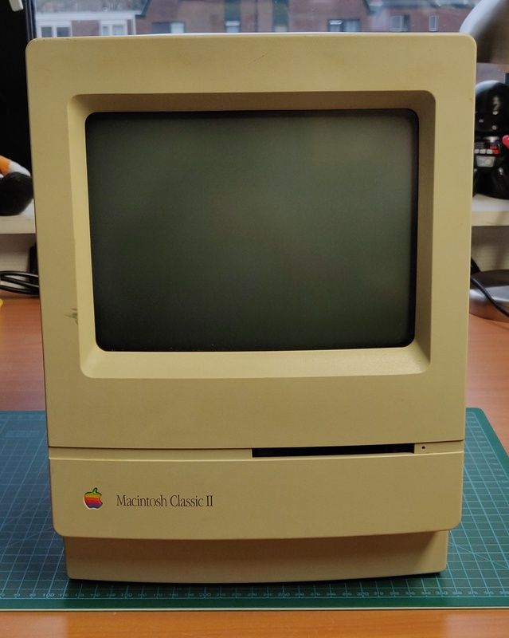

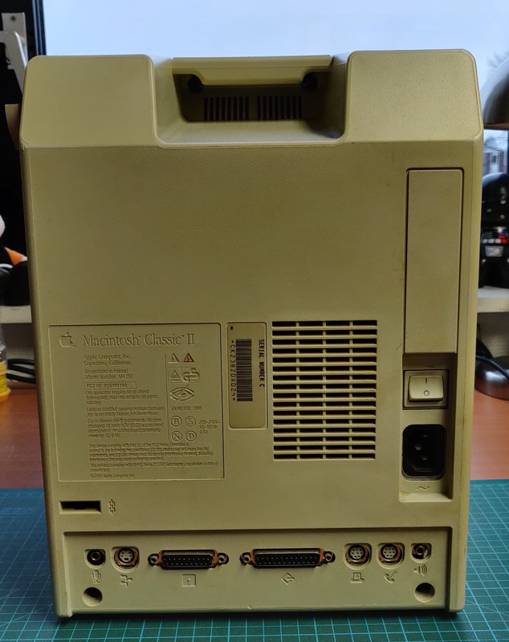

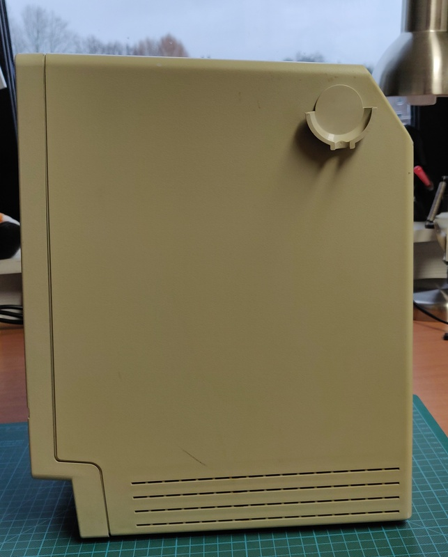

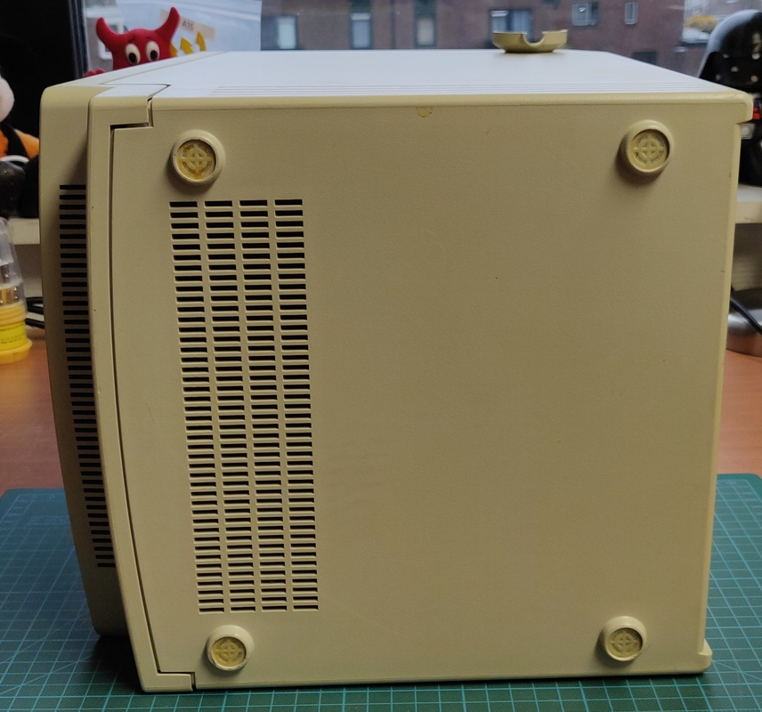

## Logic board inspection:

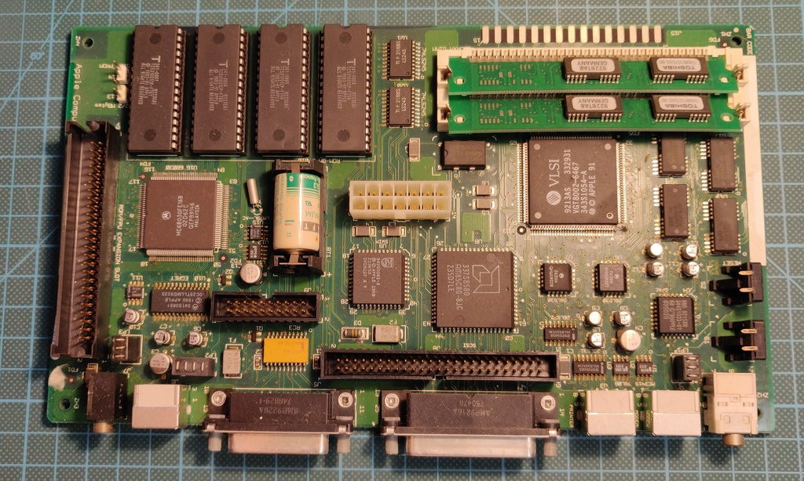

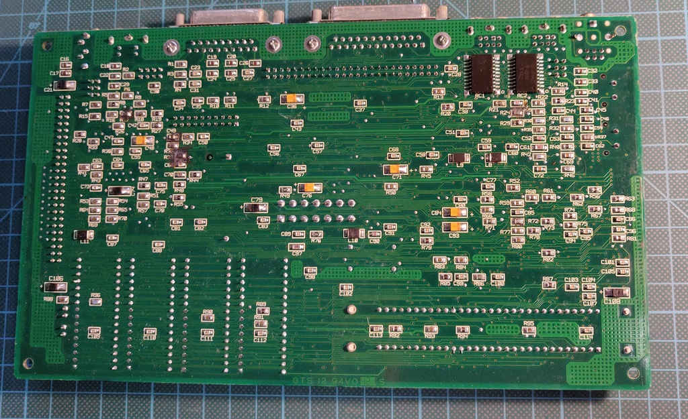

Resistors R17 and R39 are damaged, most likely capacitor C49 as well: 

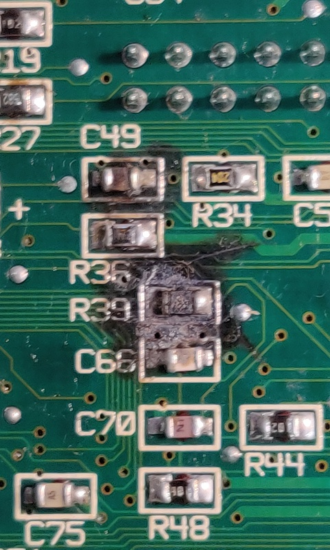

<!-- On the other side of the board R17 and possibly R18 were also burned out.

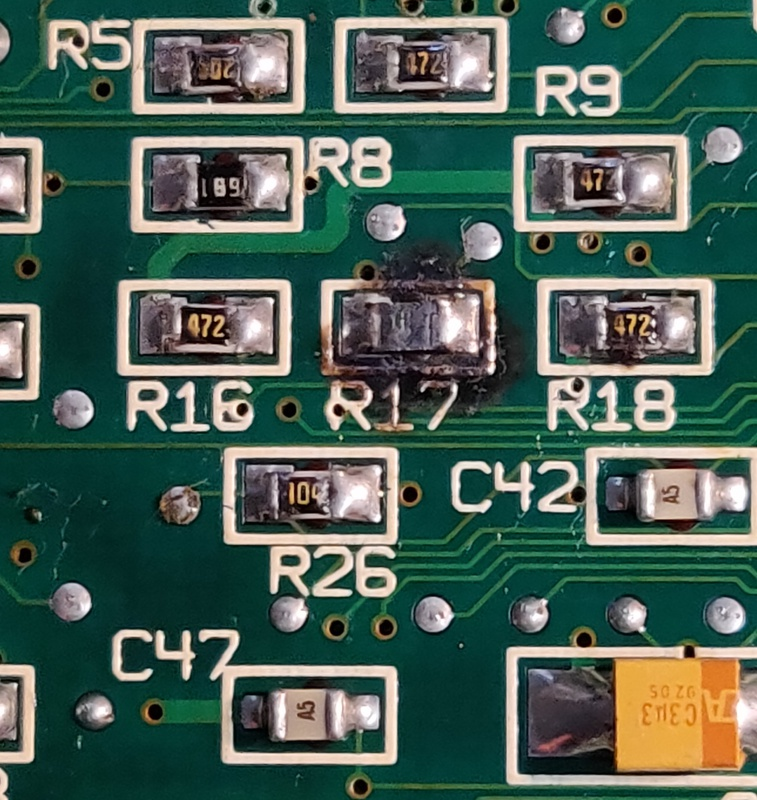 -->

Schematics show all of these are related to the EGRET IC:

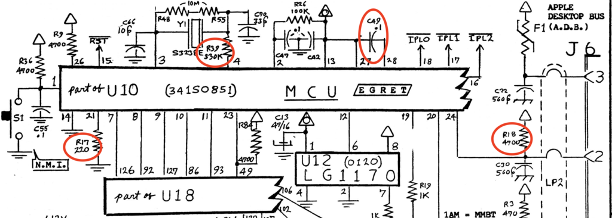

Upon inspection the egret pins are clearly damaged from electrolyte leaking capacitors, as well many other chips.

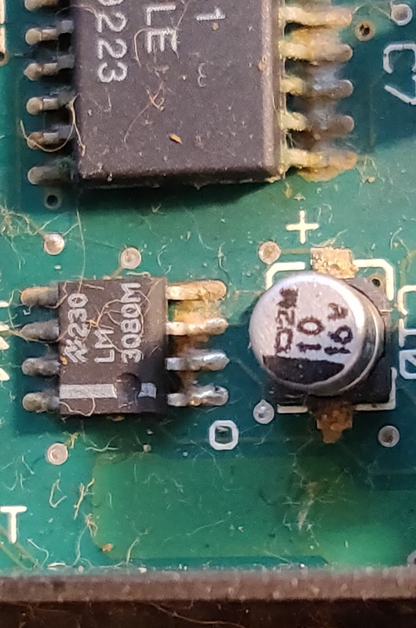

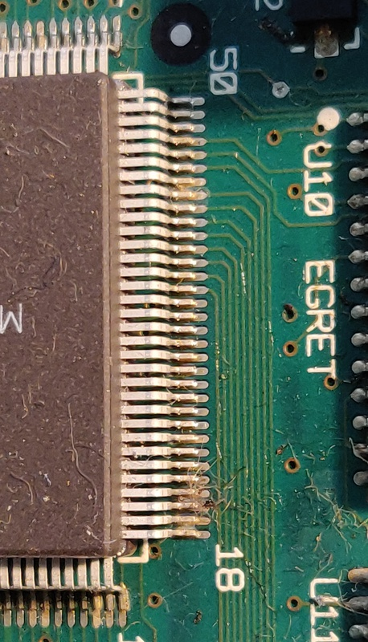

# Capacitor replacement

The first item on the long to-do list for this machine was to replace the electrolytic capacitors, which had caused all the damaged in the first place.

Here is the board with all of them swapped out and cleaned up:

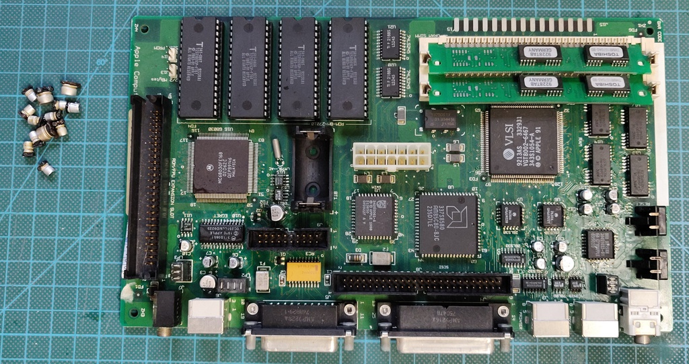

# Logic board repair

Now comes the real challenge in this repair, these components are absolutely tiny. The picture below shows the repaired board with the replaced components next to it. The parts circled in red are the 2 tiny resistors and the capacitor which came off of it. For reference, each square in this picture is 1 cm²

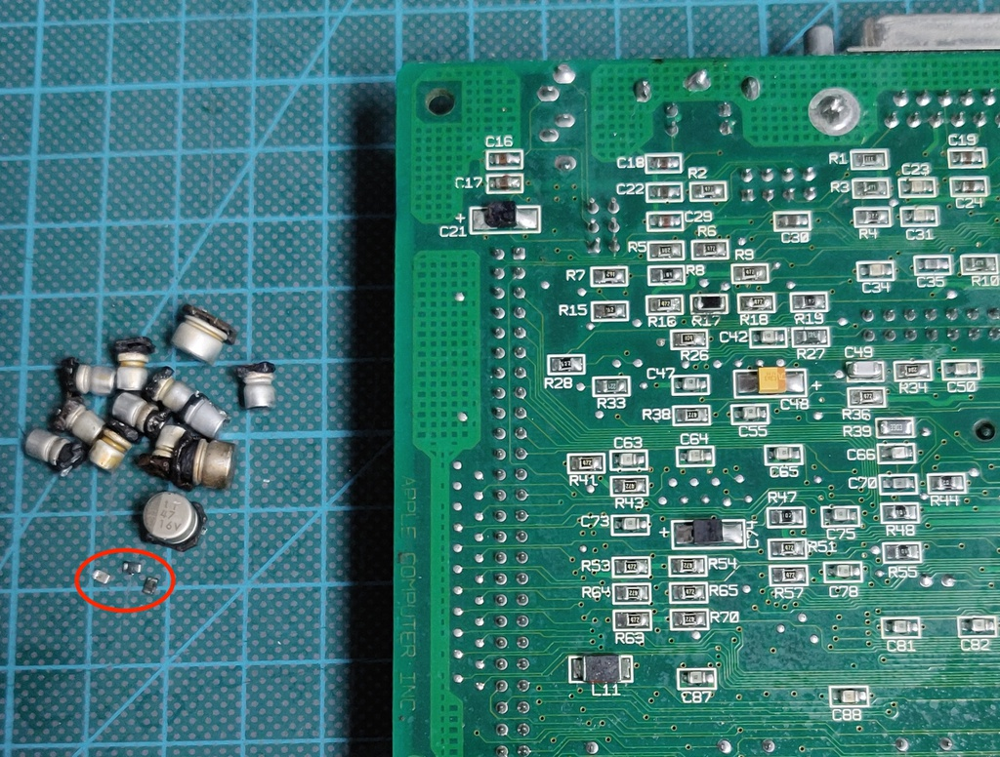

<!-- Still to be replaced:

C66 10pf??
R72 ?? -->

And here is the result, a perfectly working Macintosh Classic II!

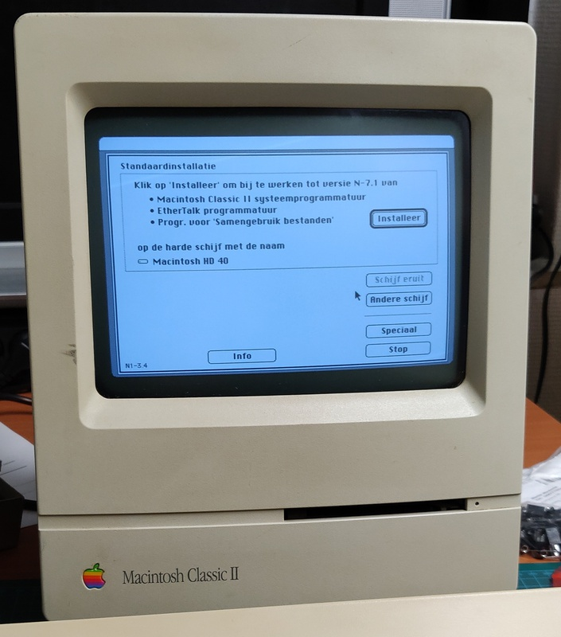