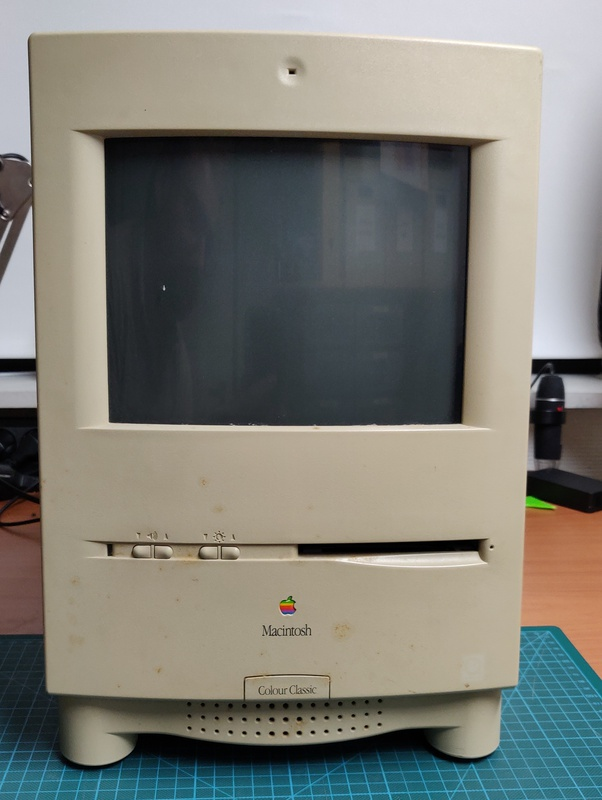
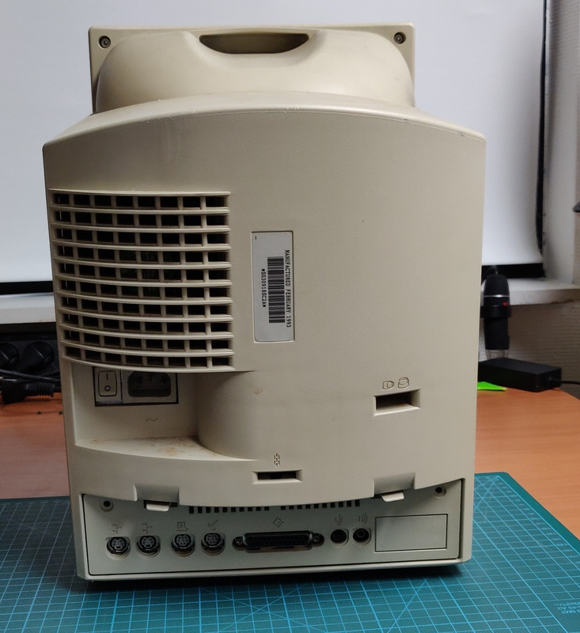
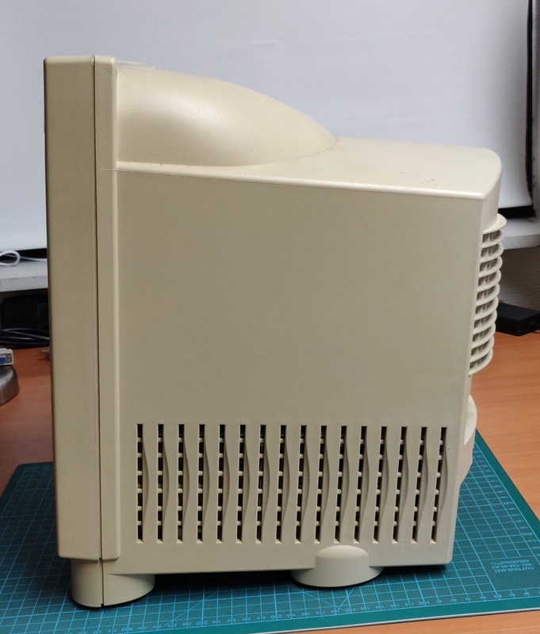
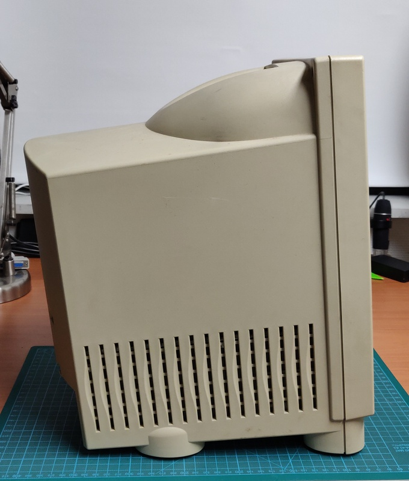
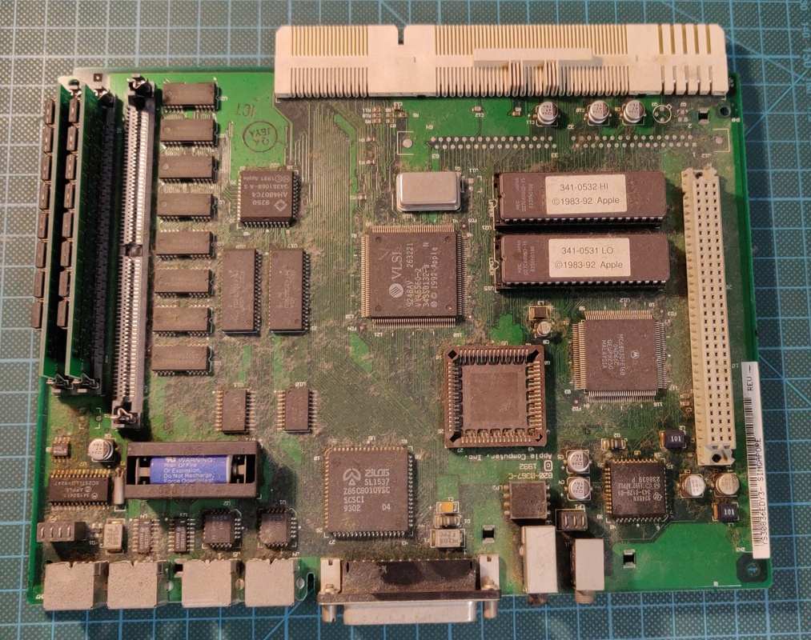
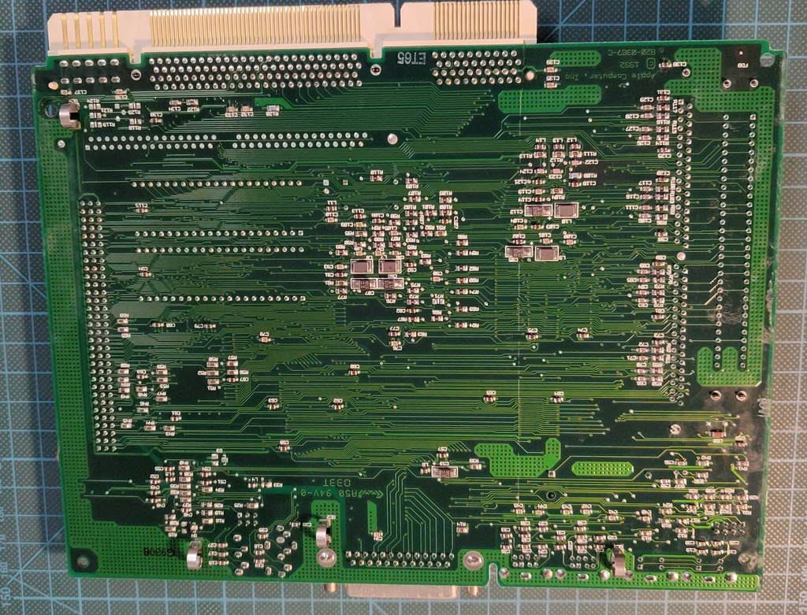
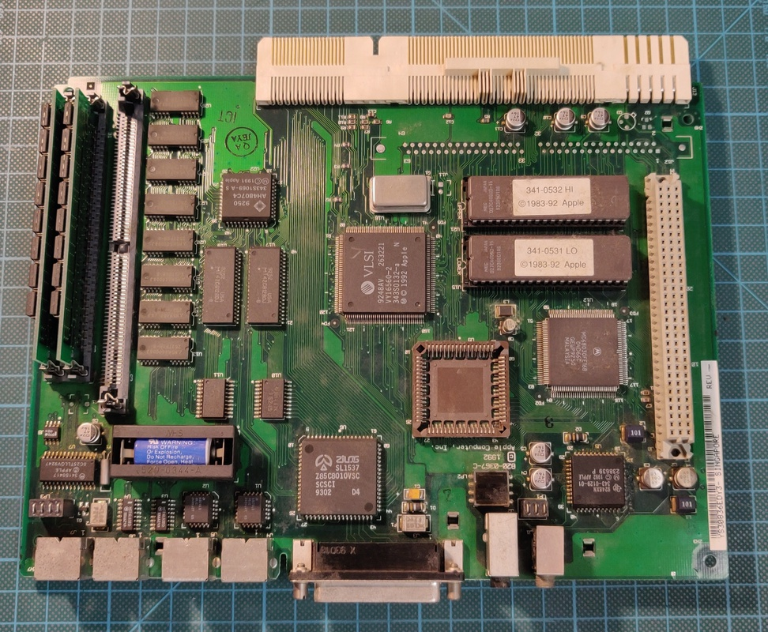
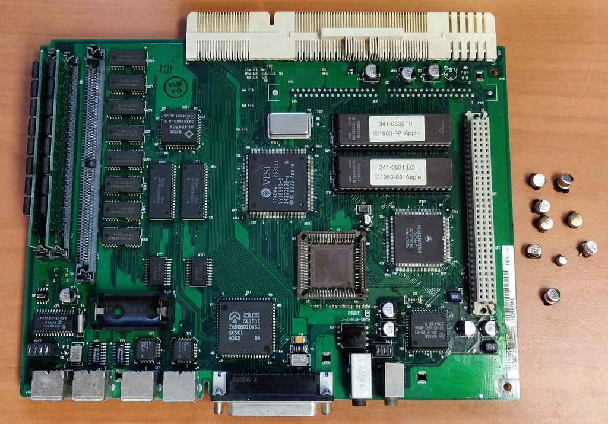
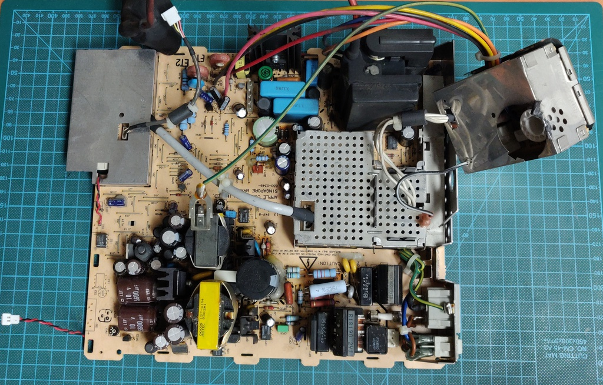

# Macintosh Color Classic

I purchased this Macintosh as faulty / not powering on. I was worried to find significant damage like on the
Classic II I worked on recently, but after a good cleaning I found that only the keyboard was faulty.

## Work done so far: 

* Partial inspection and testing
* Replace electrolytic capacitors

## Planned work: 

* Repair keyboard
* Deep cleaning inside and out
* Floppy drive cleaning and lubrication
* Re-installation
* Fully reversible external battery modification

## Exterior inspection:

The case is very dirty and quite yellowed, looks like I have quite the task ahead of me:

## First boot

After cleaning off all the electrolyte from the leaking capacitors and fully inspecting the boards I decided to try 
to power on the Mac. 

I plugged in the power, flipped the power switch, pressed the power button on the keyboard and.... absolutely nothing happened. 

This could mean 1 of 2 things, either there were more issues with this Mac, or there's something wrong with the keyboard. 
I grabbed another keyboard I had lying around, and it powered up on the "first" attempt!

It was only powered on for a very short while, but I could notice straight away that the sound wasn't working properly, but this turned out to be caused by the leaky capacitors and was completely resolved after replacing them.

## Logic board:

Here is the logic board fresh out of the case:

After some initial cleaning:

And after replacing all electrolytic capacitors and a full cleaning:

When I powered it on again I was straight away greeted by the proper chime and a quick game of Lemmings confirmed that the sound is working perfectly again as well!

## Analogue board:

And here is the analogue board, ready for capacitor replacement as well:

