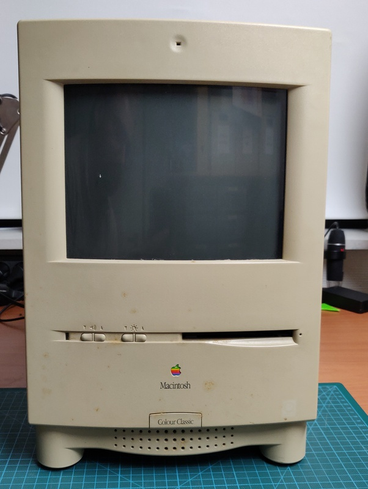
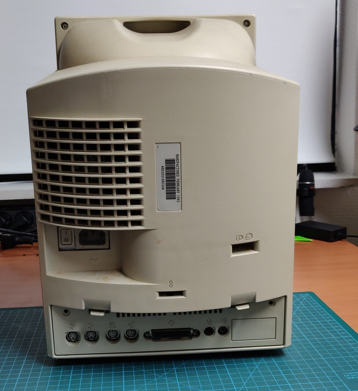
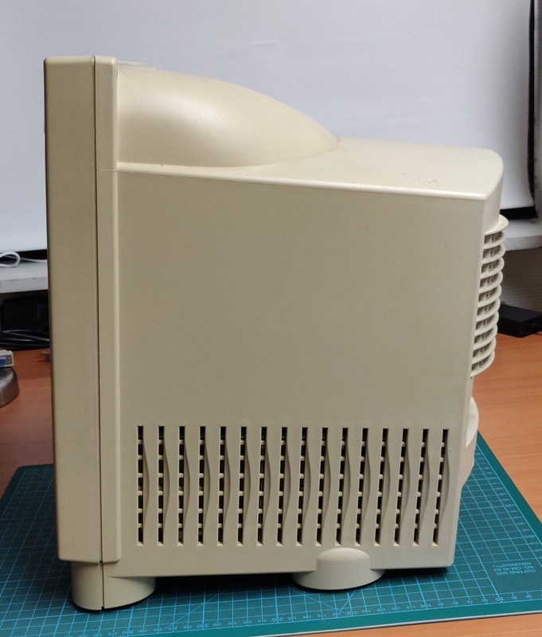
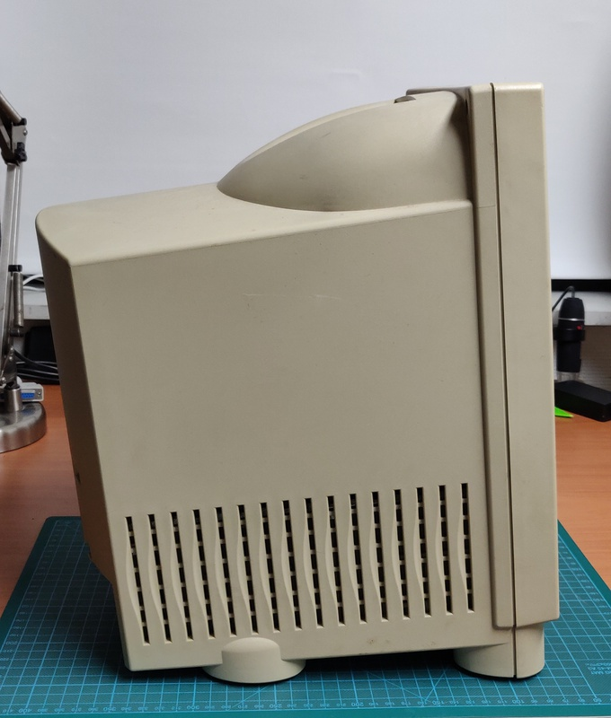
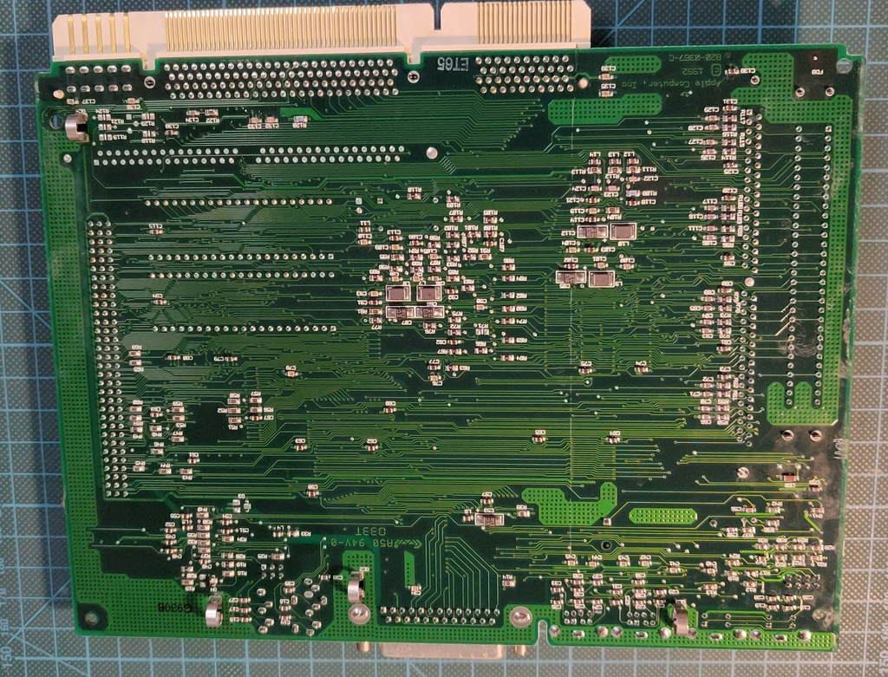
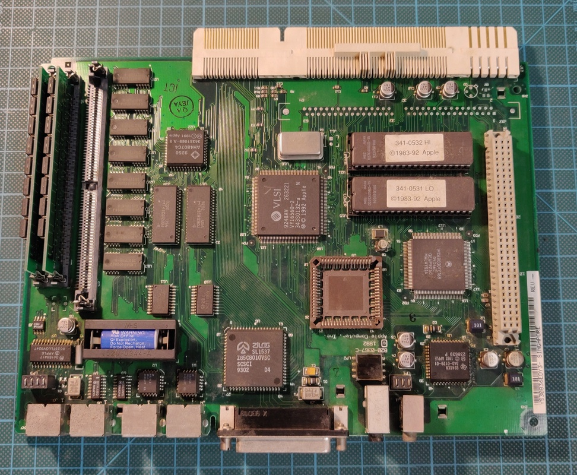

# Macintosh Color Classic

I purchased this Macintosh as faulty / not powering on. I was worried to find significant damage like on the 
Classic II I did recently, but after a good cleaning I found that only the keyboard was faulty.

## Work done so far: 

* Partial inspection and testing

## Planned work: 

* Recap and repair work
* Deep cleaning inside and out
* Floppy drive cleaning and lubrication
* Colour restoration of the plastic
* Re-installation
* Fully reversible external battery modification

## Exterior inspection:

The case is very dirty and quite yellowed, looks like I have quite the task ahead of me:

## Logic board inspection:

Here is the logic board fresh out of the case:

After some initial cleaning, mainly for my self as a reference for the capacitors:

## First boot

After cleaning off all the electrolyte from the leaking capacitors and fully inspecting the boards I decided to try 
to power on the Mac. 

I plugged in the power, flipped the power switch, pressed the power button on the keyboard and.... absolutely nothing happened. 
This could mean 1 of 2 things, either there were more issues with this Mac, or there's something wrong with the keyboard. 
I grabbed another keyboard I had lying around, and it powered up on the "first" attempt!

It was only powered on for a very short while, but I could notice straight away that the sound wasn't working properly,
but this might be down to the leaky capacitors. I will investigate further if it's still present after fully cleaning and recapping.
