# Sharp PC-1251 pocket computer with CE-125 dock

I purchased this unit as untested with very few pictures of background information, but I was curious 
what exactly it was.

After replacing the batteries I found the computer itself was working perfectly, but the batteries in the 
CE-125 were starting to corrode, the printer printed very faded and microcassette players belts were gone.

##### Work done:

* Initial clean-up and inspection
* Battery removal

##### Planned work:

* Printer repair
* Microcassette repair

## Visual inspection

The unit is stored in this really nice vinyl case:

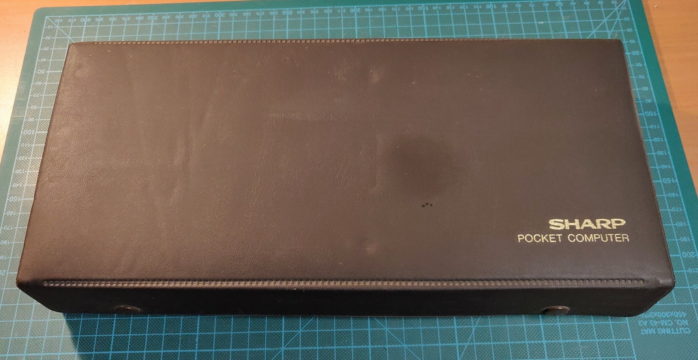

When opened it reveals the CE-125 dock with the PC-1251 microcomputer installed and a small
storage compartment on the side for cables, paper, etc.

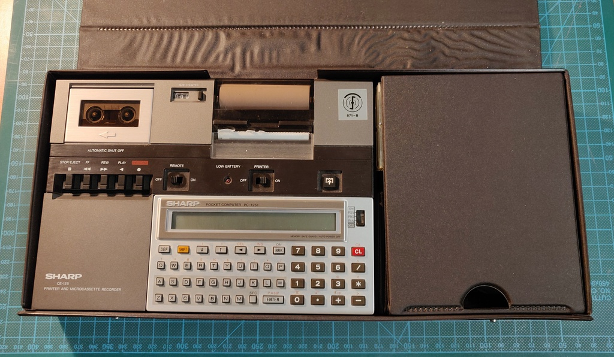

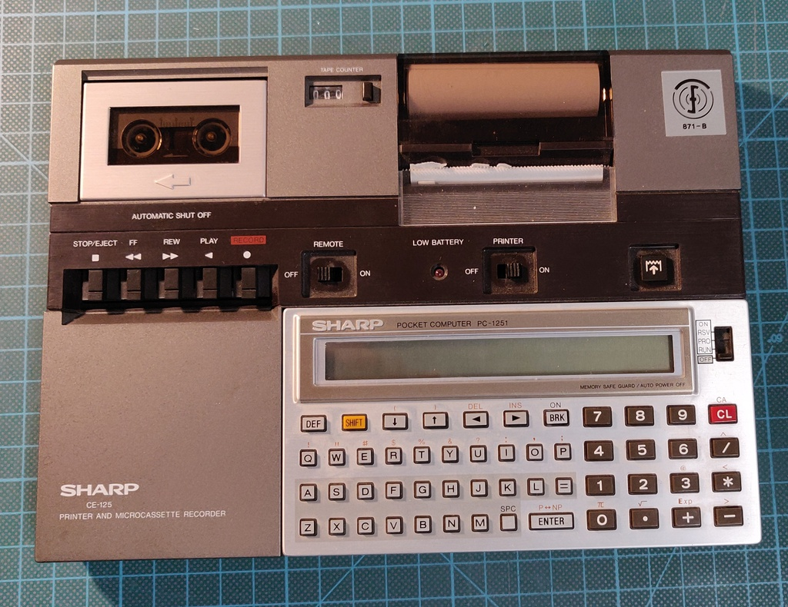

This is the back of the CE-125, notice the two slots where plastic covers can be inserted while in use.
Here the PC-1251 cover is installed. 

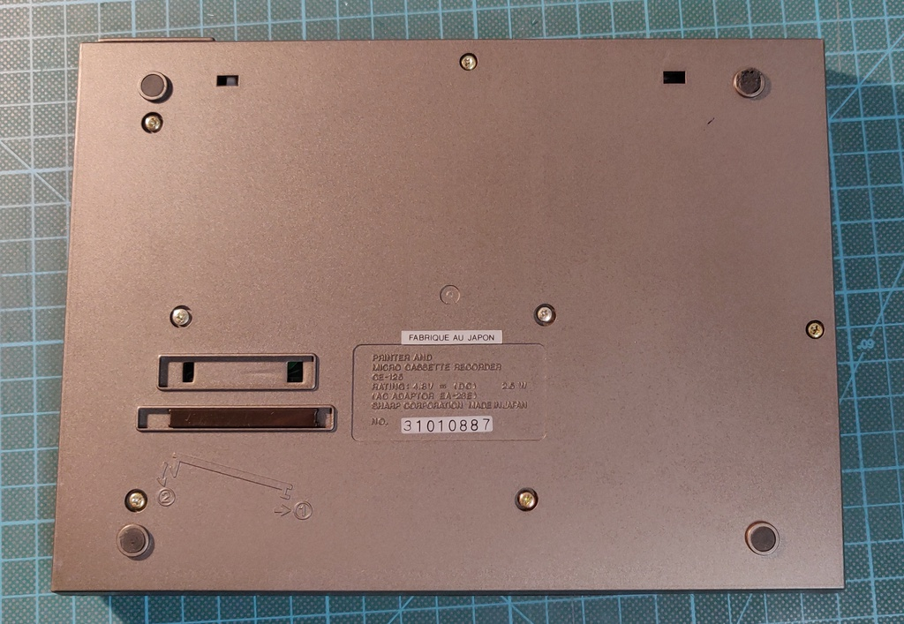

Here is the side of the unit, it didn't come with a charger, so I would have to figure out what
voltage is needs.

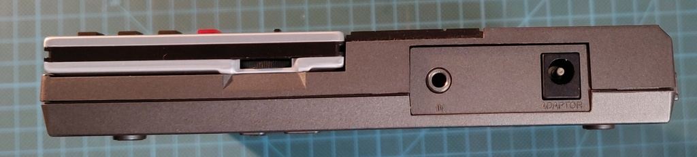

The PC-1251 slides easily out of the dock and here is the back of the unit:

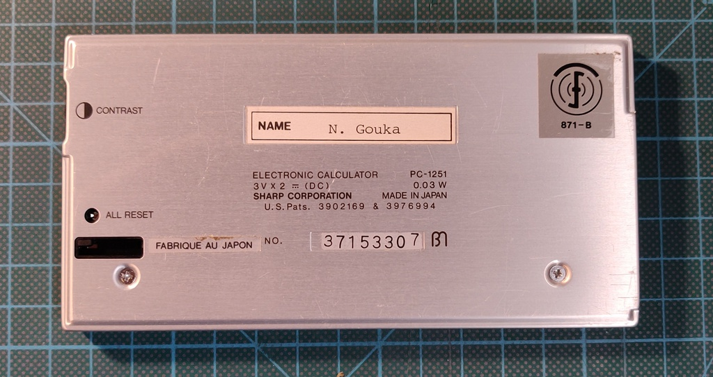

Two screws are removed to access the battery compartment, here for reference since the polarity is
a bit different.

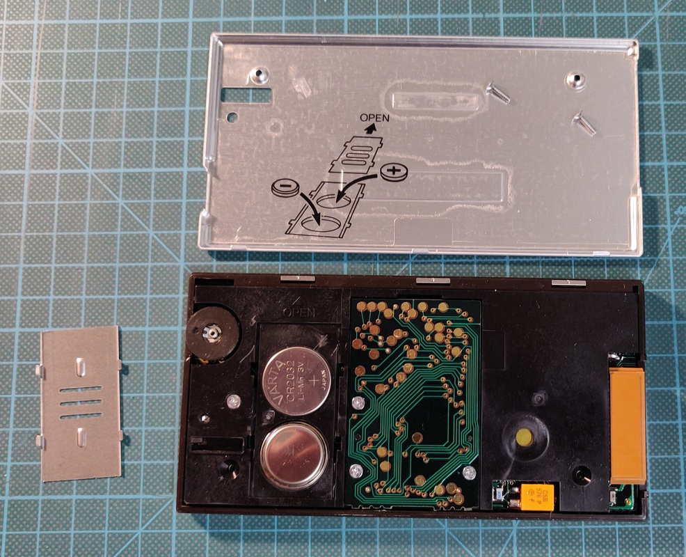

Two fresh CR-2032 batteries are installed, and it's already working!

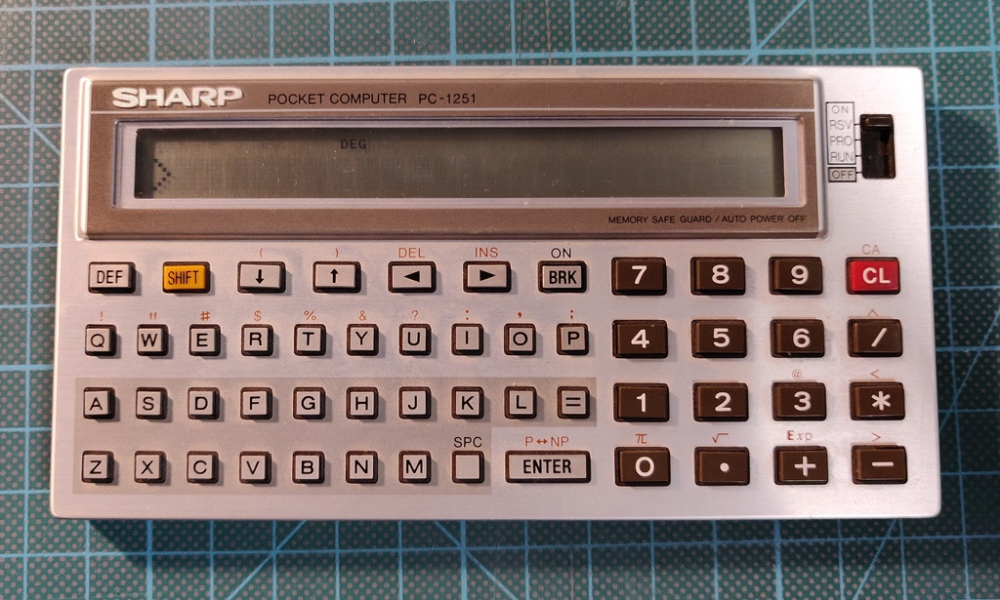

With that out of the way I turned my attention once again to the CE-125 and opened it up:

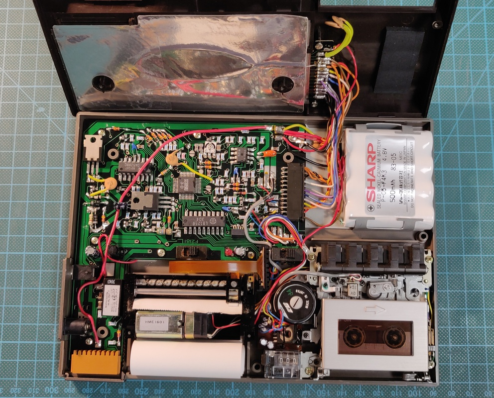

The battery was already starting to leak, but luckily I was still on time to remove it:

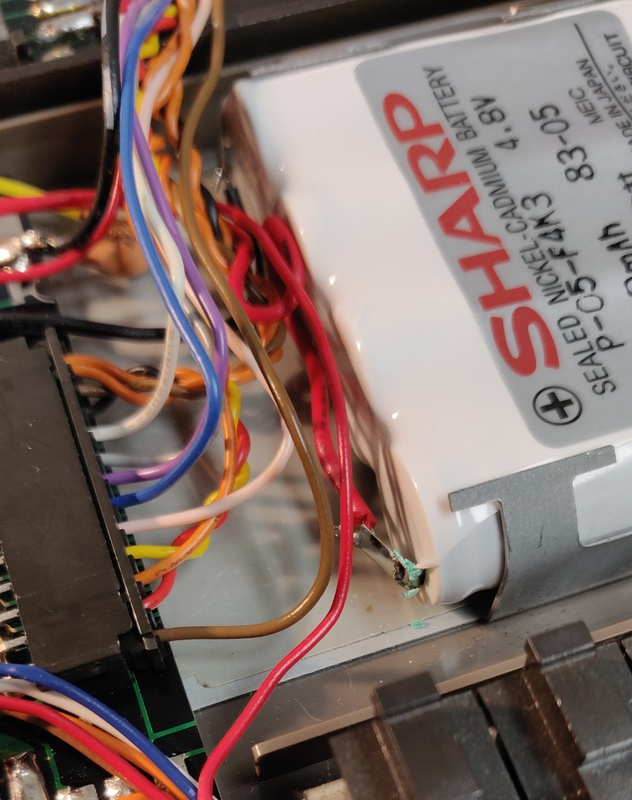

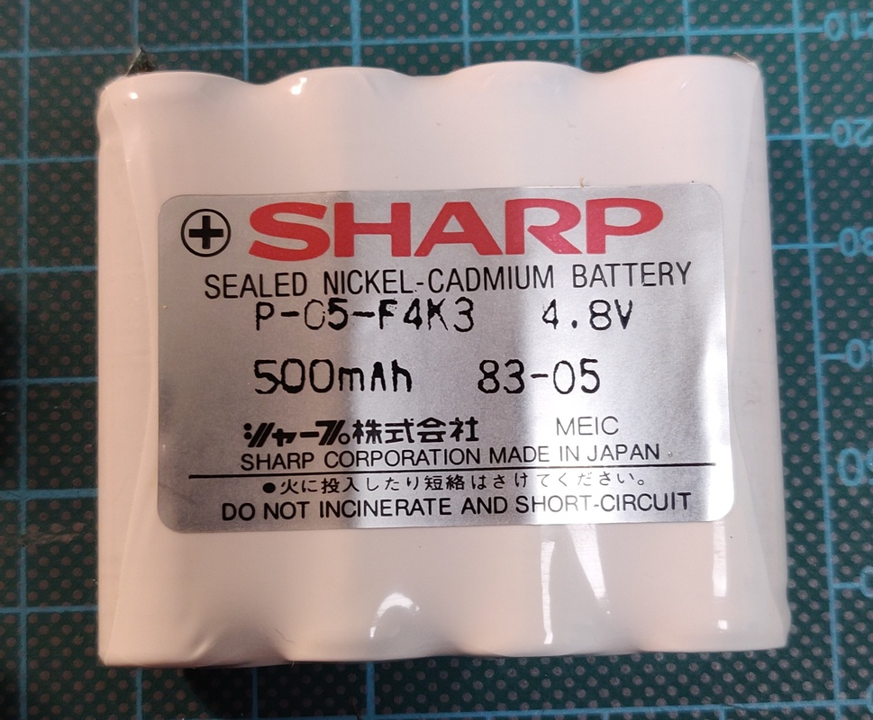

On the top of the unit I found this mystery connector. The manual refers to it as a test connector
but there is a holder for the cover on the bottom, which makes me suspect that it was maybe initially
intended as another expansion port.

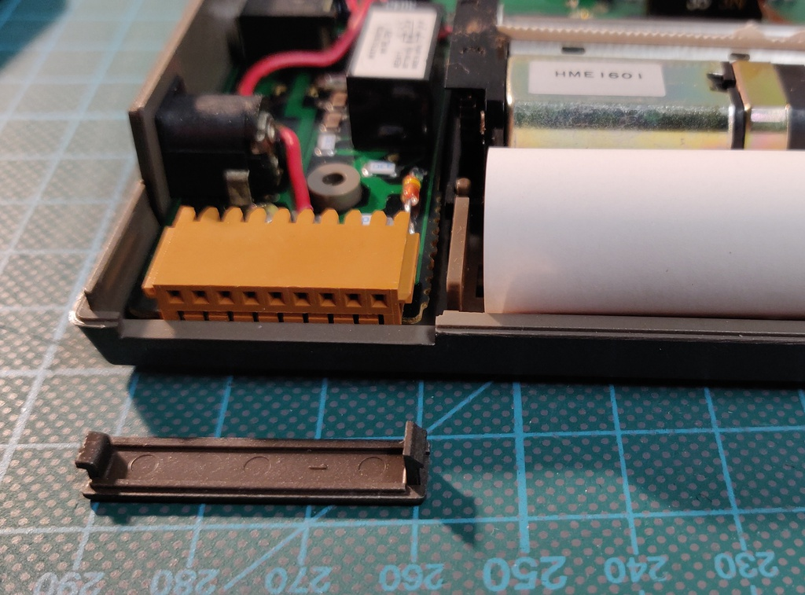

While testing, I found that the cassette unit didn't work, the reels were not turning at all. After
removing it and turning it around it was pretty obvious why, the main drive belt had completely degraded
to the point it just fell apart.

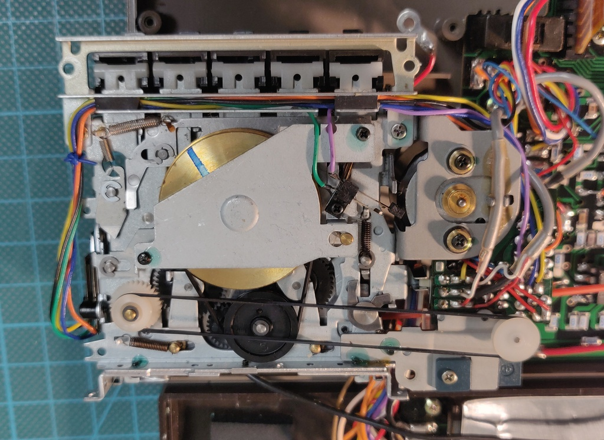

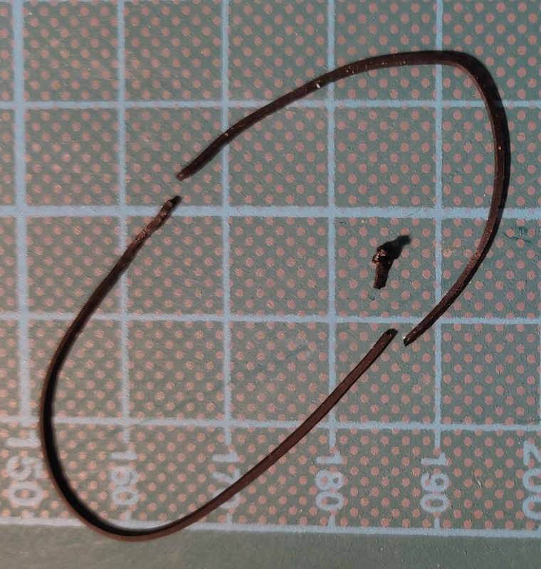

## CE-125 Power requirements

After some research I found the original power brick is the Sharp EA-23E which supplies 8.5v DC.

The DC barrel jack is **centre negative** which makes it incompatible with most current DC power supplies.

The internal battery should supply around 4.8v.