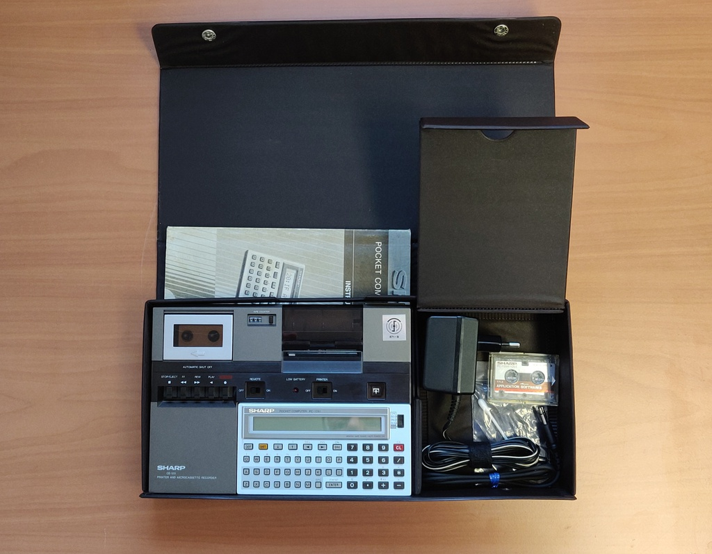
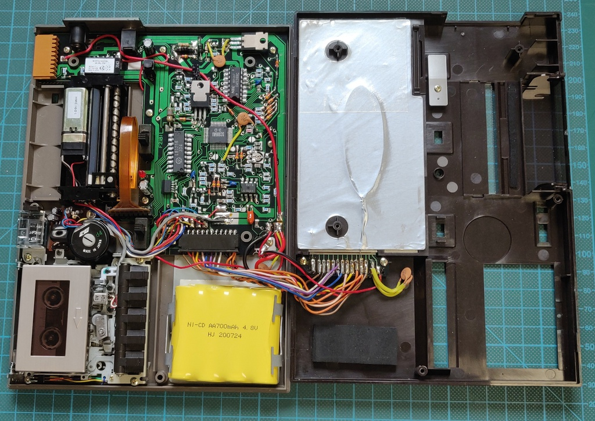

# Sharp PC-1251 pocket computer with CE-125 dock

I purchased this unit as untested with very few pictures of background information, but I was curious
what exactly it was.

After replacing the batteries I found the computer itself was working perfectly, but the batteries in the
CE-125 were starting to corrode, the printer printed very faded and eventually stopped write all together. The micro-cassette players belt needed replacement.



##### Work done:

* Initial clean-up and inspection
* Battery removal
* Micro-cassette repair
* Copying original data off of the micro-cassette
* Attempted repair of the thermal printer

## More information

I've added the following information to my [GitHub](https://github.com/number42net/sharp-pc1251):

* User and service manuals for the PC-1251 and CE-125
* Macintosh Binaries for PocketTools (Windows binaries are available on the original [website](https://www.peil-partner.de/ifhe.de/sharp/)
* Recordings of the original Sharp demo software which can be played back
* Basic source code of the original Sharp demo software.

## Visual inspection

The unit is stored in this really nice vinyl case:


When opened it reveals the CE-125 dock with the PC-1251 microcomputer installed and a small
storage compartment on the side for cables, paper, etc.


This is the back of the CE-125, notice the two slots where plastic covers can be inserted while in use.
Here the PC-1251 cover is installed.


Here is the side of the unit, it didn't come with a charger, so I would have to figure out what
voltage is needs.


The PC-1251 slides easily out of the dock and here is the back of the unit:


Two screws are removed to access the battery compartment, here for reference since the polarity is
a bit different.


Two fresh CR-2032 batteries are installed, and it's already working!


With that out of the way I turned my attention once again to the CE-125 and opened it up:


The battery was already starting to leak, but luckily I was still on time to remove it:


On the top of the unit I found this mystery connector. The manual refers to it as a test connector
but there is a holder for the cover on the bottom, which makes me suspect that it was maybe initially
intended as another expansion port.


While testing, I found that the cassette unit didn't work, the reels were not turning at all. After
removing it and turning it around it was pretty obvious why, the main drive belt had completely degraded
to the point it just fell apart.


## CE-125 Replacement battery and power supply

After some research I found the original power brick is the Sharp EA-23E which supplies 8.5v DC, looking at the internals it should easily handle a regular 9v adapter, but the DC barrel jack is **centre negative** which makes it incompatible with most current DC power supplies.

The internal battery should supply between 4.8v and 6.4v (4x nicad). I replaced it with a slightly higher capacity 700mah version:



## Micro-cassette repair and data recovery

Once the replacement belts arrived it was just a matter of opening up the CE-125 again, removing the micro-casette unit and popping a new belt on. I checked the other belts, but they were flexible and sufficiently tense, so I did not replace them.


Everything back in its original place, time to recover the data on the tape.


The CE-125 can only receive data through an external cassette recorder, there is no way to get the data off the unit again, and I don't own another player I could use. To get around this I decided to trace the signal to find an amplified source.

Pretty soon I came across the 5218 dual op amp, and on pin 7 there was a perfectly amplified output for me to use. I soldered a wire to it and used the battery as a ground.


I found the following process worked extremely well:

* Leave the "Remote" switch off to keep control over the tape
* Use the CLOAD command to read the data and record it on a computer using the fantastic open source Audacity
* Connect the computers output to the CE-125 and use the CLOAD? command to verify the data recorded
* Save the recording as a wav file and disconnect the computer output again

## Converting recorded wav files to BASIC

I started on writing my own decoding program when I came across the excellent work by Torsten Mücker who created [PocketTools](https://www.peil-partner.de/ifhe.de/sharp/) which doesn't just convert data from the PC-1251 but also for many other Sharp pocket computers.

He provides binaries for Windows, but it compiled without any problems on MacOS Catalina. I've added these Mac binaries to my [GitHub](https://github.com/number42net/sharp-pc1251)

I found that the following settings worked best for me:

```
./wav2bin --pc 1251 --device=CAS test.wav test.basic  
```

A quick one-liner to convert all the files in the current directory.
```
for i in *.wav; do echo $i; ../Pocket\ Tools\ MacOS/wav2bin --quiet --pc 1251 --device=CAS "$i" "../basic2/$(echo $i | awk -F. '{print $1}').basic"; done
```

More details on these tools, all the recordings and converted files are on my [GitHub](https://github.com/number42net/sharp-pc1251).
