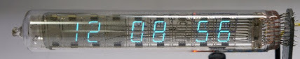
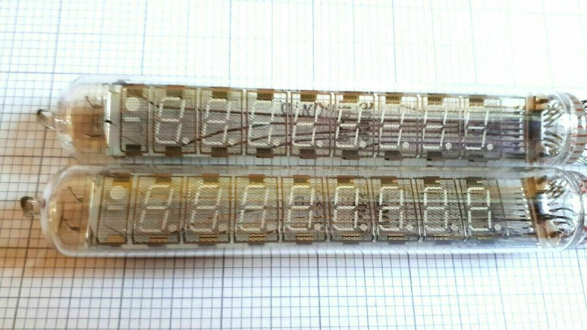
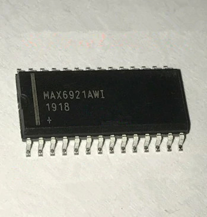
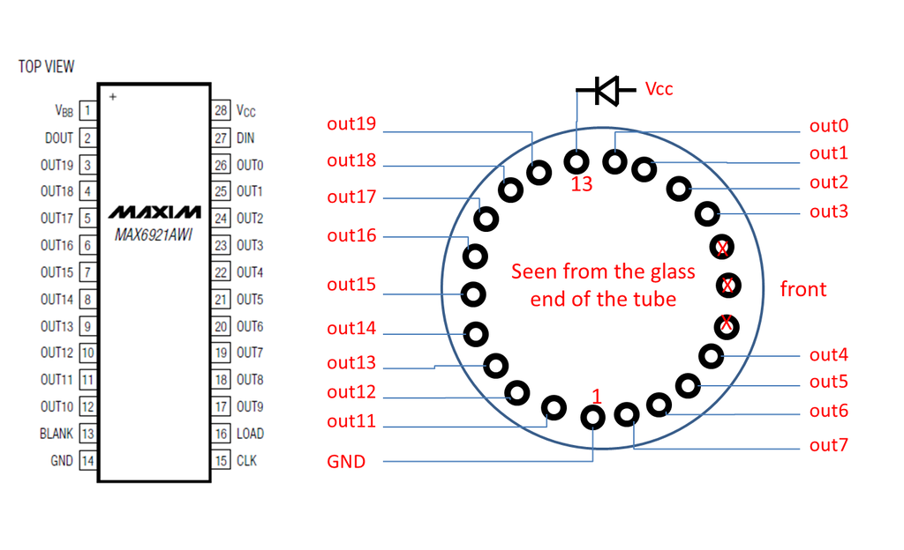

# Retro clock using a Russian IV-18 VFD tube

I've been wanting to build a clock for a few years already, initially using Nixie tubes, but after seeing endless projects based on them I had seen enough.

Then I came across these amazing Russian IV-18 VFD (Vacuum Florescend Display) tubes and decided they would make for a perfect clock.

## Work done so far: 

+ Initial research
+ Purchasing tubes and driver IC

## Planned work: 

+ Create a working circuit
+ Design the clock

## Initial reseach

### IV-18 tube

Grid voltage: 20-30v DC
Filament voltage: 3-5v DC

### Driver IC

I've chosen the MAX6921AWI VFD driver IC, mainly because it has sufficient pins to drive all segments and is still reasonably easy to solder. 

### Example circuit

