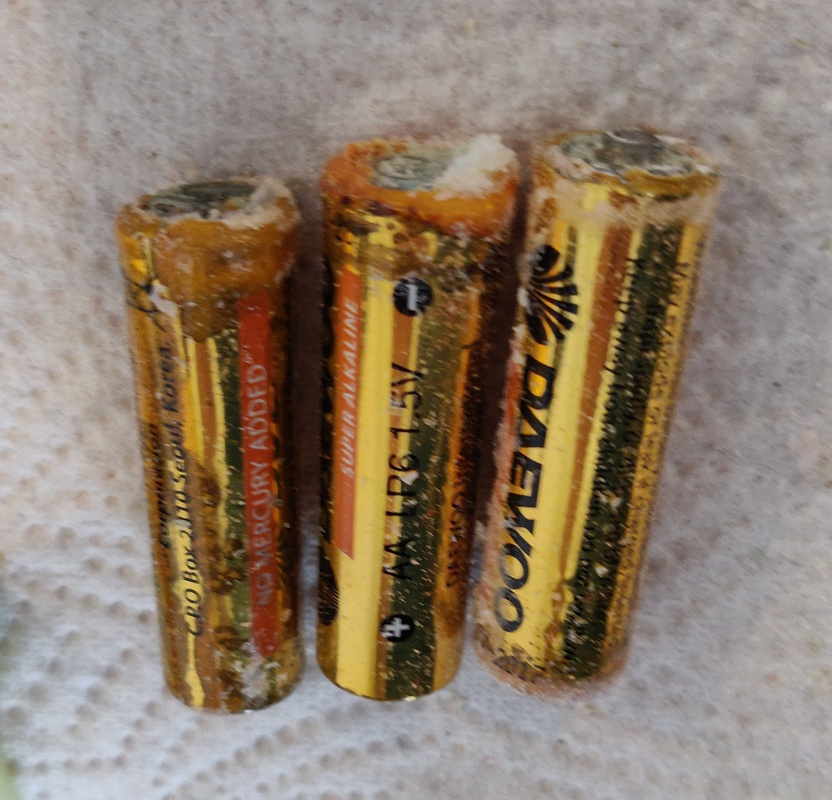
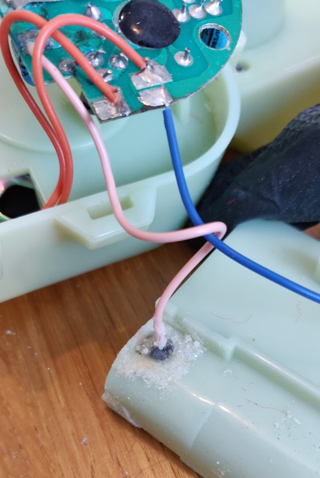
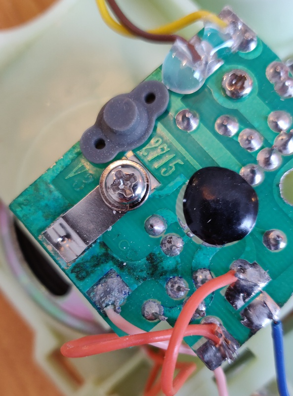
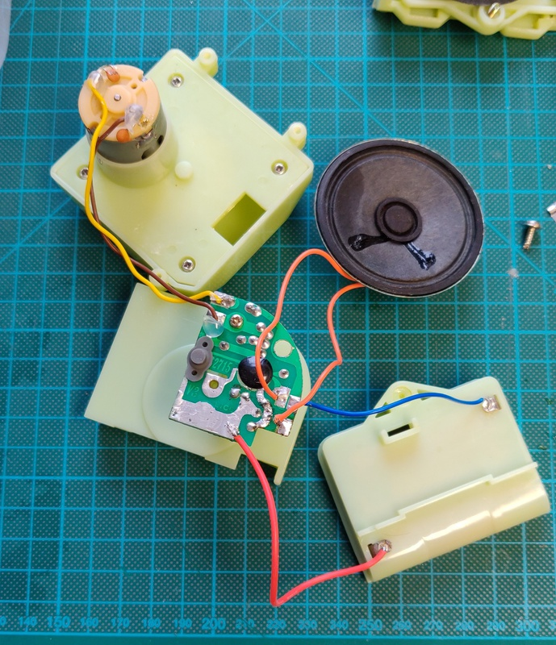
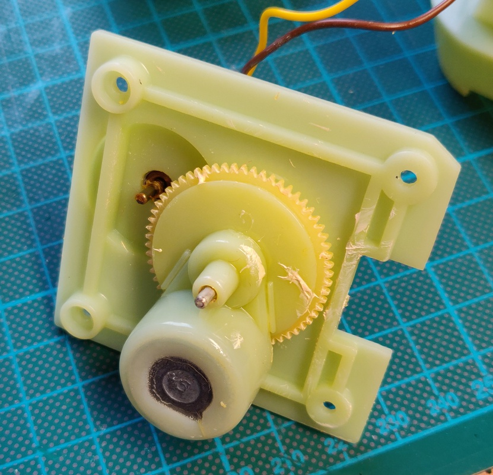
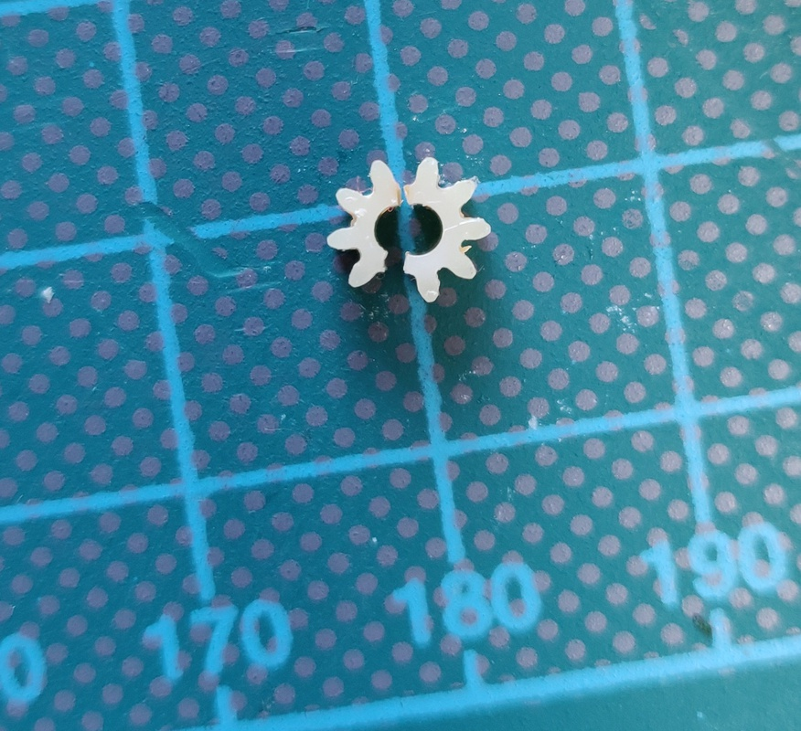
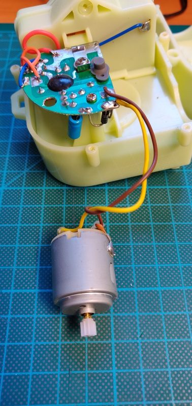

# Tickle me Elmo (1996)

I originally bought this on eBay for the huge sum of £1.71 in 2007 as a fun decoration, it ended up being a keeper and even moved countries with me. When my son was born he soon claimed it for himself, and now I wanted to let my daughter enjoy it for a while. 

But after taking it from the shelf, I discovered I had left batteries in it, and Elmo's innards were filled with electrolyte crystals.

## Work done so far: 

+ Clean up battery electrolyte
+ Repair PCB
+ Replace gear

## Inspection:

After opening everything up, it was just getting worse:

And worse:

## Board repair

I first soaked the board in vinegar for a while to neutralize the base electrolyte and reverse the corrosion. After this a few large traces were left completely exposed. I decided to protect these by tinning them. 

Normally the best solution would be to apply some lacquer or liquid PCB solder resist, but for this simple board it's more than sufficient. 

And here it is with the electronics working:

<iframe width="560" height="315" src="https://www.youtube.com/embed/7QTSh9NkolY" frameborder="0" allow="accelerometer; autoplay; clipboard-write; encrypted-media; gyroscope; picture-in-picture" allowfullscreen></iframe>

This is also the moment that I remembered hearing some crunchy noises the last time it ran and as you can see the small gear which makes Elmo shake around of joy had broken off completely:

Here are the specs of the gear in case you run into the same issue:
+ Gears: 9
+ Shaft diameter: 2 mm
+ Total diameter: 5.5 mm

After installing the replacement gear:

Here is one happy little girl with her new toy:

