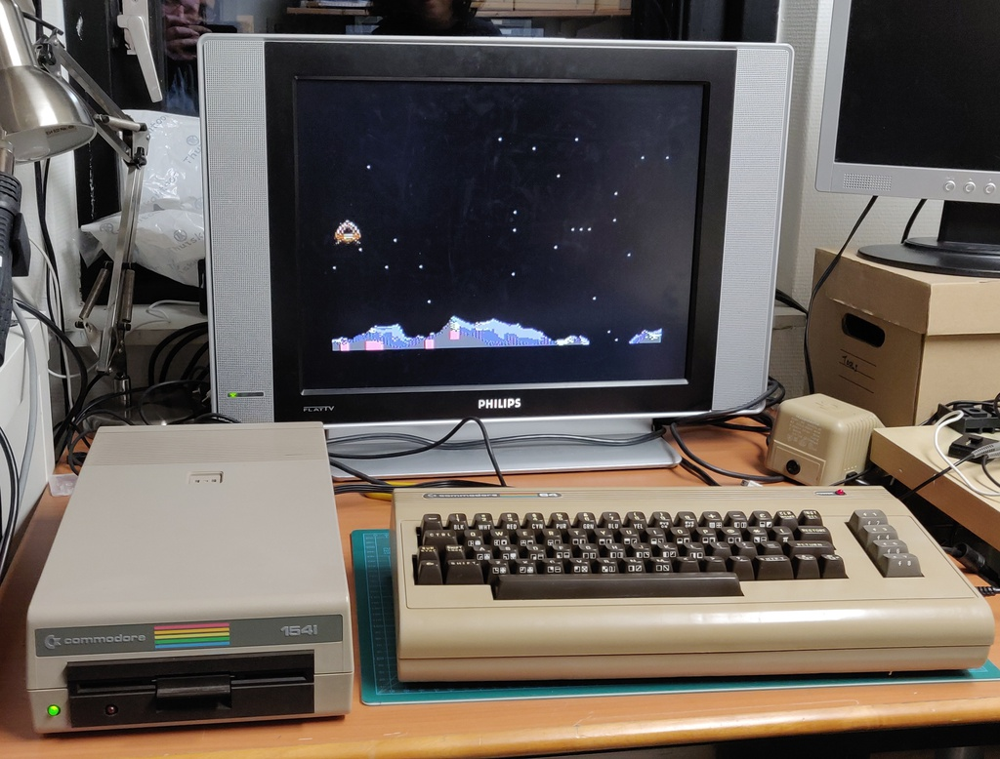

# Commodore 1541 drive - Alps mechanism / PCB Assy: 

I purchased this Commodore floppy drive locally as untested, together with a Commodore 64 computer.

Here are some pictures of the finished drive:

## Work done: 

+ Repair
+ Head cleaning
+ Full inspection and testing
+ Case replacement

## Inspection and repair

The 1541 is a special beast, it's not just a floppy drive, but a full 8-bit computer in its own right, with a MOS 6502 CPU, RAM, ROM and related logic chips.

After opening up the drive and doing a quick inspection I found that the drive belt was in excellent condition and overall the drive looked perfect. When I tried powering it on the motor started spinning straight away, but unfortunately didn't stop spinning as it should. Instead, I was greeted by 3 slow red flashes followed by a pause, which continued indefinitely. 

I started off probing the voltages, which all checked out and then moved on to the oscilloscope. On the CPU side everything seemed fine, data and address lines were active. 

Thanks to the great work of [Ray Carlson](http://personalpages.tds.net/~rcarlsen/cbm/1541/1541chip.txt) I was quickly pointed to the direction of the ROMs. The ROM in location UB4 seemed perfectly fine, but UB3 had badly corroded pins. 

After a quick clean up the issue was fully resolved, which meant moving on to the mechanical side. After cleaning the head and lubricating the shafts on which the head moves it was time for testing. 

I connected everything up and played a quick round of Landing on TB19 with my son!

After this I ran the full suite of tests on Jani's excellent [1514 diagnostics ROM ](http://blog.worldofjani.com/?p=2180) and found no further issues.

## Case replacement

Around the same I also worked on [another 1541 drive](../2021-02-23_Commodore_1541/), which unfortunately turned out to be beyond repair. The case of this drive was in a nicer condition, so I decided to switch over the whole drive and electronics assembly.

The new case, ready to receive the assembly:

This cover actually has the logo!

Same beautiful Alps mechanism:

I left the sticker of the donor drive because I didn't want to risk damaging it:

