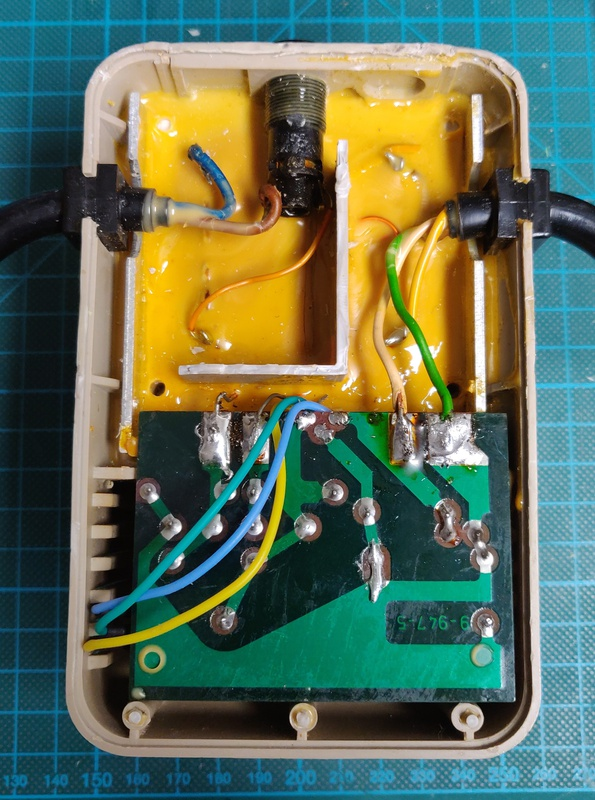

# Commodore 64 bread bin - Assy 250425

As usual, I purchased this Commodore 64 locally untested, the computer itself was working perfectly, but the 1541 floppy drive needed some work. (see: [2021-02-12 Commdore 1541 drive](../2021-02-12_Commodore_1541_drive/)

## Work done so far: 

+ Full inspection and testing
+ Clean up
+ Case repair
+ Power adapter proactive maintenance

## Planned work: 

+ Power cable repair
+ Color restauration

## Exterior inspection:

Like many computers coming across my bench, this Commodore had seen better days. Maybe one day it was a treasured home computer, right now it was a filthy mess.

The power connector in particular had seen better days:

The power supply itself has a date code stamped onto it: 10 October 1984, which matches the date codes on the chips pretty well.

One unfortunate problem is that all but 1 of the plastic hinges in the back of the case had already been snapped off by a previous owner and the last one came off when I opened the case my self. More on this below.

## Board inspection:

I had already spotted that the RF shield was still in place from the outside:

The board itself was in better shape than I had expected from the look of the power cable:

On the bottom we can see that the solder joints have been reworked at some point. Either really messy work from the factory, or more likely a repair later in its life:

I decided to do a quick clean up and remove all the flux residue:

## First boot

After this it was time to check the voltages on the power supply, which all checked out (9v AC and 5v DC), time for a test:

IT WORKS!

## Keyboard clean up:

The keyboard was particularly dirty, and I ended up taking it fully apart to do a thorough clean up:

## Case repair

As mentioned above, when I opened the case I managed to break off the last remaining hinge on the back of the case. Luckily there are great 3D designs [available](https://www.thingiverse.com/thing:3092874), I printed a set and glued them in place:

## Power supply refurbishment

The Commodore 64 has a major "Achilles' heel", the power supply. It's build into a separate plastic brick and holds a transformer which sends 9v AC directly to the computer and a small board which contains the rectifier, voltage regulator and related components for the 5v DC supply. The whole brick is filled with potting compound from the factory.

It's this voltage regulator, embedded inside the potted brick which creates the main issue. Over time, they tend  to drift higher, putting more strain on the ICs inside the computer. Eventually they often short, sending the full voltage from the transformer straight to all the sensitive components on the main board, which usually results in many parts failing instantly. 

Here is the back of the original board:

Luckily we now have modern replacements for these parts which contain safeties to prevent this type of failure in the first place and also generate barely any heat, compared to the original part which gets really hot.

Here I used a Traco Power TSR 2-2450, purchased directly from a certified distributor. It can supply 2A, slightly more than the original 1.5A regulator, which helps to run more demanding cartridges. While I had it open, I also replaced the capacitor with a matching axial model. 

