# Apple 12" RGB monitor (M1296)

Bought as faulty, it appears to suffer from a complete loss of sync, even without a Mac connected. 

## Work done so far: 
+ Initial troubleshooting
+ Capacitor replacement
+ 12v and 80v rail repair 

## Planned work: 
+ Full cleaning
+ Plastic colour restoration
+ Replace remaining capacitor and resistor

## Initial inspection and troubleshooting
When I first powered up the monitor it immediately showed this screen:

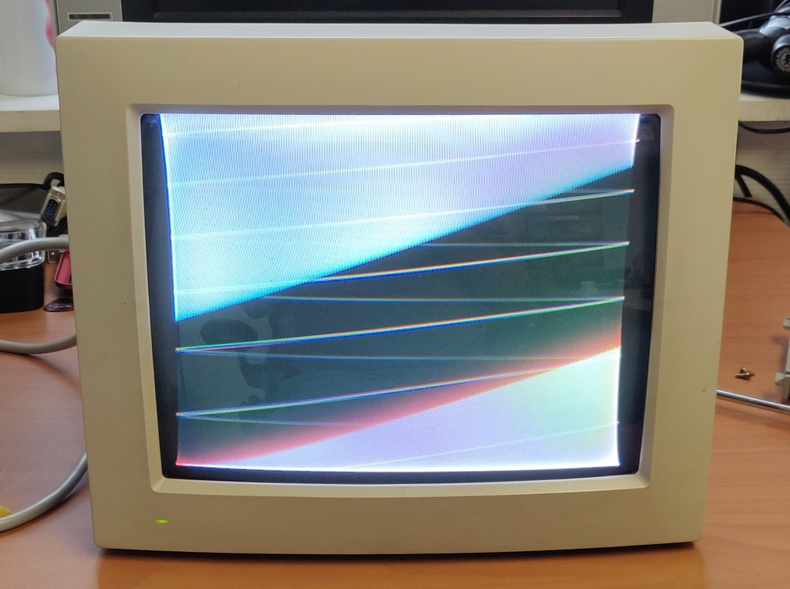

Once I opened it up it was clear that the capacitors near the back of the board were in very poor condition and had leaked badly, which is likely the cause of this issue. 

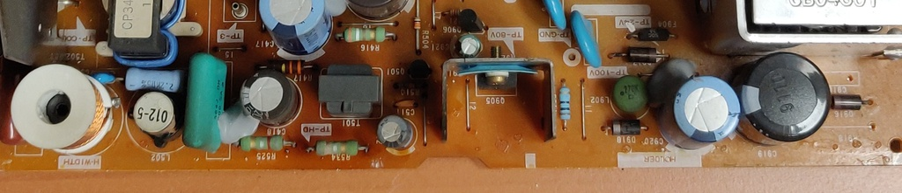

The resistors in the front carry the full B+ voltage which means they run pretty hot. Slowly cooking the capacitors behind them over the years. One could argue it's a pretty bad design choice, but considering how many years it worked before finally breaking down, I suppose it's not that bad.

Here is the neck board, which showed no signs of bad capacitors: 

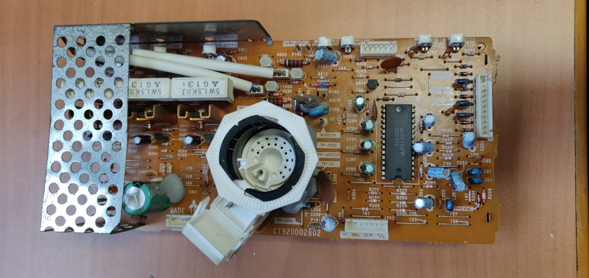

And the frame of the monitor with the tube:

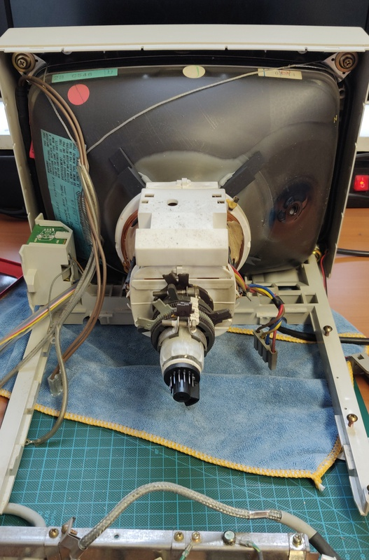

# Replacing the capacitors

Based on the mess around the board I decided to go ahead and replace all the caps in that area, which is mainly responsible for the high voltage side:

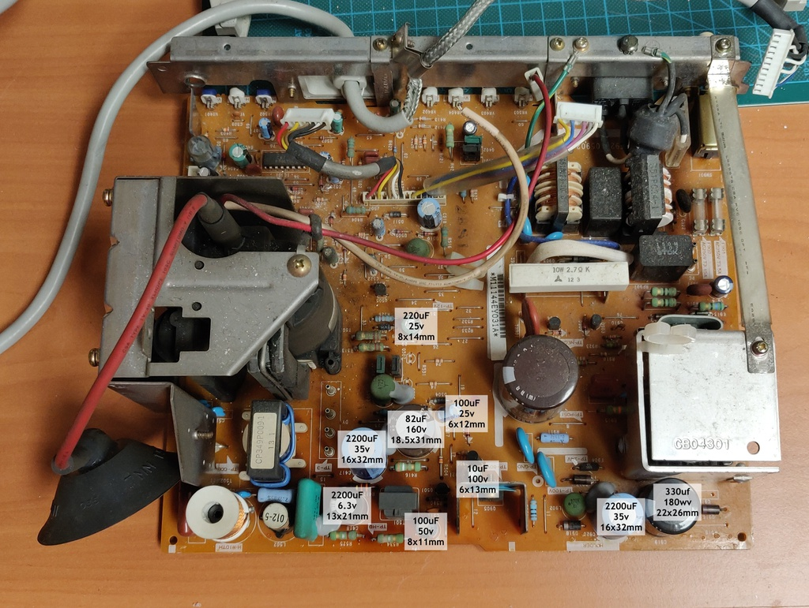

After the clean-up and replacement:

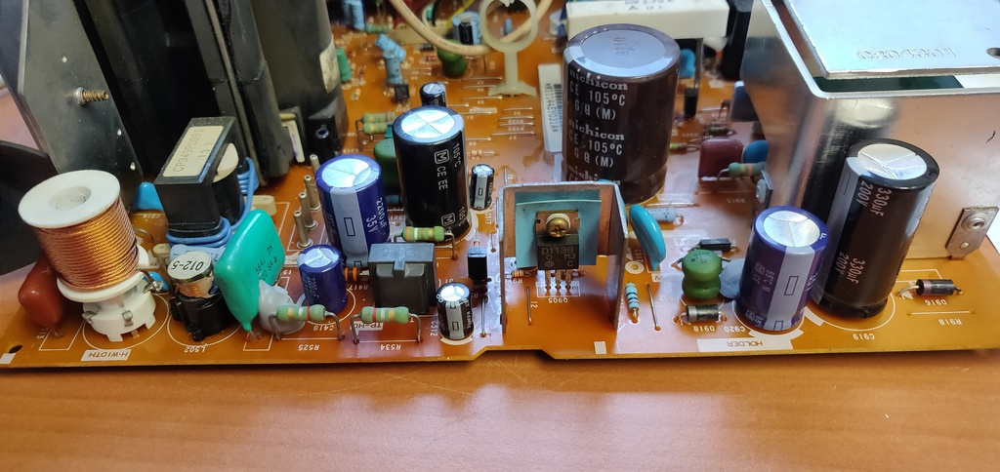

I turned the screen back on again with a Mac connected, and it's definitely improved, but still no joy:

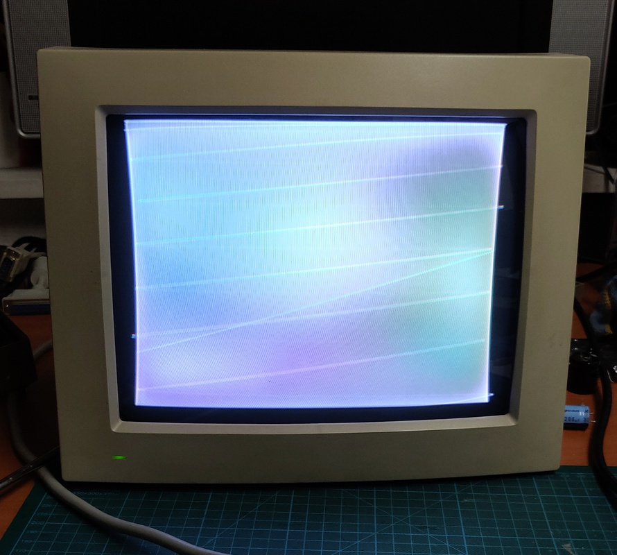

# Troubleshooting and repair

When in doubt, check (all) voltages! When I was still running into issues after replacing the capacitors I went ahead and checked the voltage test points:

+ 24v: Good
+ 100v: Good
+ 80v: Bad (11.8v)
+ 12v: Completely missed it

I spent a good while trying to figure out how the 80v is generated and ended up drawing out the circuit diagram on a picture of the board:

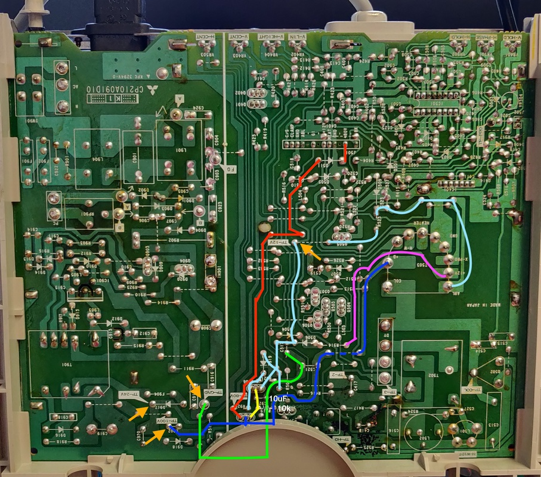

This eventually let me to the 24v rail, which I had missed earlier. It, too, was bad, showing 1.2v instead of the expected 12v. Tracing it down, its circuit is a very straight forward half bridge rectifier:

12v pin on Flyback transformer (measured 24v AC) -> Resistor R514 -> Diode D506 -> Test point

That left just three options: The diode or resistor as failure points, or something overloading the circuit, which didn't seem likely. The diode checked out fine, but the resistor measured 7 mega-ohm, that can't be right!

The colour codes are a bit difficult to see, but they should be brown, black, black, gold: 10Ω at 5% tolerance:

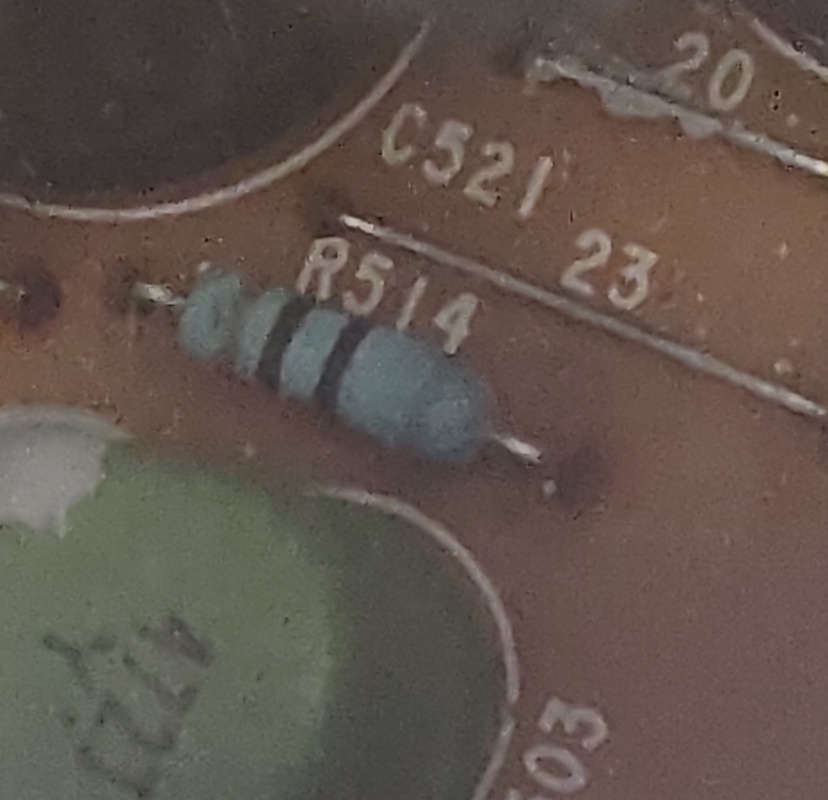

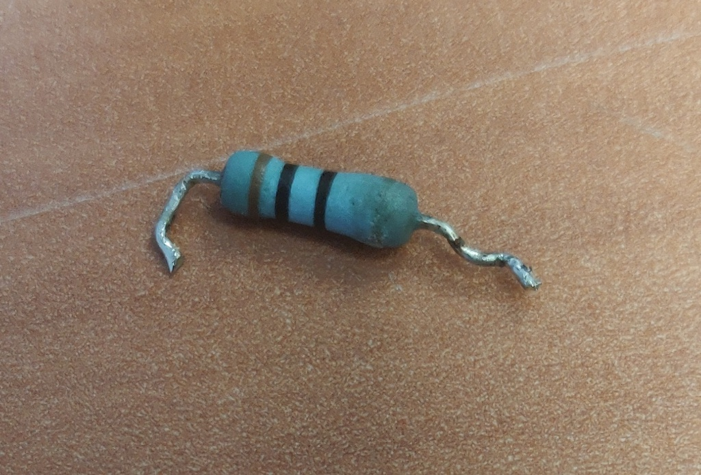

I didn't have a suitable 1/2w resistor in stock, but I replaced it with a 1/4w just for testing and the result:

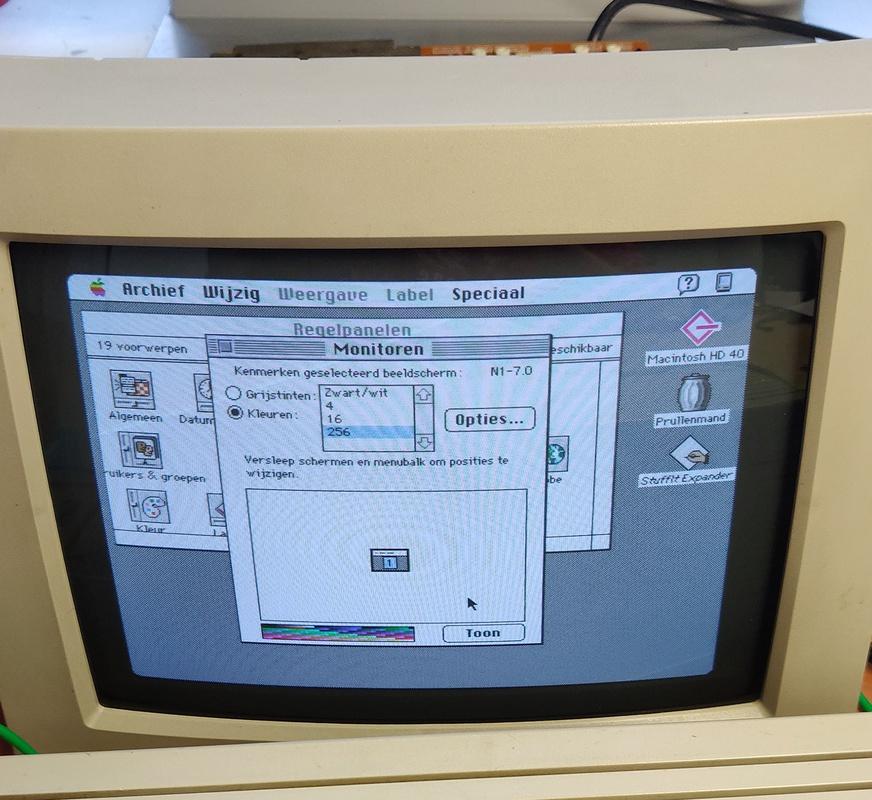

A fully working Apple 12" RGB monitor!