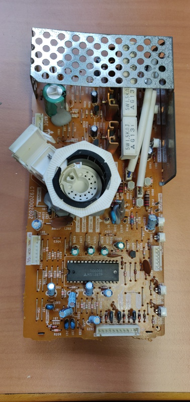
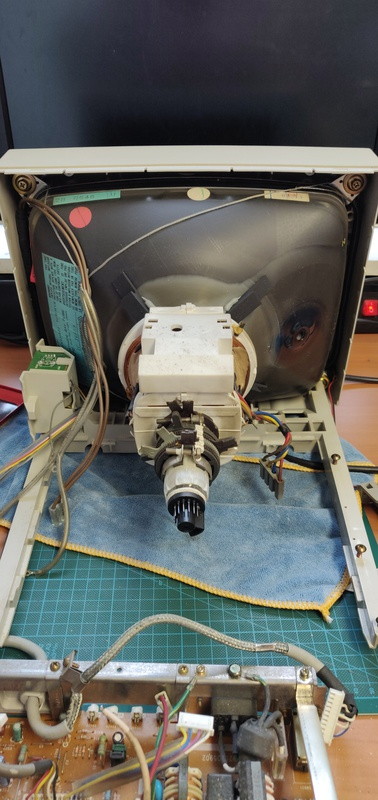

# Apple 12" RGB monitor (M1296)

Bought as faulty, it appears to suffer from a loss of sync, even without anything connected. 

## Work done so far: 
+ Initial troubleshooting

## Planned work: 
+ Replace capacitors

## initial inspection and troubleshooting
When I first powered up the monitor it immediately showed this screen:

Once I opened it up it was clear that the capacitors near the back of the board were in very poor condition and had leaked badly, which is likely the cause of this issue. 

Here is an overview of the capacitors I'm planning to replace: 

Here is the neck board: 

And the frame of the monitor with the tube:

