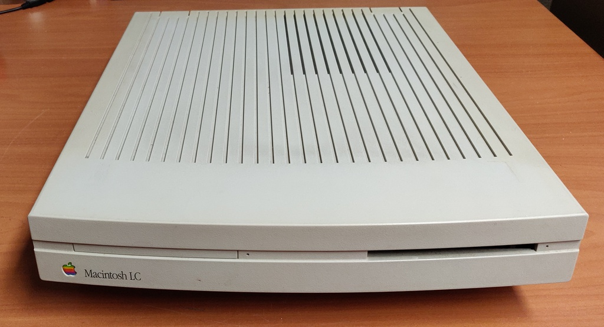
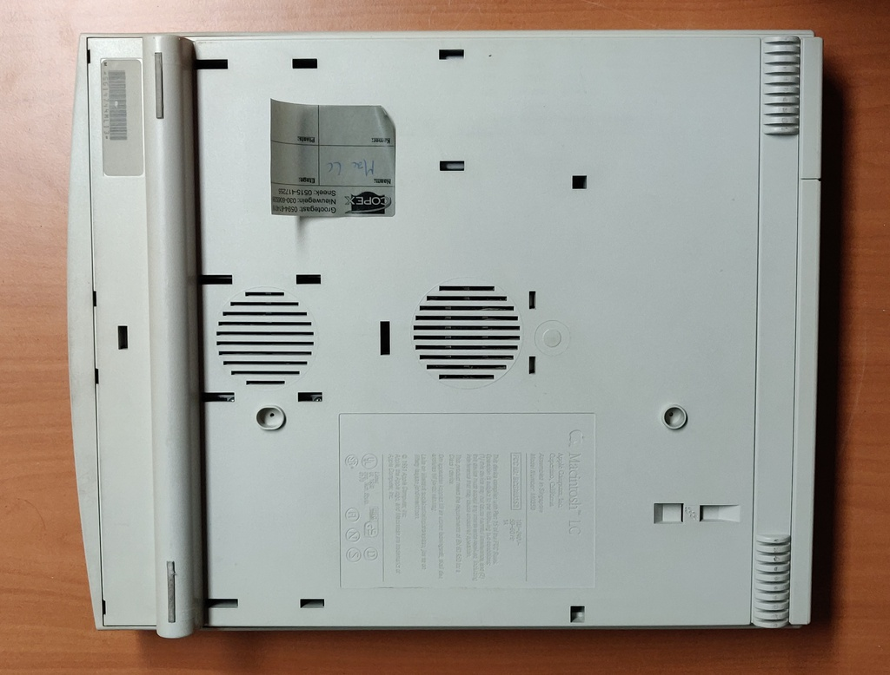
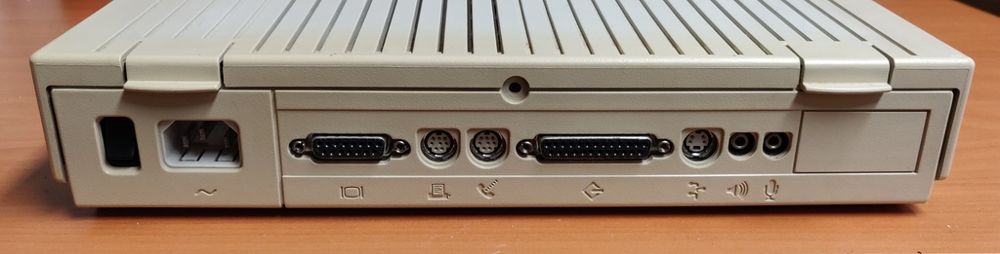
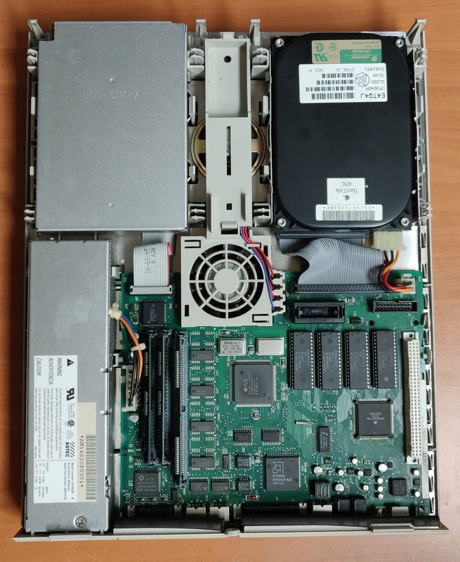

# Macintosh LC
Bought as faulty / unknown, found no issues on first power up

## Work done so far: 
+ Initial inspection

## Planned work:
+ Full testing
+ Replace capacitors

## initial inspection

When I first powered it on it worked perfectly, but hasn't been fully tested yet and still needs to have the capacitors replaced. 
