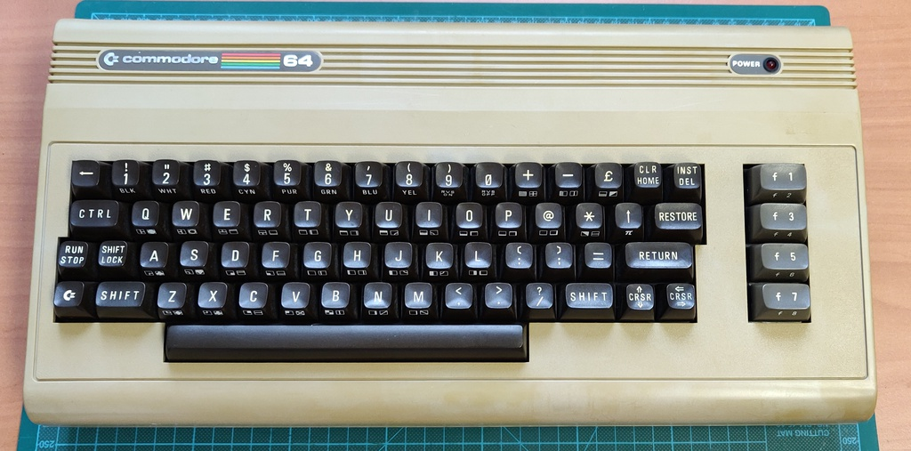
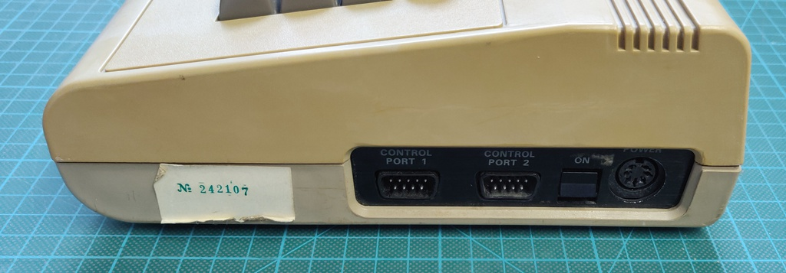
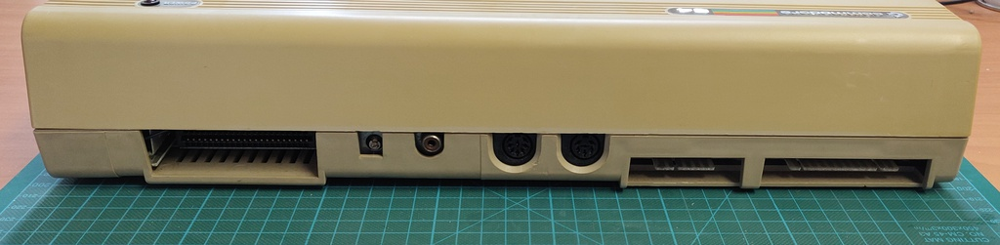
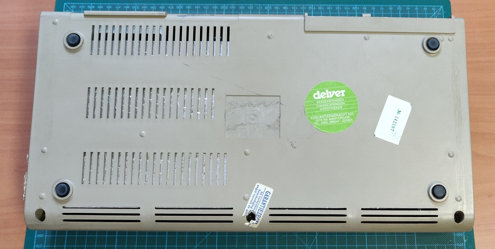
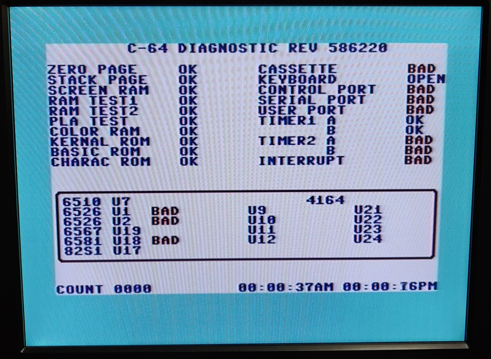
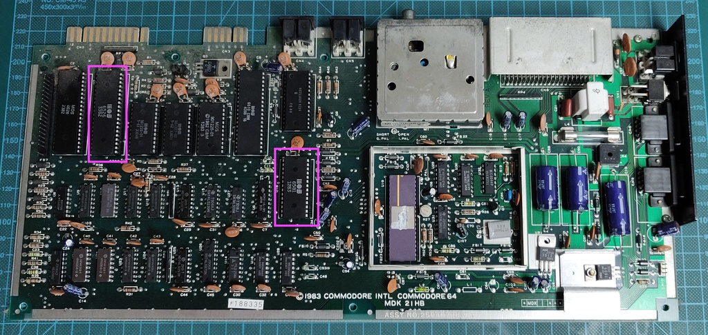

# Commodore 64 breadbin / Assy: 250407 rev A / dark

I bought this C64 as faulty / black screen, in addition it turned out to have an issue with the timers in UC2. 

In the end the machine had the following faults:

+ Bad U18: MOS6526 CIA
+ Bad U2: MOS6581 SID

Unfortunately the current prices for these chips are nearly the same as the price for a working Commodore 64, making this Commodore beyond economical repair. I will use it as a parts computer instead. 

## Initial inspection

Overall the condition was okay, quite a few stickers and stains:

## Troubleshooting

When I first powered up the machine it showed only a black screen as expected. A quick check of the all the voltages confirmed they were okay. At this point the ICs were starting to warm up, and I noticed that the U18 (6581 SID) chip was getting especially hot. 

After removing the SID chip the C64 booted, so I ran a C64 diagnostic cartridge and found the following:

+ The cassette, control-, serial- and user- ports are expected to show bad when you run the ROM without a cartridge.
+ But the timer and interrupt should work as expected.
+ I also noticed that the diagnostics cartridge would hang here, instead of continue to another cycle. 

I swapped U2 (MOS6526 CIA) into a known working Commodore 64, which resulted in the same issue. Swapping a known good IC into U2 resolved the issue.

Unfortunately replacement 6526 ICs are pretty expensive and SID chips are near unobtanium. There are modern equivalents for the 6581 SID, but the sound they produce is not identical to the original.