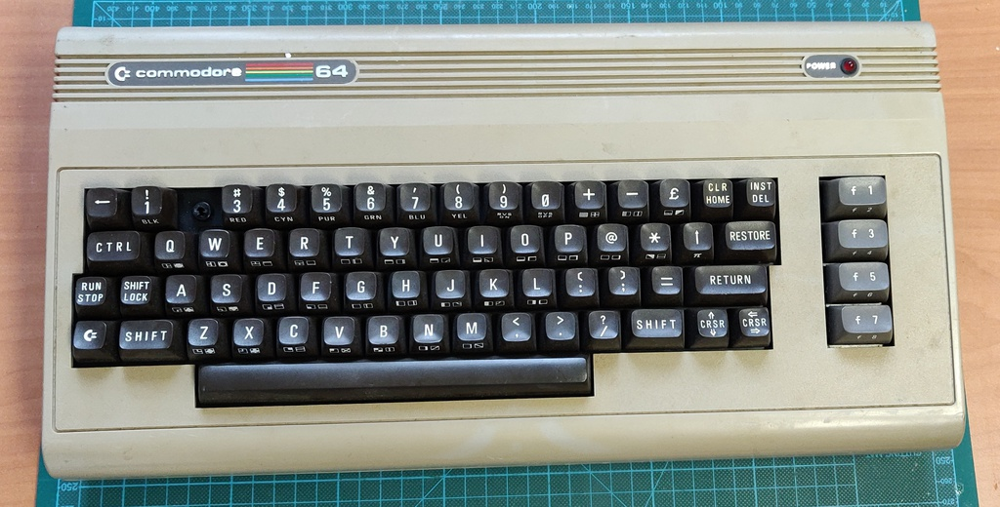
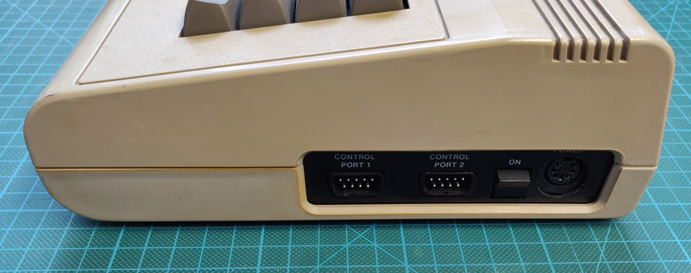
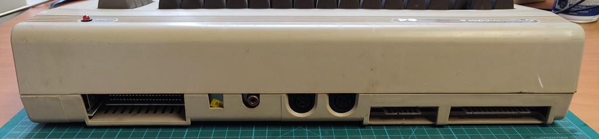
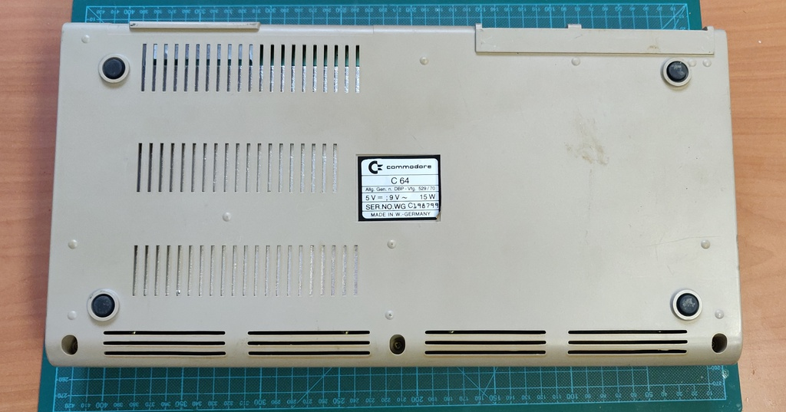

# Commodore 64 breadbin / Assy: 250425 / dark

I bought this C64 unknown / untested in a lot together with another identical model. Both had some issues, but neither appears to have ever been worked on before.

## Initial inspection

Overall the condition was decent, quite dirty, but nothing unexpected, except for the missing key and stem:

I ended up searching the whole box, but the missing key was not to be found. After powering up the machine it booted straight into Basic and passed the diagnostics cart without any issues.

## Keyboard replacement

Luckily I have parts Commodore 64 who's keyboard I can re-use for this one. 

