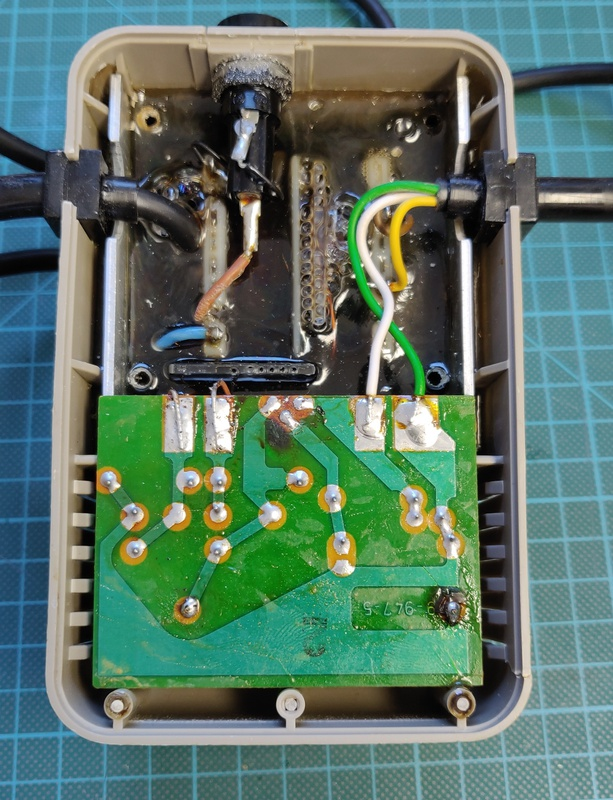
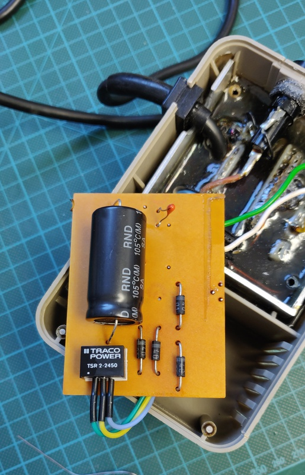
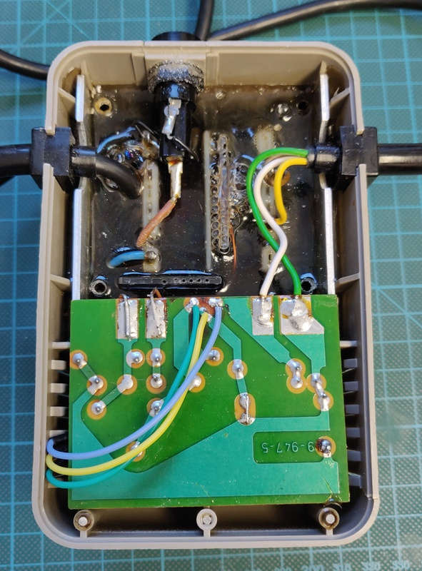

# Commodore 64 breadbin / Assy: 250425 / dark

I bought this C64 unknown / untested in a lot together with another identical model. Both had some issues, but neither appears to have ever been worked on before.

## Initial inspection

Overall the condition was decent, quite dirty, but nothing unexpected, except for the missing key and stem:

I ended up searching the whole box, but the missing key was not to be found. After powering up the machine it booted straight into Basic and passed the diagnostics cart without any issues.

## Keyboard replacement

Luckily I have parts Commodore 64 who's keyboard I can re-use for this one. Replacing the keyboard is straight forward, but this one will need some color restoration.

<!-- Missing picture of the new keyboard -->

## Power supply refurbishment

The Commodore 64 has a major "Achilles' heel", the power supply. It's build into a separate plastic brick and holds a transformer which sends 9v AC directly to the computer and a small board which contains the rectifier, voltage regulator and related components for the 5v DC supply. The whole brick is filled with potting compound from the factory.

It's this voltage regulator, embedded inside the potted brick which creates the main issue. Over time, they tend  to drift higher, putting more strain on the ICs inside the computer. Eventually they often short, sending the full voltage from the transformer straight to all the sensitive components on the main board, which usually results in many parts failing instantly. 

Luckily we now have modern replacements for these parts which contain safeties to prevent this type of failure in the first place and also generate barely any heat, compared to the original part which gets really hot.

Here I used a Traco Power TSR 2-2450, purchased directly from a certified distributor. It can supply 2A, slightly more than the original 1.5A regulator, which helps to run more demanding cartridges. While I had it open, I also replaced the capacitor with a matching axial model. 

