# Commodore 64 breadbin / Assy: 250425 / dark

I bought this C64 unknown / untested in a lot together with another identical model. Both had some issues, but neither appears to have ever been worked on before.

## Initial inspection

Overall the condition was decent, quite dirty, but nothing unexpected:

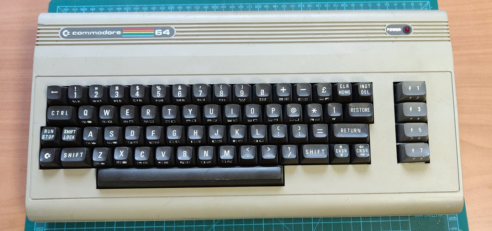

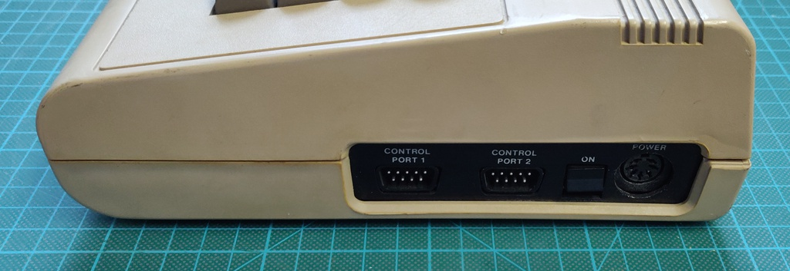

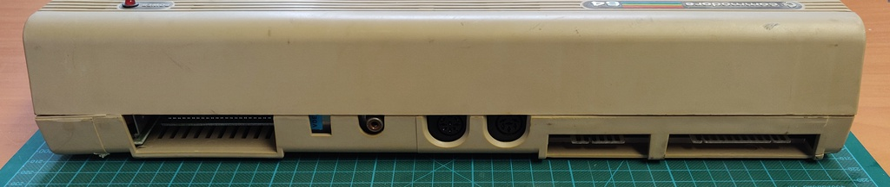

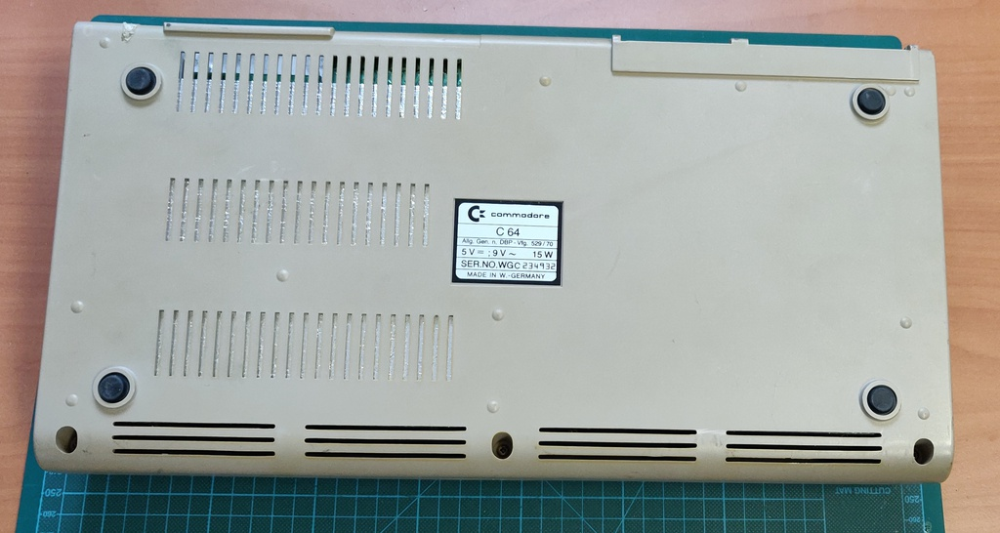

## Bad memory IC

After powering it on the for the first time BASIC appeared, but there was also some garbage on the screen. After running the diagnostics cartridge it was clear that one or more memory ICs had failed:

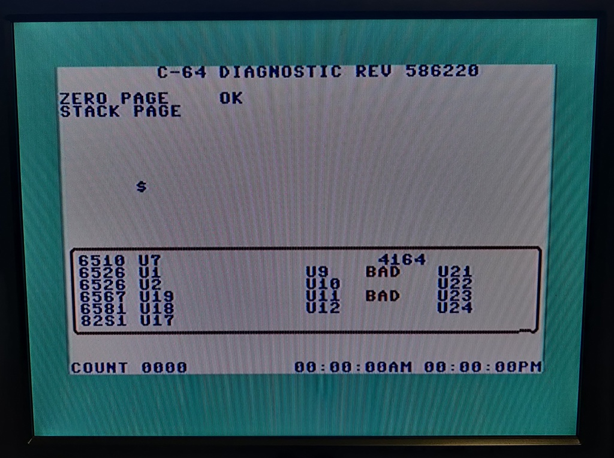

Although the picture shows U9 and U11, this would change each time I ran the C64 dead-test cartridge. As it turned out this cartridge is quite unreliable when it comes to determining exactly which IC has failed. After running C64 Diagnostics and Doktor64, they both agreed the issue was with U22, so I went ahead with the replacement. 

Looking at the top of the board, U21 was really standing out as being different from all the other chips:

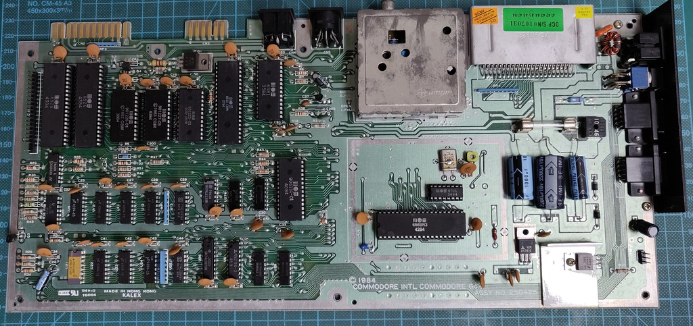

And once I turned the board around, it was clear that it had been replaced in the past, possibly at the factory, or later on.

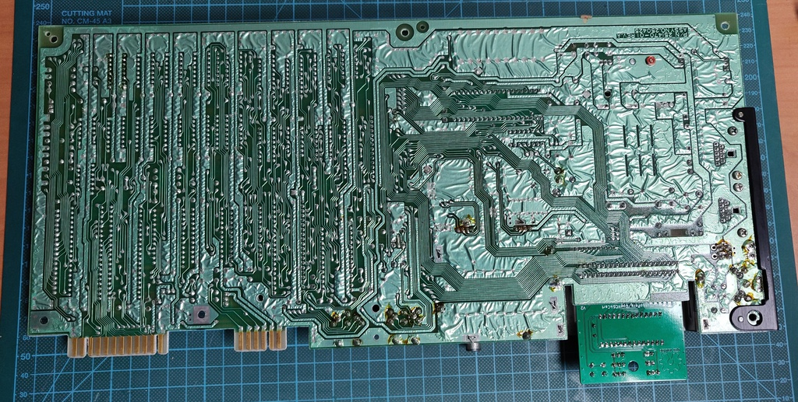

I desoldered the IC and replaced it with one from a parts C64 board. Here is a picture of the three ICs next to each other. One replaced at some point in the past, one replaced now and one of the original ICs.

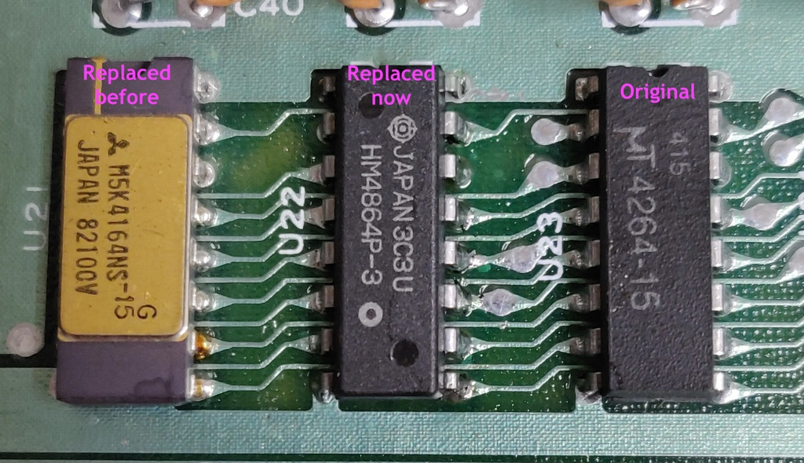

And once I booted it up it passed all diagnostics! (the ones showing BAD here are because the diagnostics harness is not installed)

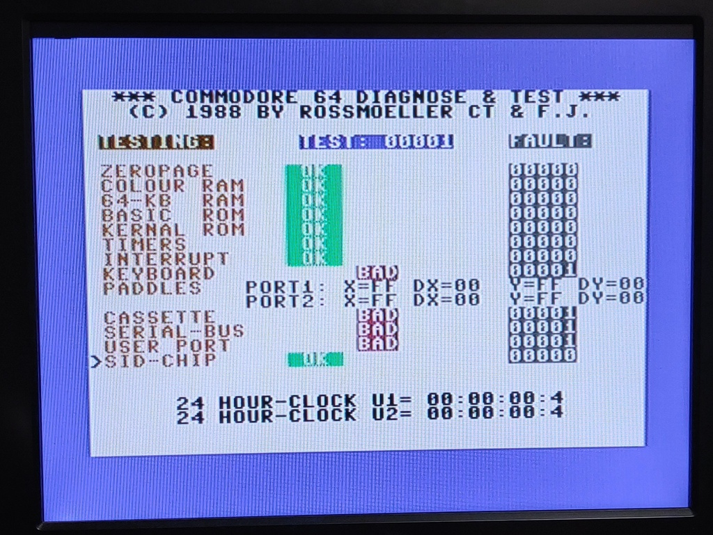

## Power supply refurbishment

The Commodore 64 has a major "Achilles' heel", the power supply. It's build into a separate plastic brick and holds a transformer which sends 9v AC directly to the computer and a small board which contains the rectifier, voltage regulator and related components for the 5v DC supply. The whole brick is filled with potting compound from the factory.

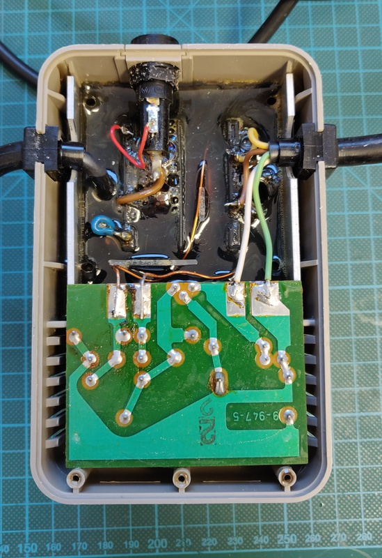

It's this voltage regulator, embedded inside the potted brick which creates the main issue. Over time, they tend  to drift higher, putting more strain on the ICs inside the computer. Eventually they often short, sending the full voltage from the transformer straight to all the sensitive components on the main board, which usually results in many parts failing instantly. 

Luckily we now have modern replacements for these parts which contain safeties to prevent this type of failure in the first place and also generate barely any heat, compared to the original part which gets really hot.

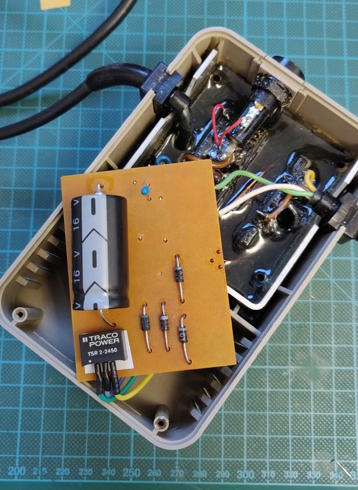

Here I used a Traco Power TSR 2-2450, purchased directly from a certified distributor. It can supply 2A, slightly more than the original 1.5A regulator, which helps to run more demanding cartridges. While I had it open, I also replaced the capacitor with a matching axial model. 

## Clean up and plastic restoration

Now for the biggest challenge, cleaning the Commodore inside and out from top to bottom. The First steps is taking it completely a part and removing the keyboard and all the key caps. It wasn't as dirty as expected:

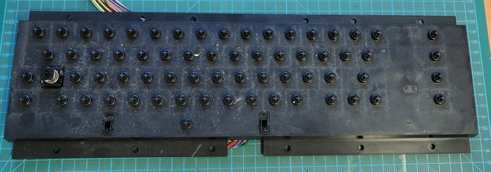

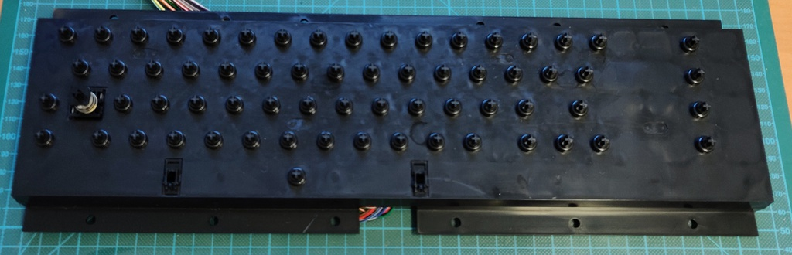

After cleaning the keyboard itself, it was time to put all the keys in soapy water for a quick scrubbing and drying. After which the keyboard can be re-assembled:

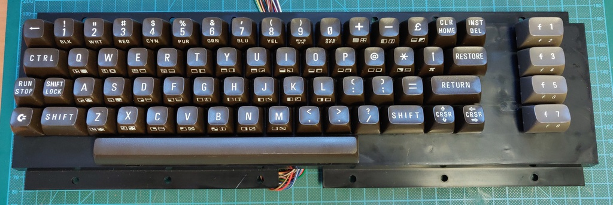

Next came a thorough scrubbing of the top part of the case and a restoration of the plastic colour. Even though this one wasn't very yellowed, it was still quite a transformation!

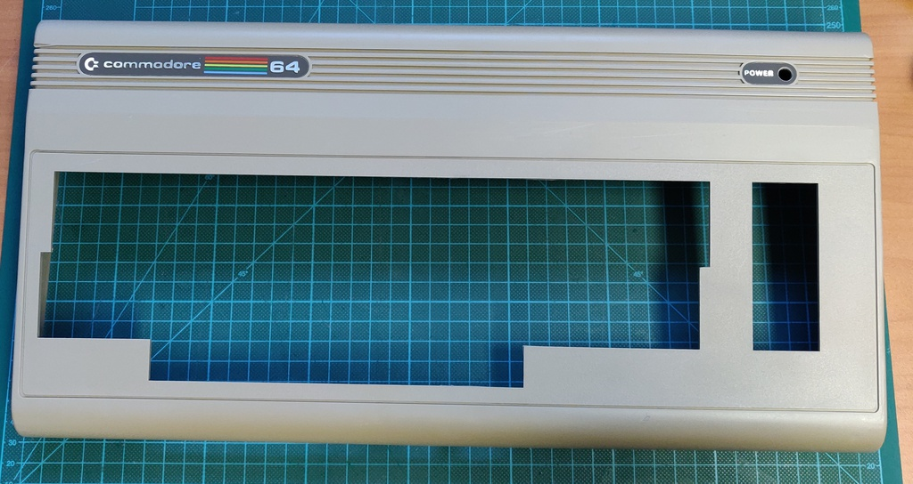

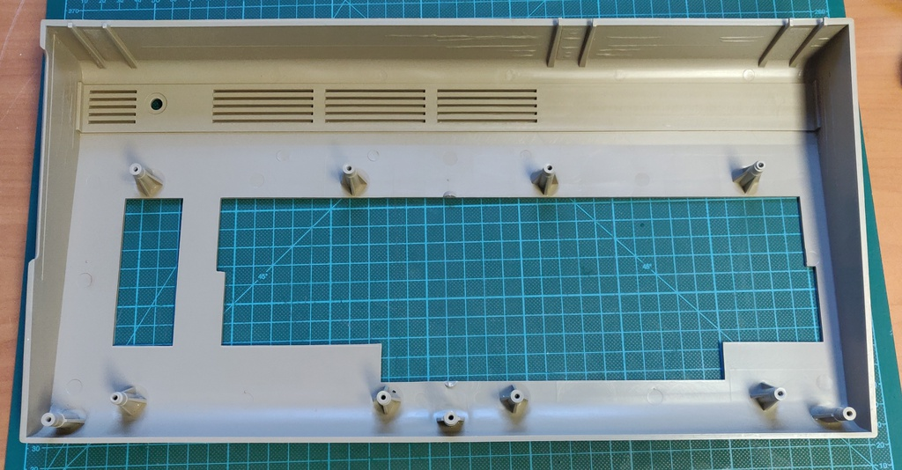

Here is a quick preview of the case assembled back together again, but the bottom half still needs to go through the same process!

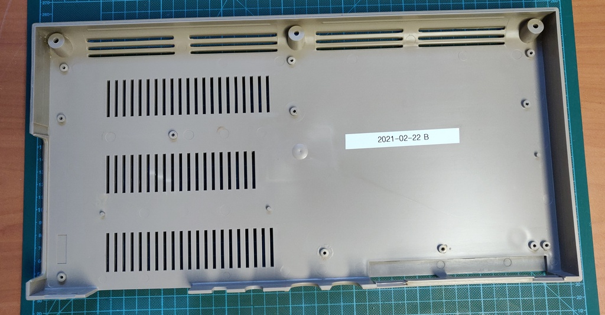
