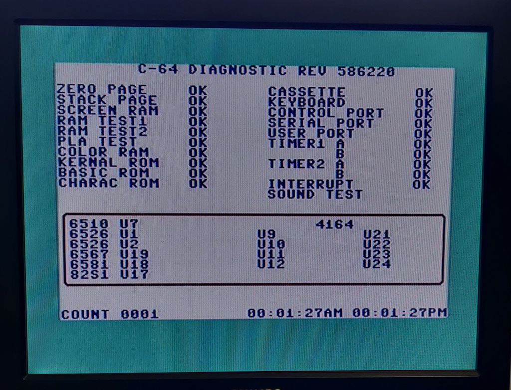

# Commodore 64 breadbin / Assy: 250425 / dark

I bought this C64 unknown / untested in a lot together with another identical model. Both had some issues, but neither appears to have ever been worked on before.

## Initial inspection

Overall the condition was decent, quite dirty, but nothing unexpected:

## Bad memory IC

After powering it on the for the first time BASIC appeared, but there was also some garbage on the screen. After running the diagnostics cartridge it was clear that one or more memory ICs had failed:

Although the picture shows U9 and U11, this would change each time I ran the C64 dead-test cartridge. As it turned out this cartridge is quite unreliable when it comes to determining exactly which IC has failed. After running C64 Diagnostics and Doktor64, they both agreed the issue was with U22, so I went ahead with the replacement. 

Looking at the top of the board, U21 was really standing out as being different from all the other chips:

And once I turned the board around, it was clear that it had been replaced in the past, possibly at the factory, or later on.

I desoldered the IC and replaced it with one from a parts C64 board. Here is a picture of the three ICs next to each other. One replaced at some point in the past, one replaced now and one of the original ICs.

And once I booted it up it passed all diagnostics! (the ones showing BAD here are because the diagnostics harness is not installed)

