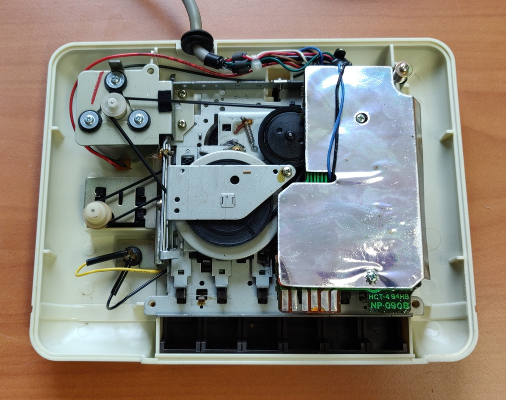

# Commodore C2N Datasette

I purchased this Commodore Datasette as a bundle together with another one and two Commodore 64s. All were offered as untested. 

Here is the finished drive:

## Inspection and cleaning

The overall condition of this drive was very good. Although these drives don't tend to yellow they do attract stains and the cables give off a chemical which can damage the plastic if left in contact together for many years. Often this looks like soldering iron marks, but it's really caused by the cables wrapped around the plastic for tens of years. 

I started off with disassembling the drive to give it a good cleaning before testing.

After cleaning the mechanism it needed a bit of lubrication around the moving parts. I checked the belts, but they were in perfection condition and didn't require replacement.

Next I tested the drive using an old audio tape. I don't have any original data tapes at hand, but I was able to write and read back to the audio tape without issue. 

Here are the plastic parts fully cleaned and ready to be re-assembled. 

This grounding strap was used for the Commodore PET to reduce radio emissions, but the Commodore VIC-20 and 64 don't have the screw to attach it:

A nice trick is to open the connector and push the grounding strap inside, all the wires are fully shielded, so it can't short out anything. It leaves the connector nice and tidy without the loose strap, but allows for it to be easily restored at any time. 

