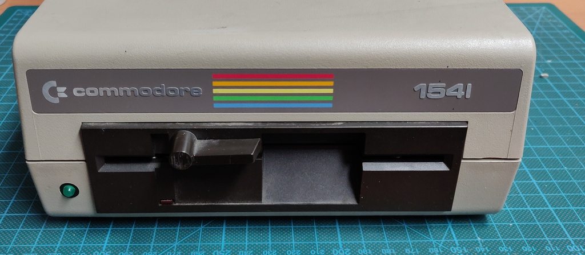
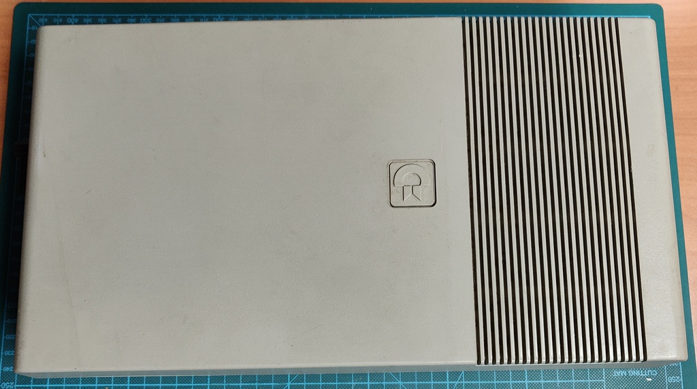
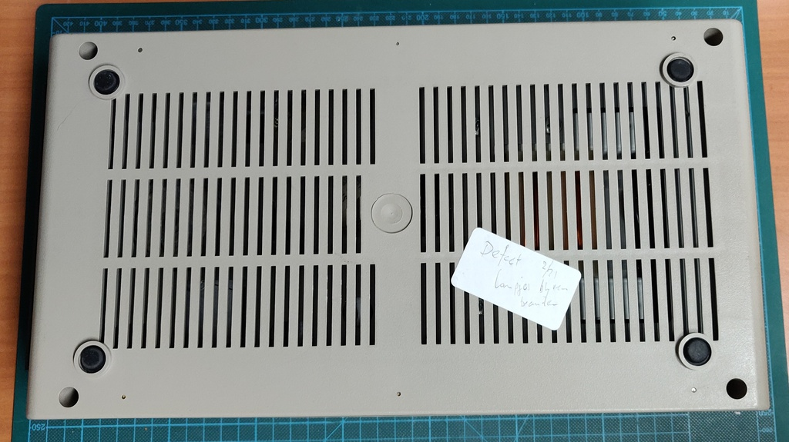
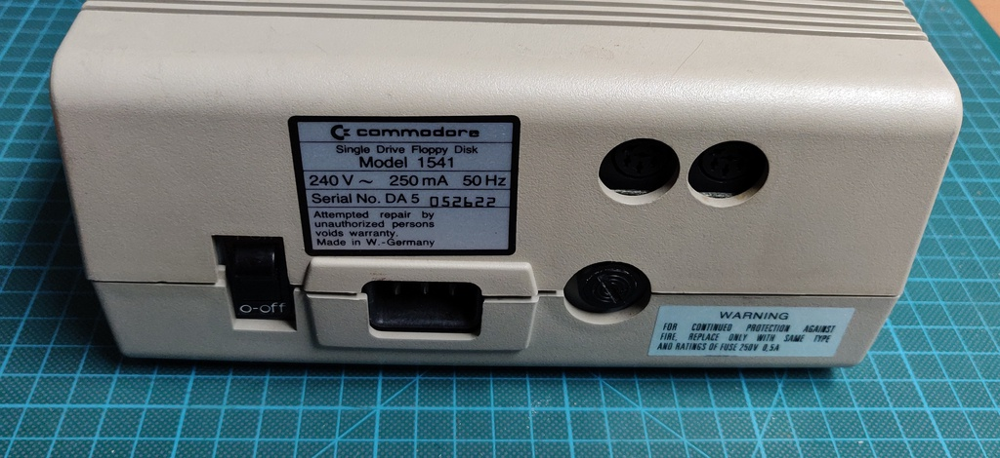
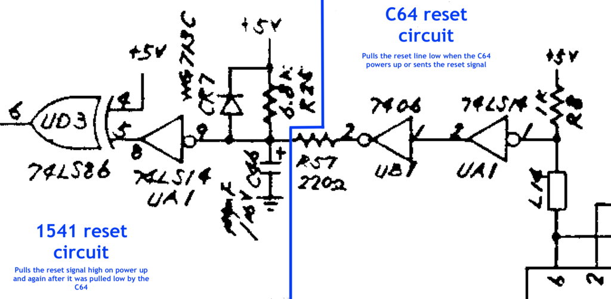
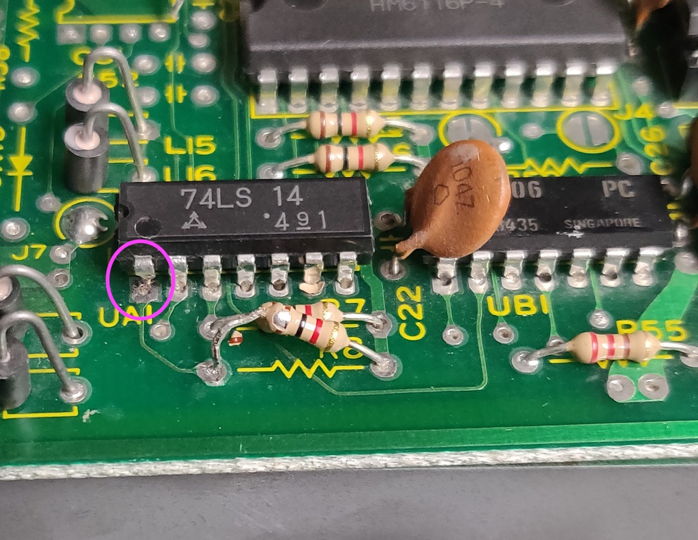

# Commodore 1541 floppy drive (dark)
I purchased this drive in a lot together with a 1451 light model. Both have the Newtronics mechanism and both were sold as faulty.

## Work done so far: 
+ Initial inspection
+ Troubleshooting

## Planned work:
+ Full repair and restoration

## Initial inspection

The drive was overall in very good condition.

## Troubleshooting

Upon power up the drive didn't spin, both LEDs turned out and didn't turn off again. This was a bit surprising since usually the 
drive should be spinning.

All voltages checked out, so time to do more in depth checks with the oscilloscope.

The 1541 is a special beast, it's not just a floppy drive, but a full 8-bit computer in its own right, with a MOS 6502 CPU, RAM, 
ROM and related logic chips. This meant first checking the reset line of the 6502, which unfortunately I was checking on the wrong pin.

This let me to assume that the 6502 was bad, since there were no signals on the data and address bus at all. I pulled the 6502 and was 
about to pull the other socketed chips as well when I suddenly noticed that one of the 6522 I/O ICs was inserted upside down!

Once that was fixed, the drive started spinning again, but still no luck on the 6502 starting properly.

## Reset line

After testing the 6502 in another drive and confirming it was good, I double-checked the schematics and confirmed I was checking the wrong
pin for the reset line, and it turned out the reset line was always low.

I investigated the reset circuit further in the diagram and after a few hours of tracing it around the board between the different logic 
ICs. I finally confirmed there was a short to ground in the signal to pin 1 of UB1 (hex inverter), the very first stage of the C64 side 
of the reset circuit.

First I tested if UB1 was working correctly by shorting the input on pin 1 directly to 5v, which worked perfectly and caused pin 2 to 
go low as expected and the motor and LED to turn off, But somehow the pull-up resistor (RP1 on the diagram but R8 on the board) wasn't 
enough to trigger it.

I spent quite a while longer trying to figure out what could be pulling it low, since I had tested UB1 and confirmed it worked and removing
the IC would be quite a bit of work without a desoldering gun.

Eventually I gave up and just cut pin 1 on UB1 and the short was gone!

