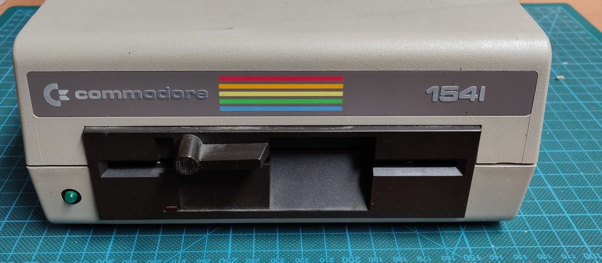

# Commodore 1541 drive - Newtronics mechanism / PCB Assy: 250442
I purchased this drive in a lot together with a 1541c model. Both have the Newtronics mechanism and both were sold as faulty.

This drive had a long list of faults:

+ Low reset line - Caused by UB1 (74LS14 Schmitt trigger hex inverter)
+ No ATN signal from C64 - Caused by another pin on UB1 also being faulty
+ No communication with C64 - Caused by UC3 (MOS 6522 I/O controller), which was originally inserted into UC2 upside down.
+ Open circuit inside read / write head.

I was able to repair all the above, except for the fault read / write head. With no spare read / write heads available, this makes the drive unrepairable. It will be used as a parts drive instead.

## Initial inspection

Overall the drive was in very good condition:

## Troubleshooting

When I first powered up the drive, it didn't spin. Both LEDs turned on and didn't turn off again. 

All voltages checked out, so time to do more in depth checks with the oscilloscope.

The 1541 is a special beast, it's not just a floppy drive, but a full 8-bit computer in its own right, with a MOS 6502 CPU, RAM, 
ROM and related logic. 

I decided to check the reset line of the 6502 first, but I ended up checking the wrong pin! This let me to assume that the 6502 was bad, since there were no signals on the data and address bus at all. I pulled the 6502 and was about to pull the other socketed ICs as well when I suddenly noticed that one of the 6522 I/O ICs was inserted upside down!

Once that was fixed, the drive started spinning again, but still no luck on the 6502 starting properly.

## Reset line

After testing the 6502 in another drive and confirming it was good, I double-checked the schematic and confirmed I was checking the wrong pin for the reset line. It turned out the reset line was always low, which means the 6502 is held in reset all the time.

I investigated the reset circuit further in the diagram and after a few hours of tracing it around the board between the different logic ICs. I finally confirmed there was a short to ground in the signal to pin 1 of UB1 (74LS14 Schmitt trigger hex inverter), the very first stage of the C64 side of the reset circuit.

First I tested if UB1 was working correctly by shorting the input on pin 1 directly to 5v, which worked perfectly and caused pin 2 to go low as expected, followed by the motor and LED turning off. But somehow the pull-up resistor (RP1 on the diagram but R8 on the board) wasn't enough to trigger it.

I spent quite a while longer trying to figure out what could be pulling it low, since I had tested UB1 and confirmed it worked and removing the IC would be quite a bit of work without a desoldering gun.

Eventually I gave up and just cut pin 1 on UB1 and the short was gone!

At this point I was able to manually pull the reset signal high and start the drive, but it still wasn't communicating with the C64 at all and wasn't even resetting when the C64 powered up.

I decided to remove UB1 from the PCB completely for testing and found that not just pin 1-2 was bad, but also pin 5-6 showed bad as well.

## Faulty 6522 and head

After replacing UB1 the drive was starting perfectly and reset with the C64 correctly, but the C64 wasn't receiving any data back and was throwing communication errors.

I straight away remembered the upside down 6522 IC (which ended up in UC3 now) and swapped it out with a known good part. Yet another problem resolved and the C64 was no longer throwing communication errors, but still not reading any data.

Since the drive was passing through all the right steps now, but reading only "@" characters (HEX 00) it was time to check the incoming signals from the head. 

The read signals comes in at pins 1 and 5 of P8 and pass through diodes to UF3 (NE592N14 Video Amp) pins 1 and 14. I checked the signals on the oscilloscope and there was a steady DC voltage, but no AC signal riding on it at all. 

After doing some research I found that there should be continuity between all the wires going to the drive head. All of them checked out, except for pin 5, which was completely open. 

Unfortunately there is no way to repair the read / write head and there are no spares readily available. This means this drive will be used as a parts drive unless I come across a drive which is otherwise unrepairable but has a usable head.