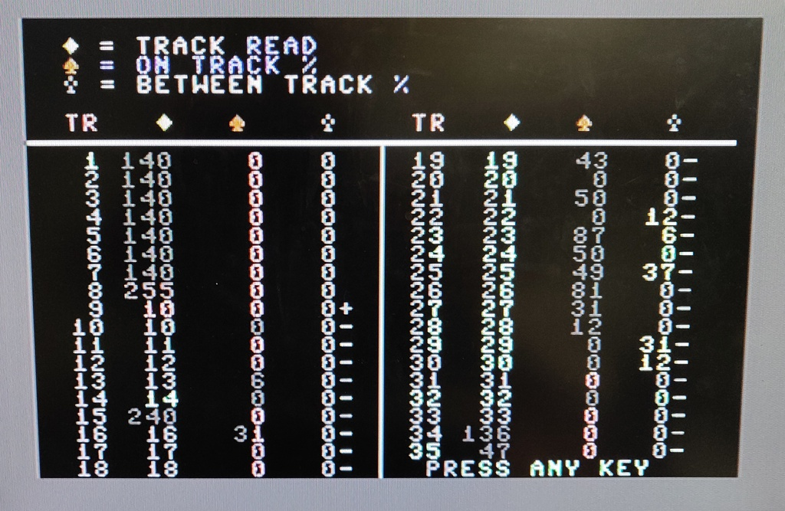

# Commodore 1541c floppy drive
I purchased this drive in a lot together with a 1541 model. Both have the Newtronics mechanism and both were sold as faulty.

This is the last 1541 model sold, it had a reduced number of components and a 'track zero' sensor which was disabled from the
factory. (more on this below)

## Work done so far: 
+ Initial inspection
+ Troubleshooting and repair

## Planned work:
+ Full restoration
+ Possibly Jiffy DOS since the ROM is already writable. 

## Initial inspection

The drive was quite yellowed, but otherwise in decent condition:


## Troubleshooting a dirty head

After a quick look over the drive I powered it up and to my surprise it started normally straight away. I had to double-check the label in the bottom put there by the previous owner, which indicated the drive had read errors.

The drive wasn't particularly dirty inside and in the excitement of it starting I put a floppy into the drive straight away. And as expected, it failed to read even the directory listing. I noticed that the head went right past track 18, which contains the file table, so I suspected a possible alignment issue. 

After booting with Jani's excellent [1541 diagnostics ROM](http://blog.worldofjani.com/?p=2180) I ran the alignment test. During the first run it came with nothing but garbage, all tracks were read as track 0. I ran it a second time to take a picture, and it actually already started to improve a bit:



A third run produced this result and I started to suspect the head might just be dirty or needed demagnetization:


And yes, there was a large piece of extremely stubborn residue on the head, which even the swap with alcohol could barely dissolve:


After getting the head sparkling clean, the results were perfect (or as perfect as I could get with a bad floppy)

<!-- Add picture of cleaned head -->


<!-- replace img_008.jpg with a good disk -->

## The track zero sensor

I thought I completely resolved the issues with this drive, but no luck, after restarting into Basic and trying to load up a game from a known good floppy, the head would just run into the end of the rails, chatter against the end stop and fail to read anything. I figured that maybe the tests had left the drive in a weird state, so I power cycled both the drive and the C64. 

After this the drive successfully homed, and I was able to get the directory listing and load a game. But after resetting the C64 I attempted to load another game and ran into the same issue again. Even sending a reset to the drive using the below command didn't work:

```
OPEN15,8,15:PRINT#15,"I0":CLOSE15
```

It was time to start-up Jani's 1541 diagnostics cartridge again, this time I ran the head exerciser program. I noticed that I was able to move the head backwards and forwards, but if I would chose track 0 or track 18, it would usually fail. 

This made me think that maybe somehow the drive was somehow 'forgetting' on which track it was. I started to do a lot of research on how exactly the track information is stored, especially [SAMS 1541 troubleshooting & Repair guide](https://usermanual.wiki/Pdf/SAMSCommodore1541TroubleshootingRepairGuide.423279469/view) by Michael G. Peltier was an excellent resource, but nothing really got me any closer.

Then I decided to go and look for known issues with the 1541c revision, since I knew it had some different behaviors compared to the other 1541 revisions. Soon I came across the Track Zero sensor, which had been installed to avoid the noisy 'chatter' during the startup and formatting operations in most 1541's. But it turned out that this caused some compatibility issues, in particular it often caused the drive to lose track of the head position(!) so all 1541c drives ended up shipping with a closed jumper on the PCB which prevented the sensor from operating and returned the drive to the original behavior. 

I quickly checked my drive and there it was, jumper J3 had been cut:


Apparently this was quite a common mod for 1541c owners to perform, since it made the drives much more quiet during startup, but clearly it also caused my issue.

One little blob of solder later, and I found my drive to be in perfect working order again!

<!-- Add picture of said blob -->