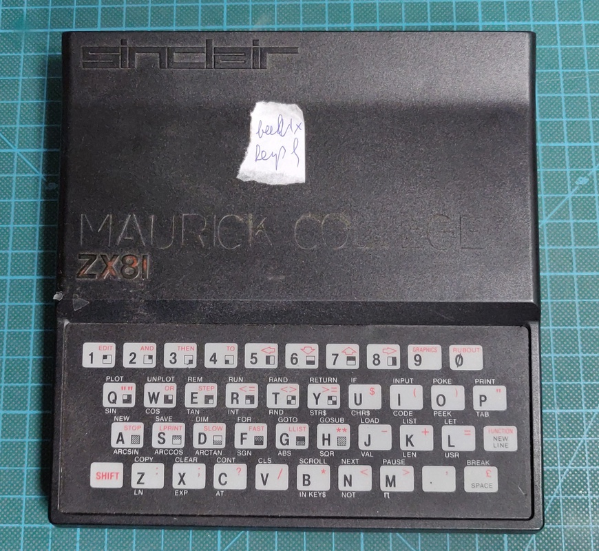
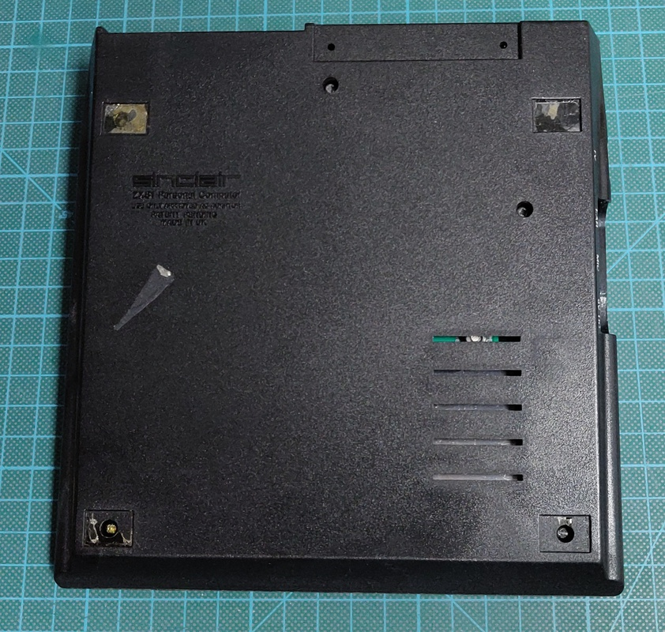
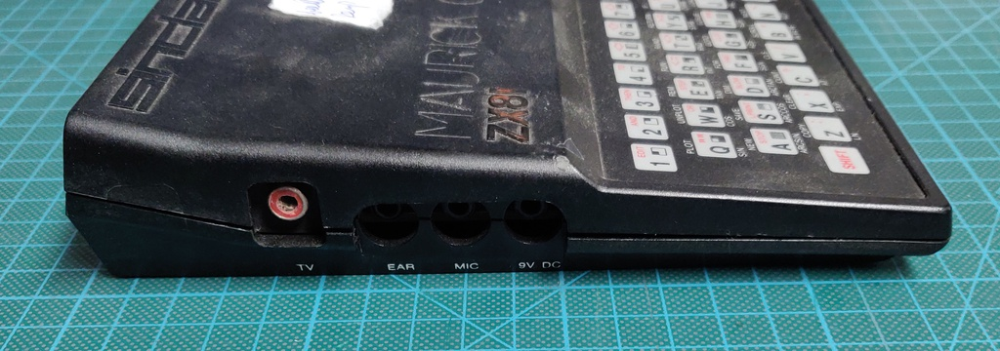
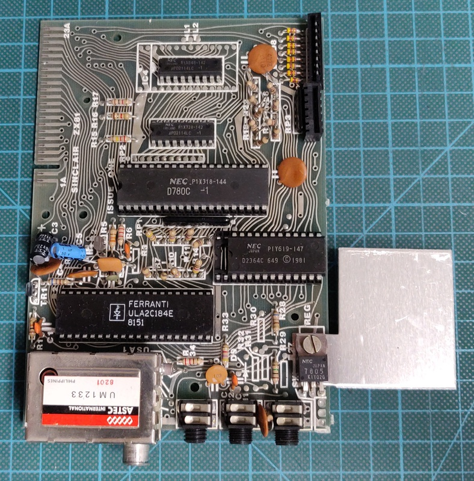

# Sinclar ZX81 
Model: Issue One / 2C184E ULA / Dual RAM ICs

I purchased this ZX81 in a lot together with several other computers, RAM expansions, printers and casettes.

# Inspection and initial troubleshooting:

My TV was not able to sync with the image generated by the computer. Once I opened it up I found that it has a early 2C184E ULA, which is known to generate a video signal which is not compatible with most newer TVs. 

After makaking a simple composite mod I was able to get it working without further issue.

