# Sinclar ZX81 
Model: Issue One / 2C184E ULA / Single RAM IC

I purchased this computer in a lot together with several other ZX81s. They were sold as faulty, but this specific model was working perfectly as designed. Unfortunately 'as designed' in this case meant there was no usable video on modern TVs. 

A lot of people make destructive modifications to these computers, but I like to preserve the original as much as possible. So all upgrades done are fully reversible, even the memory, although the original 1K ram IC did have to be removed.

#### Work done:
+ Inspection and testing
+ Keyboard replaced
+ CPU replaced
+ Reversible composite video upgrade
+ Reversible 16K RAM upgrade
+ Full cleaning inside and out
+ Paint touch ups

And here is the final result:

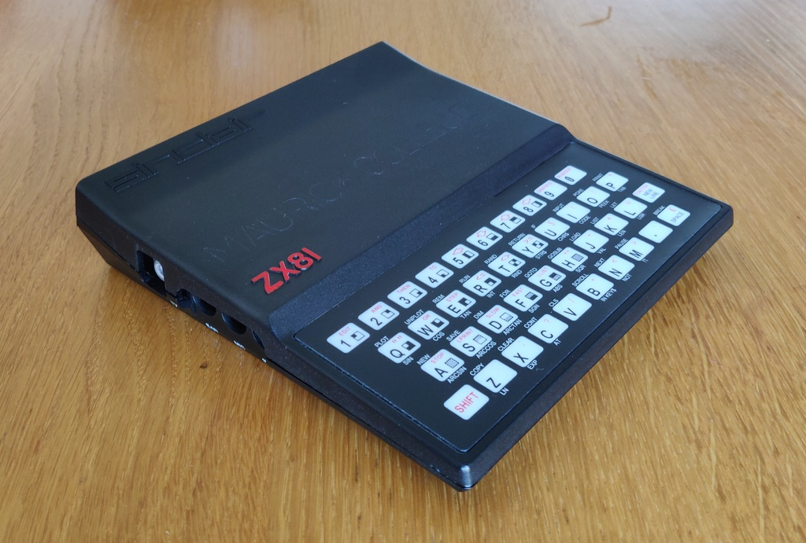

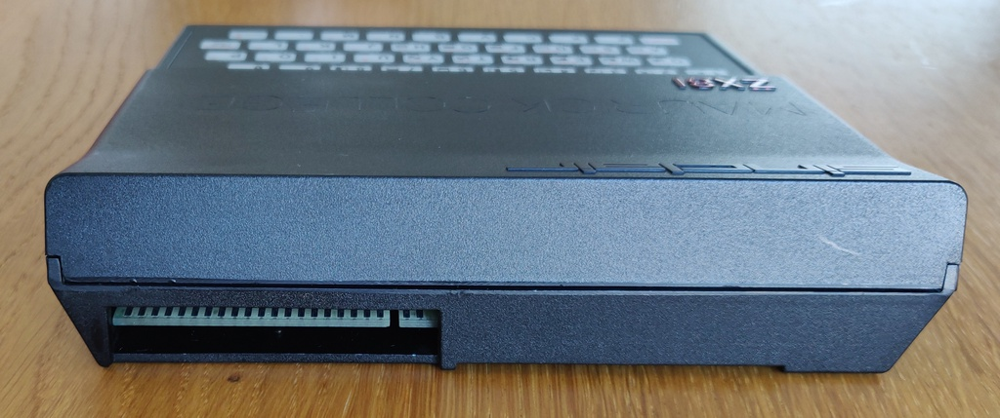

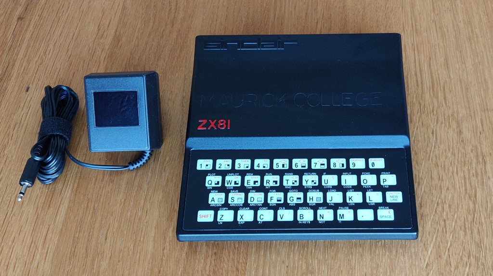

# Inspection and initial troubleshooting:
When opening the computer the first thing I found was a broken keyboard membrane.

This ZX81 was showing a completely blank screen on power up and after some troubleshooting I found the Z80 CPU to be faulty.

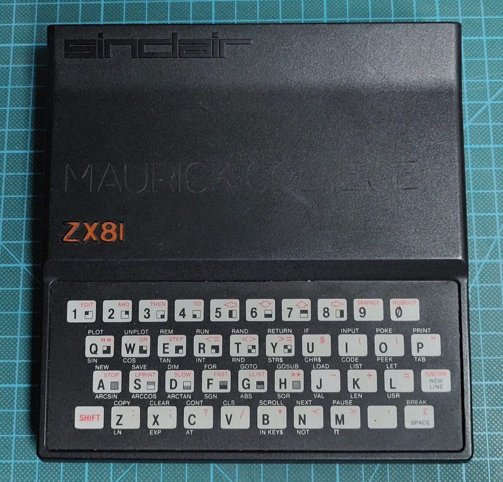

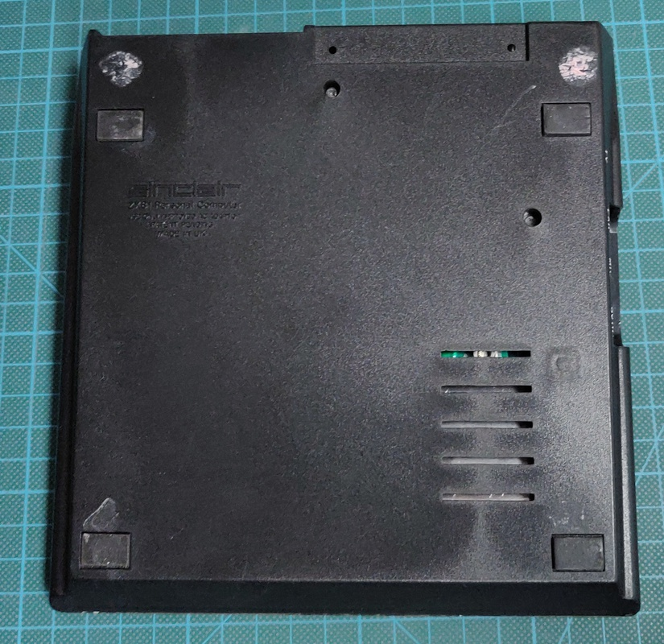

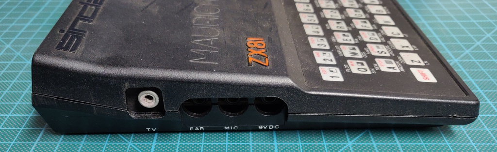

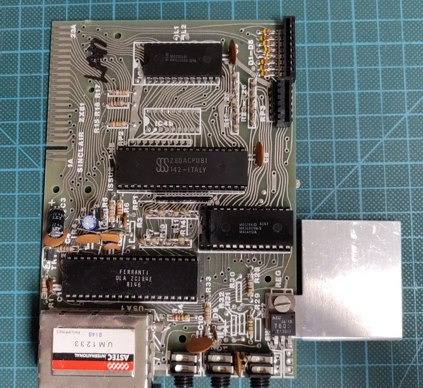

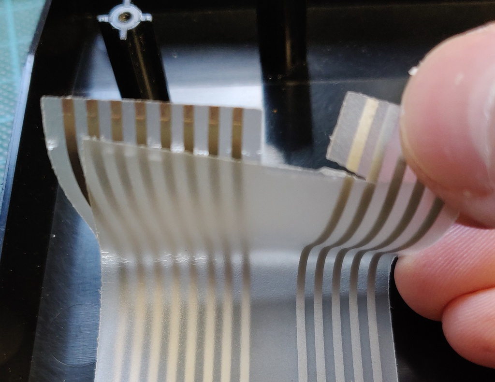

# Keyboard replacement

I purchased a brand-new replacement keyboard, the old one can simply be peeled off of the plastic and the new membrane is applied.

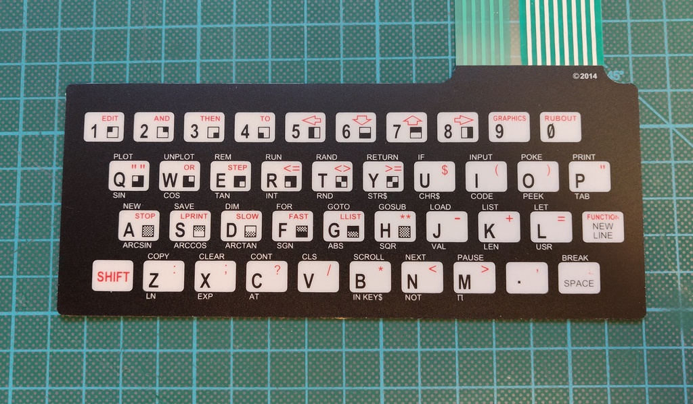

# Composite video upgrade
My TV wasn't able to sync with the image generated by the computer, leaving the screen just blank. This is caused by an early 2C184E ULA, which is known to generate a video signal which is incompatible with most colour TVs. 

I worked on a few different designs, which are documented on this [page](../2021-03-20_Sinclair_ZX81_video_board). In the end I found that the solution of sinclairworld.com user [Pokemon](https://www.sinclairzxworld.com/viewtopic.php?f=6&t=840) gave an absolutely amazing result by not just adding the required back porch, but actually recreating the whole signal. Unfortunately it wasn't available for sale anywhere at the time of writing, so I ended up designing a similar circuit using the 74HC04 logic IC instead. 

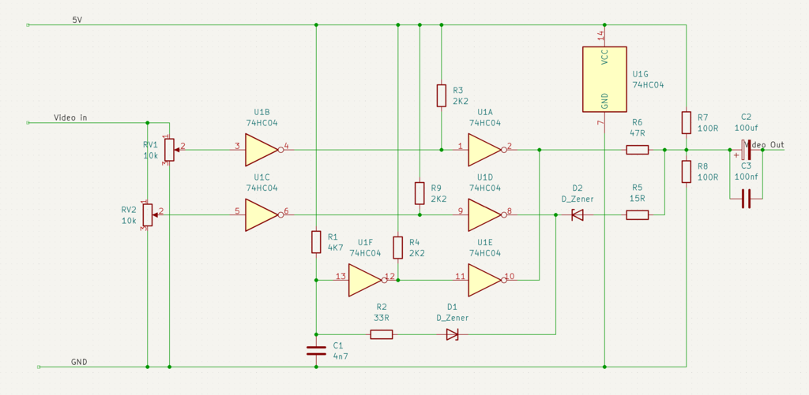

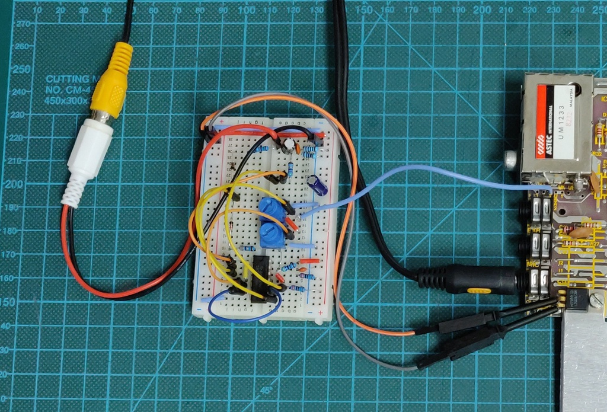

Here is the final board ready to be installed:

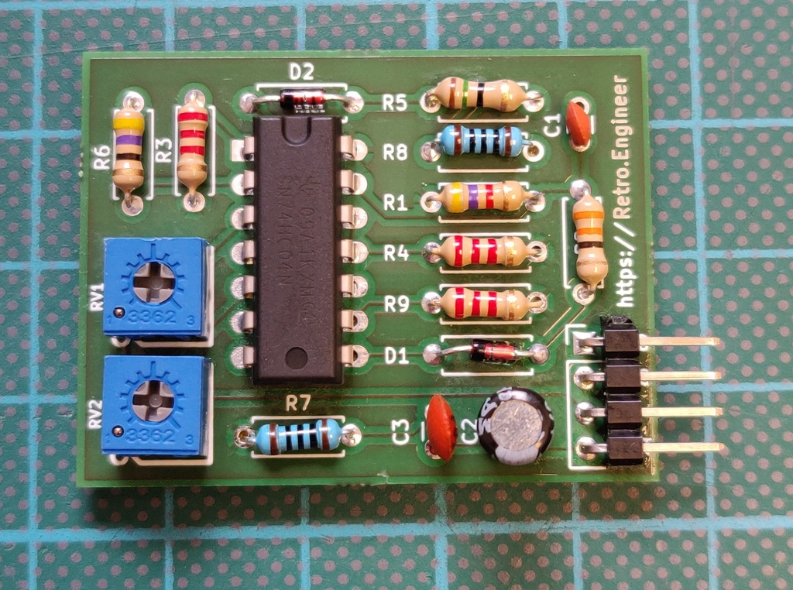

Some pictures of the installation:

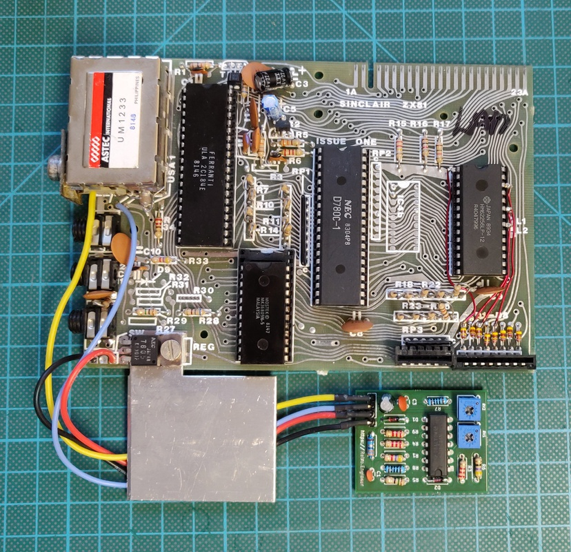

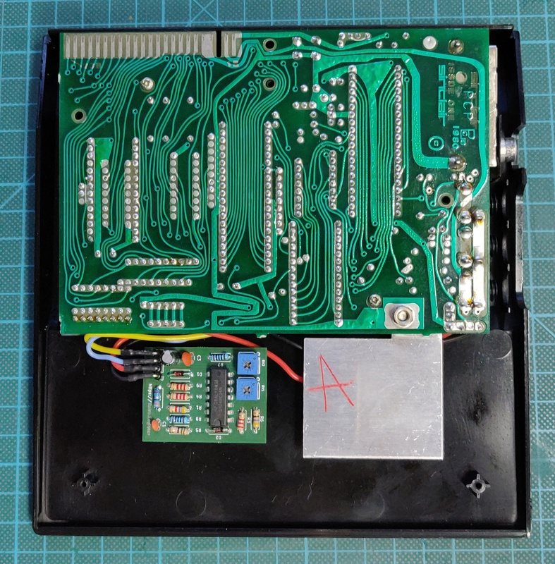

And lastly the end result on a TV:

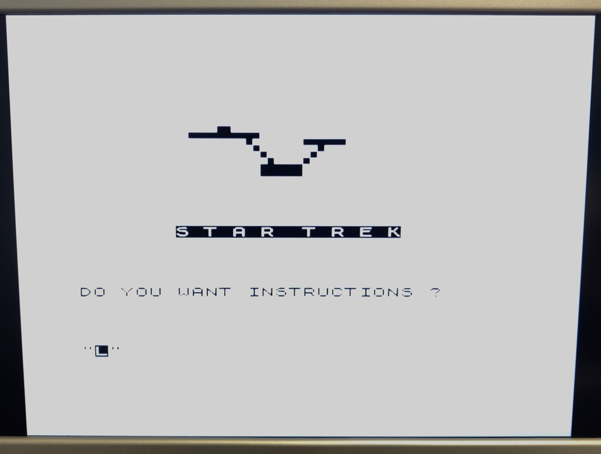

# 16K ram upgrade
As standard the ZX81 comes with 1 KB or RAM, which even in 1981 was very little. There is a 16 KB RAM expansion pack which addresses this, but because it's about half the size of the computer itself, it's not very practical and easily disconnects, instantly crashing the computer. 

Luckily it's quite easy to upgrade the memory of the ZX81 to 16K without any permanent modifications. All it requires is a socket, a replacement 16K or 32K SRAM IC and a few wires. Below I used a 32 KB memory IC because they're more common, but only 16 KB is actually usable, which is enough for almost all applications and games.

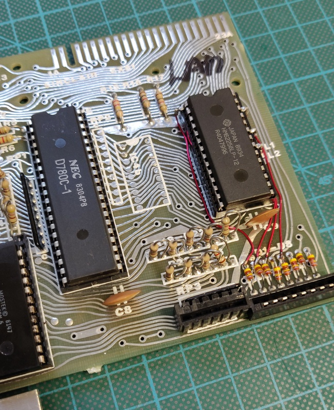

Some pins of the memory IC are bend out of the socket and instead connected directly to the following diodes, which allows it to be used as 16 KB:

+ Pin  1 -> D1
+ Pin 21 -> D2
+ Pin 23 -> D3
+ Pin 26 -> D5

No tracks needed to be cut for this upgrade, so it can be easily reversed by placing a 1 KB IC and removing the additional wires. 
