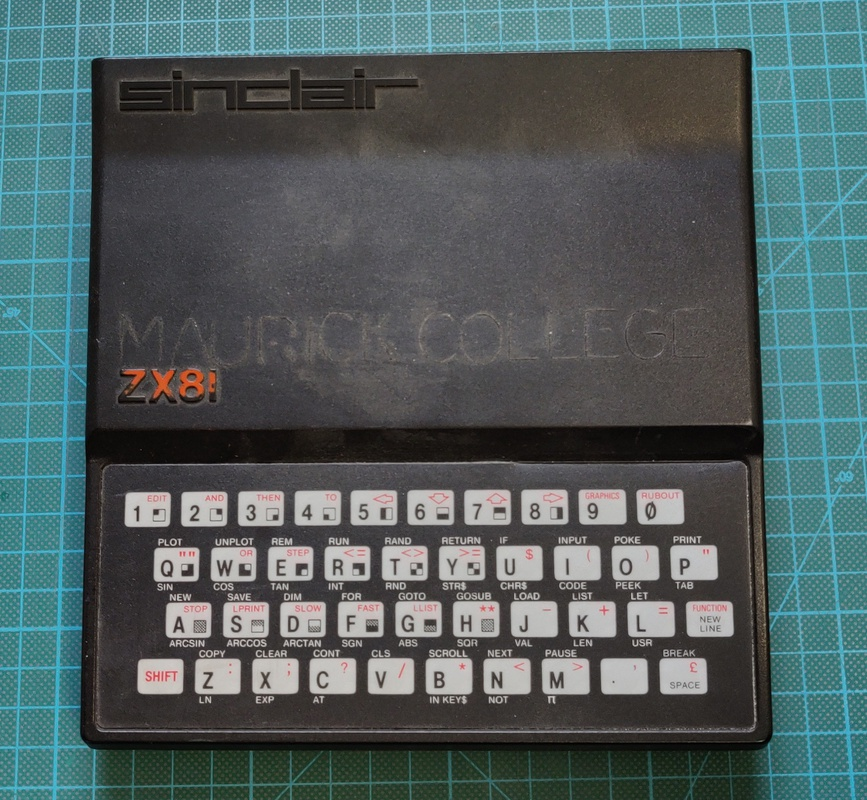
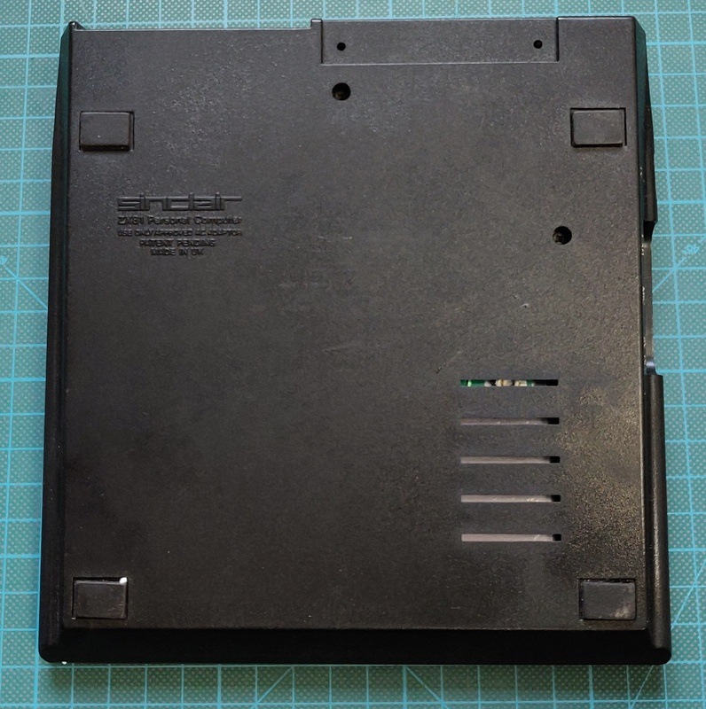
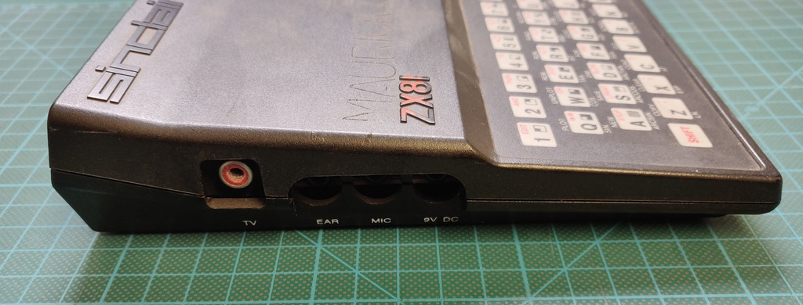
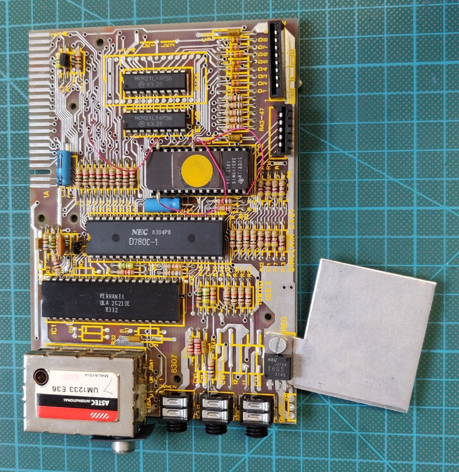

# Sinclar ZX81 
Model: Issue One / 2C184E ULA / Dual RAM ICs

I purchased this ZX81 in a lot together with several other computers, RAM expansions, printers and casettes.

# Inspection and initial troubleshooting:

The keyboard membrane is showing some cracks

This ZX81 was showing a completely blank screen on power up and after some troubleshooting I found the ULA to be faulty.

My TV was not able to sync with the image generated by the computer, this is caused by an early 2C184E ULA, which is known to generate a video signal which is not compatible with most newer TVs. 

