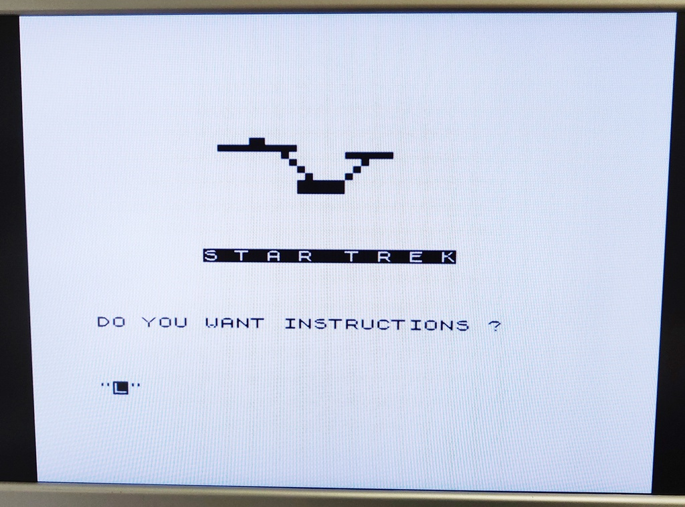

# Sinclar ZX81 
Model: Issue One / 2C184E ULA / Dual RAM ICs

I purchased this computer in a lot together with several other ZX81s. They were sold as faulty, but this specific model was working perfectly as designed. Unfortunately 'as designed' in this case meant there was no usable video on modern TVs. 

A lot of people make destructive modifications to these computers, but I like to preserve the original as much as possible. So all upgrades done are fully reversible, even the memory, although the original 1K ram IC did have to be removed.

#### Work done:
+ Inspection and testing
+ Replaced faulty ULA with vLA81 board
+ Composite video modification
+ Reversible 16K RAM upgrade
+ Full cleaning inside and out
+ Paint touch ups

And here is the final result:

# Inspection and initial troubleshooting:

The keyboard membrane is in great condition

This ZX81 was showing a completely blank screen on power up and after some troubleshooting I found the ULA to be faulty.

Even after swapping the ULA with one from another board my TV was not able to sync with the image generated by the computer, this is caused by an early 2C184E ULA, which is known to generate a video signal which is not compatible with most newer TVs. 

# ULA replacement
Rather than using an original replacement I decided to purchase a [vLA81](https://vdrivezx.com/vla81/) board. Aside from being a fully compatible ULA replacement it also provides support for composite output straight out of the box. 

After installing the ULA all I had to do was disconnect the original RF modulator and connect the video output of the ULA directly to the original RF output connector. This provides great quality composite video output using the original connector and no permanent changes are made, making it fully reversible.

# 16K ram upgrade
As standard the ZX81 comes with 1 KB or RAM, which even in 1981 was very little. There is a 16 KB RAM expansion pack which addresses this, but because it's about half the size of the computer itself, it's not very practical and easily disconnects, instantly crashing the computer. 

Luckily it's quite easy to upgrade the memory of the ZX81 to 16K without any permanent modifications, especially since this computer already came with the memory socketed. Below I used a 32 KB memory IC because they're more common, but only 16 KB is actually usable, which is enough for almost all applications and games.

Some pins of the memory IC are bend out of the socket and instead connected directly to the following diodes, which allows it to be used as 16 KB:

+ Pin  1 -> D1
+ Pin 21 -> D2
+ Pin 23 -> D3
+ Pin 26 -> D5

No tracks needed to be cut for this upgrade, so it can be easily reversed by placing a 1 KB IC and removing the additional wires. 