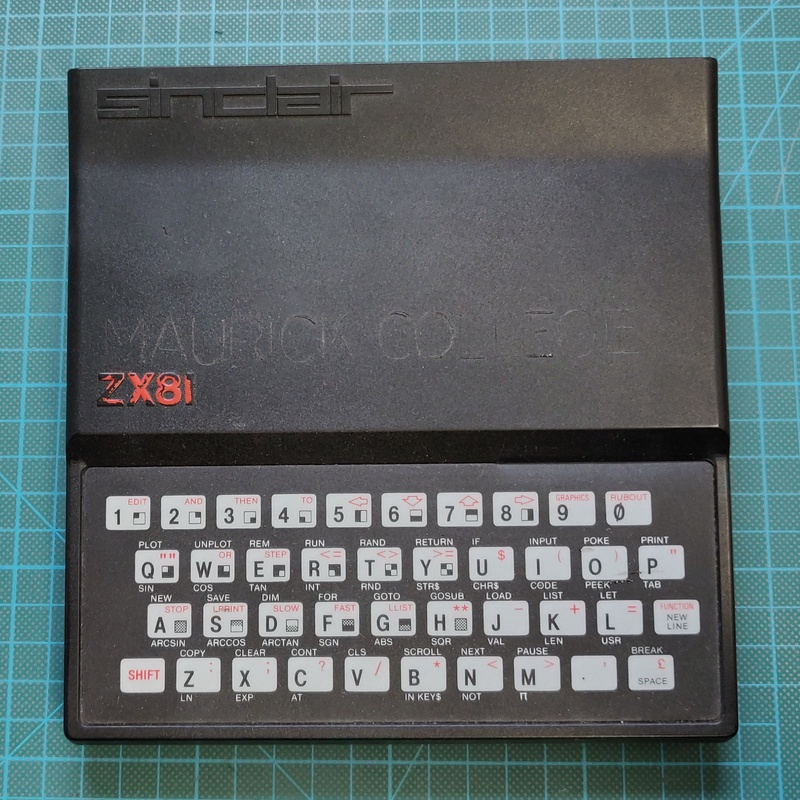
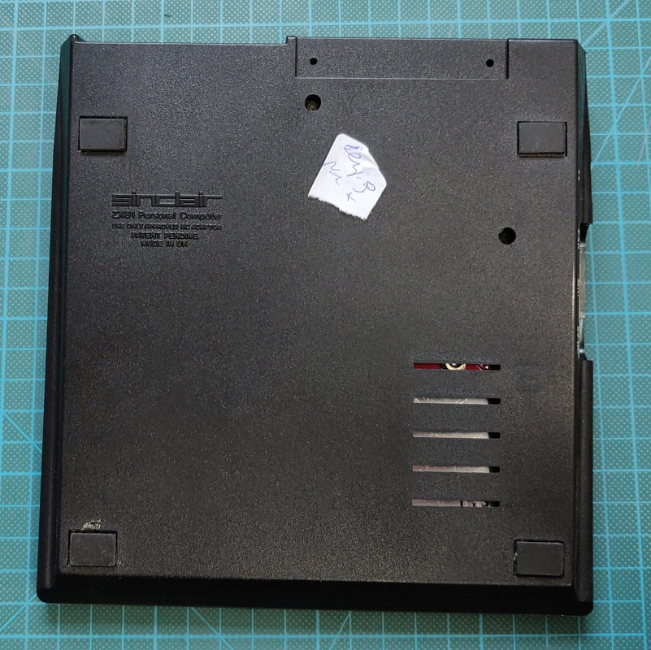
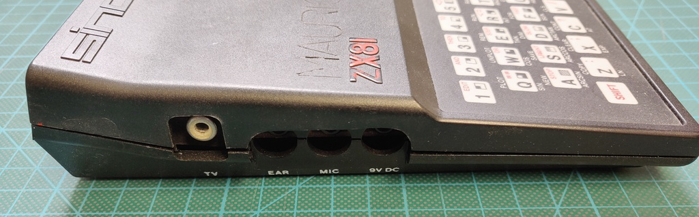
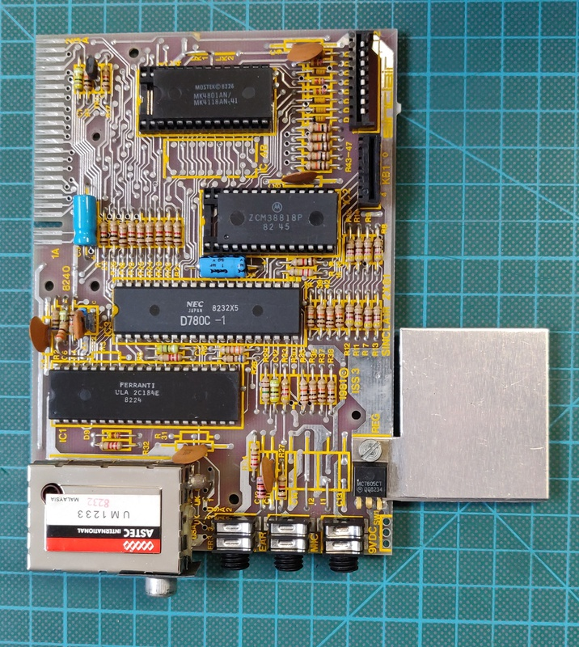
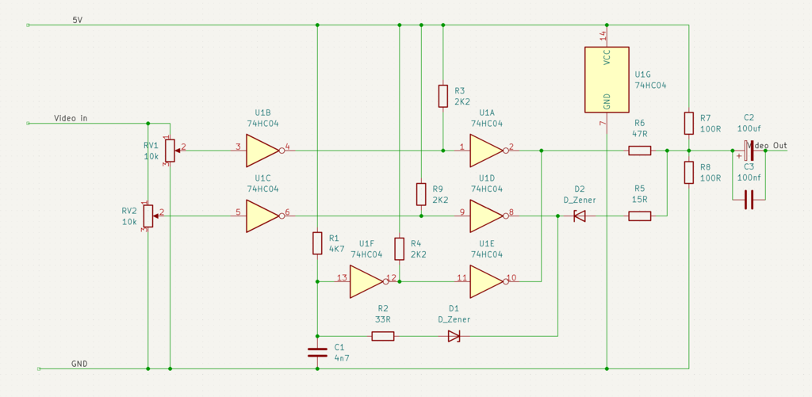
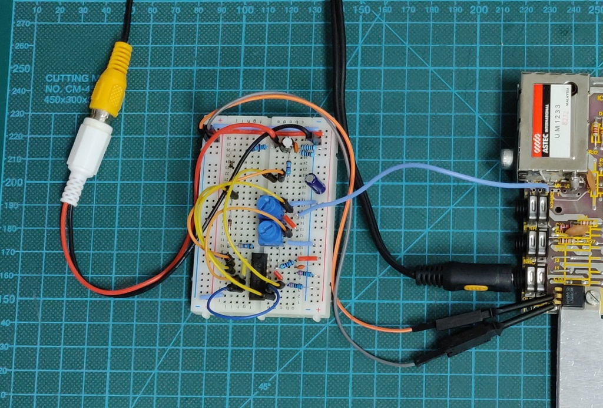
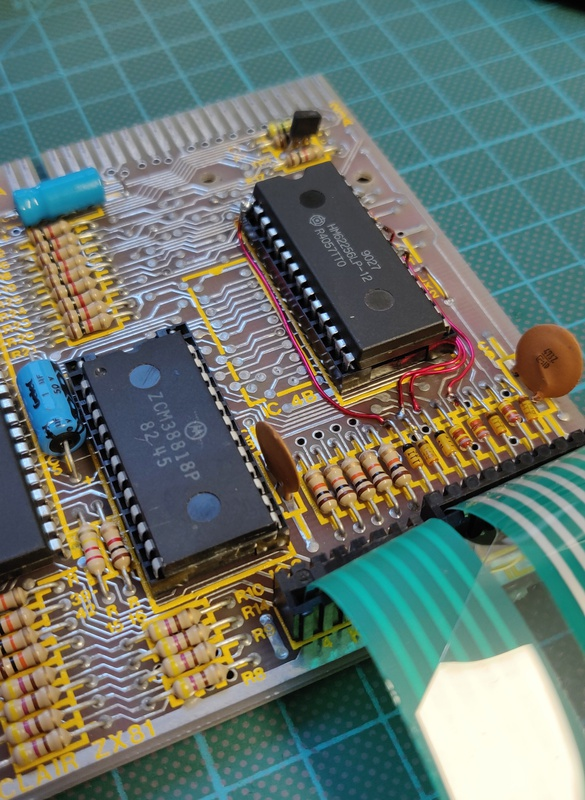

# Sinclar ZX81 
Model: Issue One / 2C184E ULA / Dual RAM ICs

I purchased this ZX81 in a lot together with several other computers, RAM expansions, printers and cassettes.

#### Work done so far
+ Inspection and testing
+ Reversible 16K RAM upgrade

#### Planned work
+ Reversible composite video upgrade

# Inspection
Here are some pictures of the computer as I purchased it:

# Reversible composite video upgrade
My TV was not able to sync with the image generated by the computer, this is caused by an early 2C184E ULA, which is known to generate a video signal which is not compatible with most colour TVs. 

I worked on a few different designs, which are documented on it this [page](../2021-03-20_Sinclair_ZX81_video_board). In the end I found that the solution of sinclairworld.com user [Pokemon](https://www.sinclairzxworld.com/viewtopic.php?f=6&t=840) gave an absolutely amazing result by not just adding the required back porch, but actually recreating the whole signal. Unfortunately it wasn't available for sale anywhere at the time of writing, so I ended up designing a similar circuit using the 74HC04 logic IC instead. 

I'm currently waiting for the PCBs to arrive from the factory.

# 16K ram upgrade
As standard the ZX81 comes with 1 KB or RAM, which even for 1981 was extremely low. The majority of games and applications require 16 KB or RAM. There is a 16 KB RAM expansion pack which addresses this, but because it's about half the size of the computer itself, it's not very practical and easily disconnects crashing the computer. 

Luckily it's quite easy to upgrade the memory of ZX81 to 16K without any permanent modifications, especially since this computer already came with the memory socketed. Below I used a 32 KB memory IC because they're more common, but only 16 KB is actually usable, which is enough for almost all applications.

Some pins of the memory IC are bend out of the socket and instead connected directly to the following diodes, which allows it to be used as 16 KB:

+ Pin  1 -> D1
+ Pin 21 -> D2
+ Pin 23 -> D3
+ Pin 26 -> D5

No tracks need to be cut for this upgrade, so it can be easily reversed by placing a 1 KB IC and removing the additional wires. 