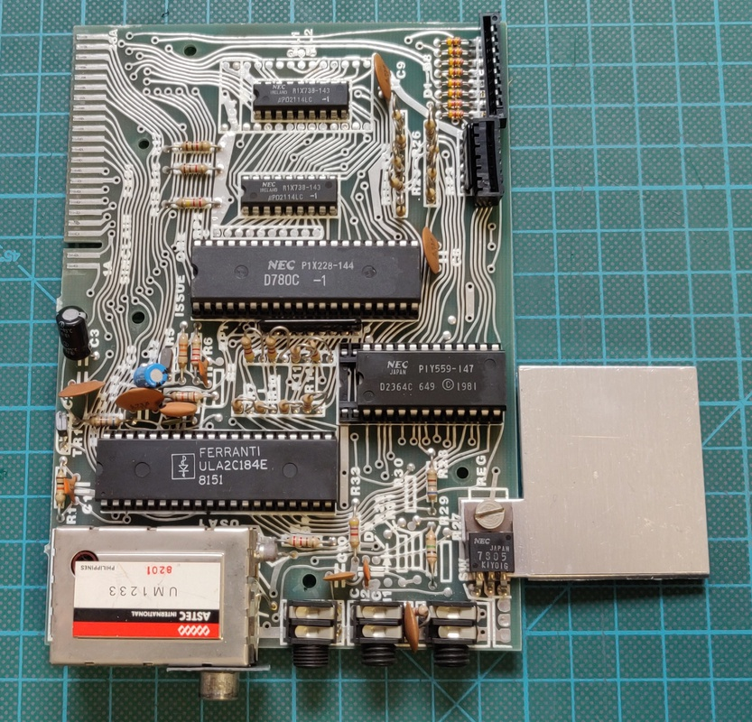

# Sinclar ZX81 
Model: Issue One / 2C184E ULA / Dual RAM ICs

I purchased this ZX81 in a lot together with several other computers, RAM expansions, printers and casettes.

# Inspection and initial troubleshooting:
When I tried powering it up I found that there was no image on the TV at all. When I opened it up I found that this is a realy early issue one board and 2C184E ULA which doesn't generate a correct video signal (more on the below). I rigged up a temporary workaround for testing and found it was actually working perfectly.

# Keyboard replacement
The original keyboard membrane was completely dried out and cracked. I ordered a replacement and installed it. 

Here is a picture of the original keyboard removed:

# Composite video upgrade
My TV wasn't able to sync with the image generated by the computer, leaving the screen just blank. This is caused by an early 2C184E ULA, which is known to generate a video signal which is incompatible with most colour TVs. 

I worked on a few different designs, which are documented on this [page](../2021-03-20_Sinclair_ZX81_video_board). In the end I found that the solution of sinclairworld.com user [Pokemon](https://www.sinclairzxworld.com/viewtopic.php?f=6&t=840) gave an absolutely amazing result by not just adding the required back porch, but actually recreating the whole signal. Unfortunately it wasn't available for sale anywhere at the time of writing, so I ended up designing a similar circuit using the 74HC04 logic IC instead. 

Here is the final board ready to be installed:

Some pictures of the installation:

And lastly the end result on a TV:

