# Sinclair ZX81 Video Board
To make the Sinclair ZX81 usable on modern TVs, the first step is to perform a 'composite mod', this converts the RF (antenna) output of the ZX-81 into a composite signal by bypassing the RF modulator. Usually a transistor is added to amplify the signal coming from the ULA. 

This works perfectly on later ZX81 models, but because early versions don't generate a correct PAL video signal there will be no image at all or a very dark image on most colour TVs, even using a CRT won't help in this case.

Here is what an ideal composite sync pulse should look like:

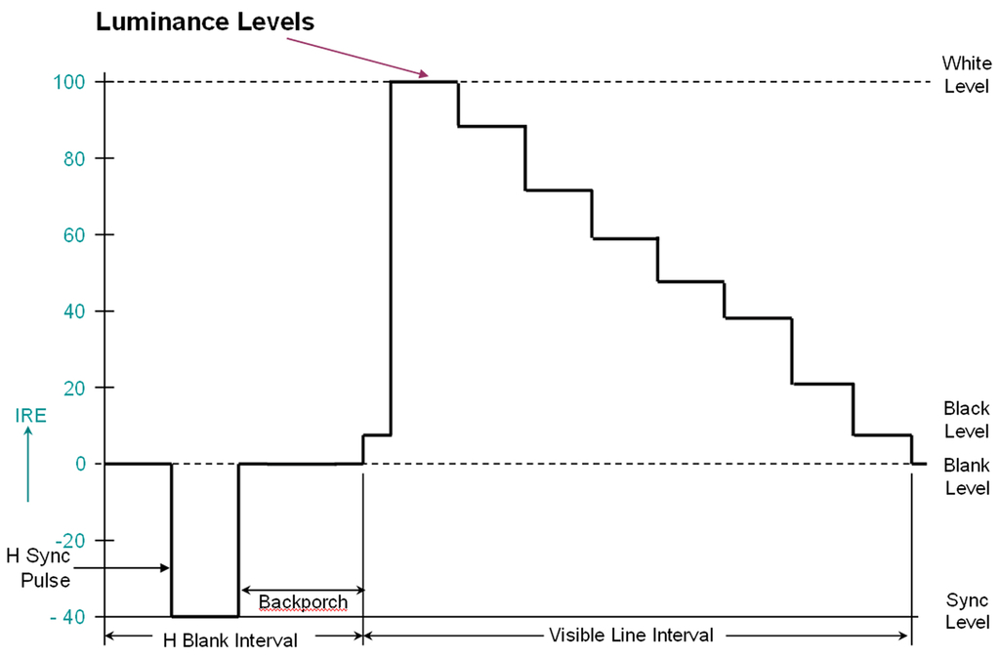

The 'back porch' section is used by the TV to set the black or blank level, this way it knows that any signal above this level indicates a lighter pixel. On models with the 2C184E ULA this section is completely missing and instead the signal goes straight to full white. 

This is an oscilloscope trace of the original signal (blue) with the fixed signal overlaid (yellow), in addition to adding the back porch the peak to peak voltage of the signal has also been reduced to nearly 1v to match the composite specification.

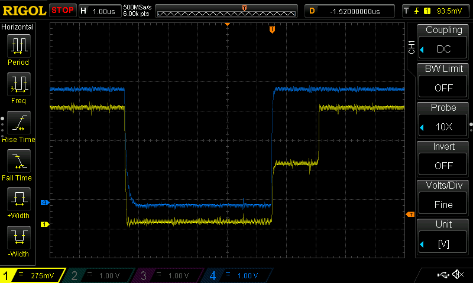

# Solution

I ended up having issues making the below circuit work correctly with different TVs without having to make adjustments to the potentiometers. I therefore abandoned this design and instead used the solution of sinclairworld.com user [Pokemon](https://www.sinclairzxworld.com/viewtopic.php?f=6&t=840) which gives absolutely amazing results by not just adding the required back porch, but actually recreating the whole signal. Unfortunately it wasn't available for sale anywhere at the time of writing, so I ended up designing a similar circuit using the 74HC04 logic IC instead. 

For this reason I no longer plan on selling these boards, but will make the design available on GitHub once I have received and tested the PCBs from the factory.

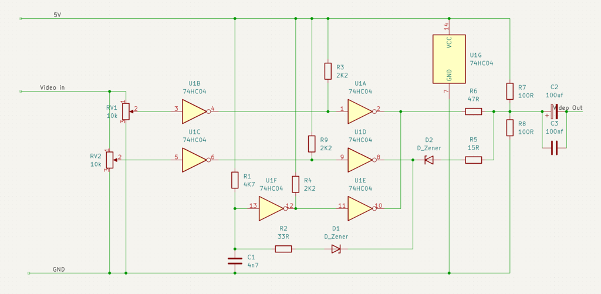

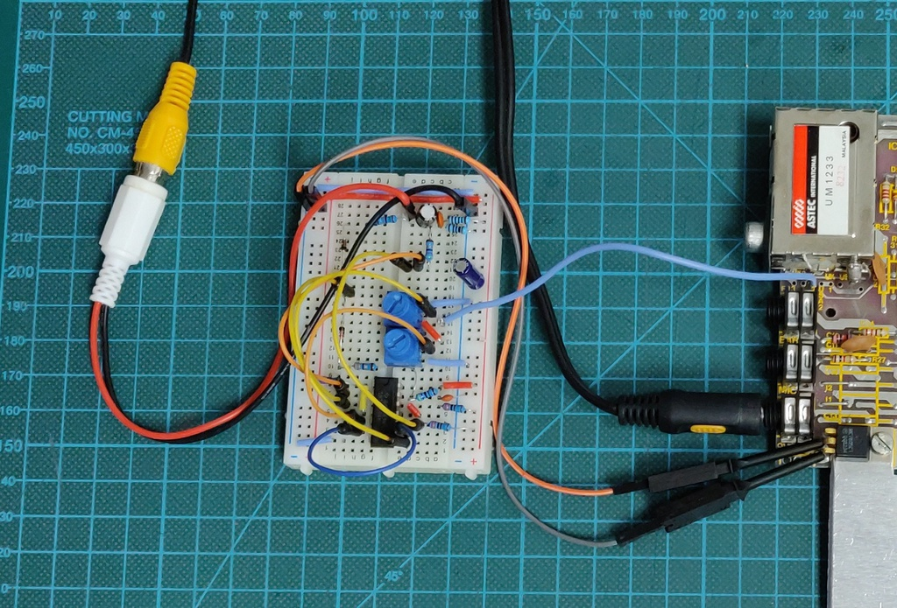

The remainder of this page documents my original circuit.

#### Finished PCB

The final PCBs will be ordered soon, but here is a rendering for now:

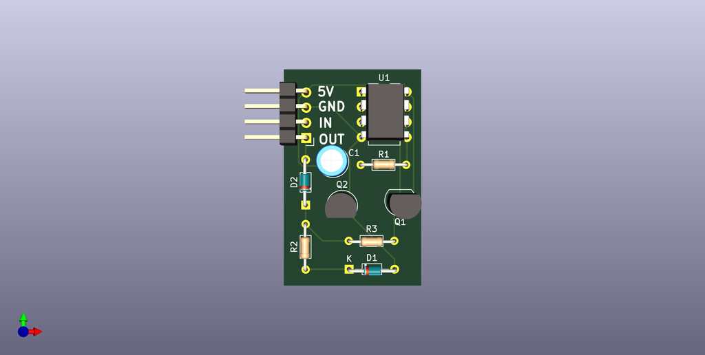

#### Schematic 

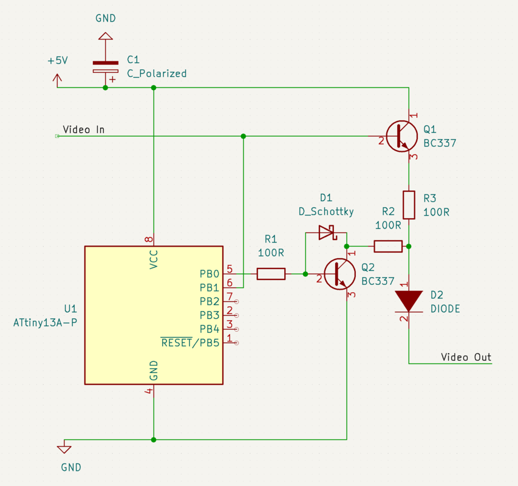

The original video signal from the ULA is passed both to the microcontroller and Q1 for amplification. The latter is done to ensure a minimal amount of current is drawn from the ULA. 

When the microcontroller detects the sync pulse it waits for a preconfigured delay before activating Q2. This creates a voltage divider between Q1 and Q2 which generates the back porch. D1 ensures that Q2 turns off faster to generate a cleaner signal. 

Lastly D2 is used to drop the voltage of the signal to 1v peak to peak as required by the composite specification.

#### Required parts:

Most of the components don't require a very precise value, but unless specified, only the component values below were actually tested. If you decide to make this board yourself an oscilloscope is probably required to properly adjust the timings.

| Component     | Value              | Description  |
| ------------- |--------------------| -----|
| C1            | 100uF electrolytic | This is used to provide a stable input voltage for the microcontroller and can be substituted with any reasonable value.  |
| D1            | Schottky diode     | Can be substituted with most diodes, but Schottky is preferred |
| D2            | Signal diode       | Can be substituted with 1 or multiple fast switching diodes, as long as the voltage is dropped sufficiently |
| Q1, Q2        | BC337              | Timing might need to be adjusted if changed. | 
| R1, R2, R3    | 100 Ω 1/8w          | Values are not very critical, but R2 and R3 need to be chosen properly to ensure the correct voltage drop for the back porch.     |
| U1            | ATtiny13a          | Any Arduino compatible microcontroller should work, ATtiny13a, ATtiny85 and ATmega328P were tested |
| ------------- |--------------------| -----|

#### First Prototypes

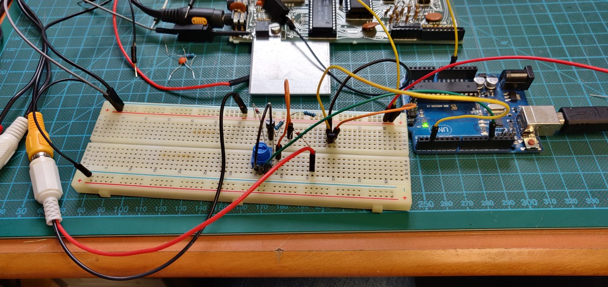

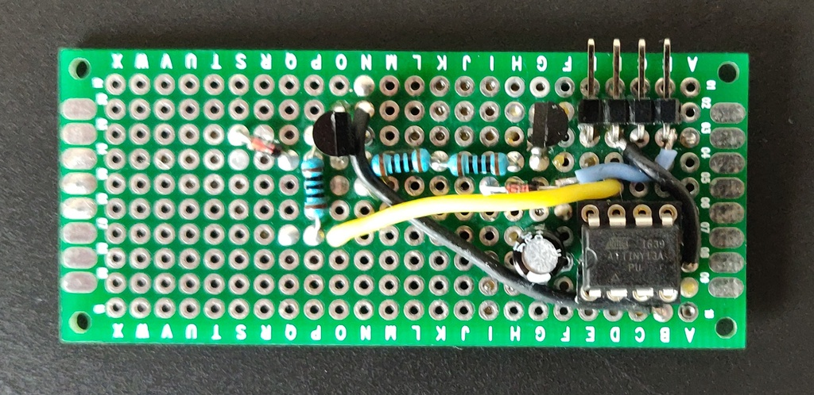

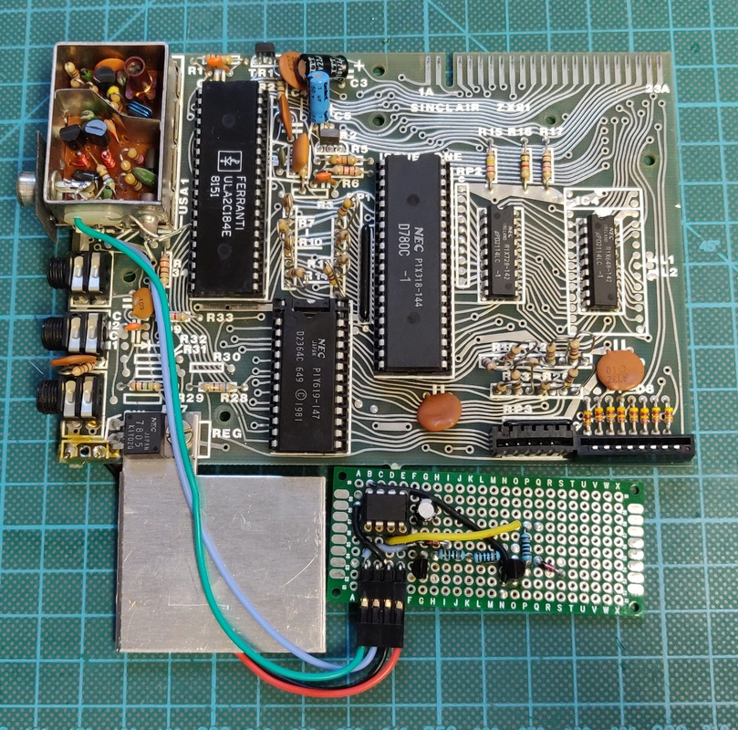

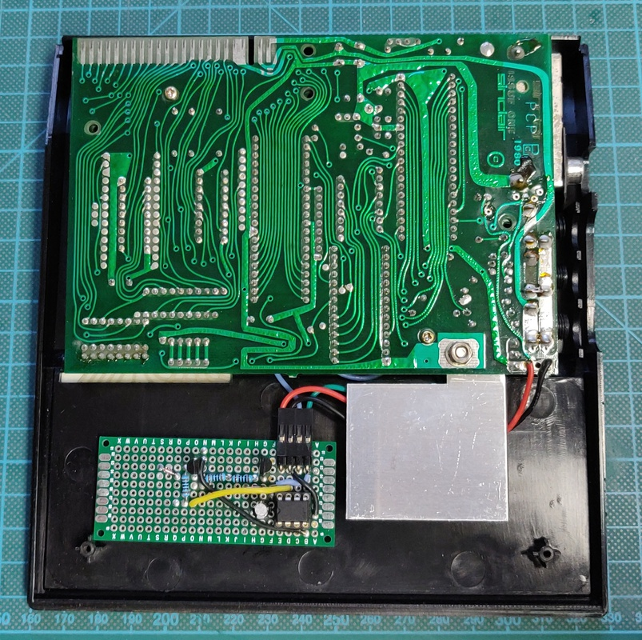

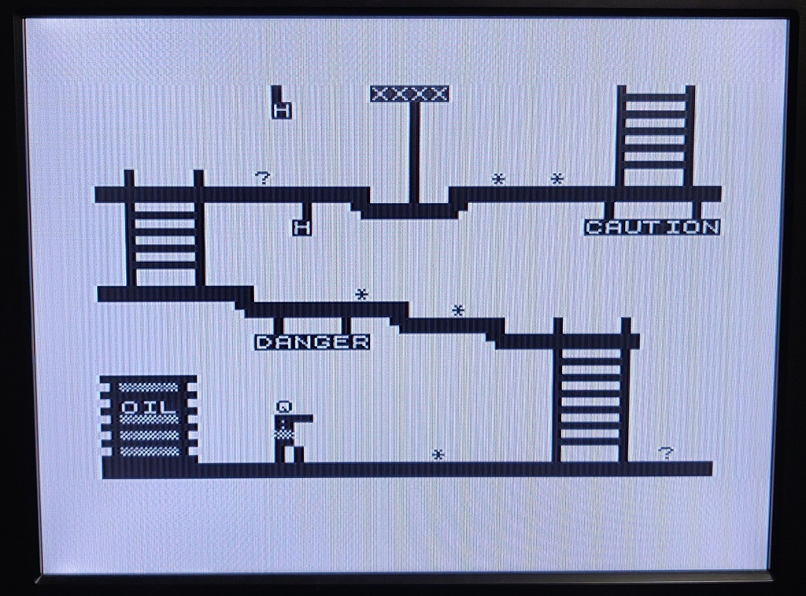