# Sinclair QL 
I purchased this Sinclair QL locally as unknown / untested, together with the power supply and 8 Microdrive cartridges. When I opened it up, I found an issue 7 board. Judging from the date codes on the ICs it was probably manufactured late 1984 or early 1985.

Overall, the computer is great condition, the only fault I was able to identify so far is the keyboard membrane, which is a common issue for all computers with these types of keyboards. 

#### Work done so far

+ Initial inspection
+ Keyboard membrane replacement
+ Power cable replacement

#### Planned work

+ Check Micro Drives
+ Possible expansions

# Initial inspection:

Here are some pictures of the machine after collecting it:

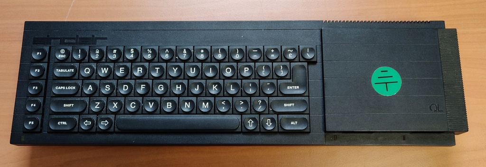

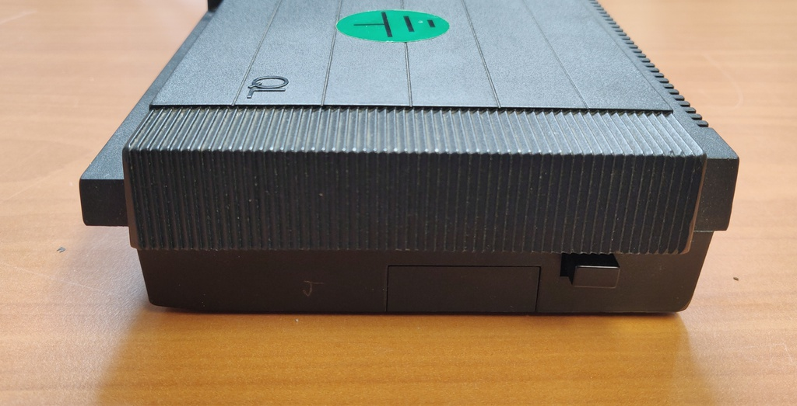

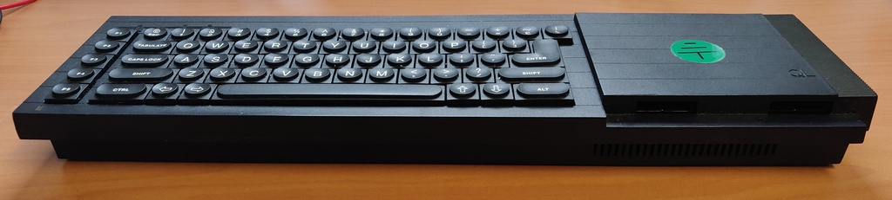

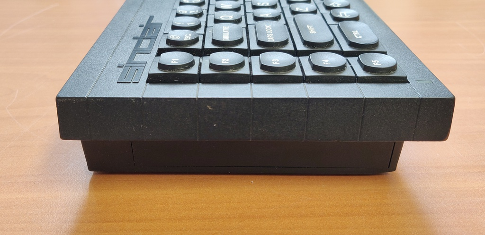

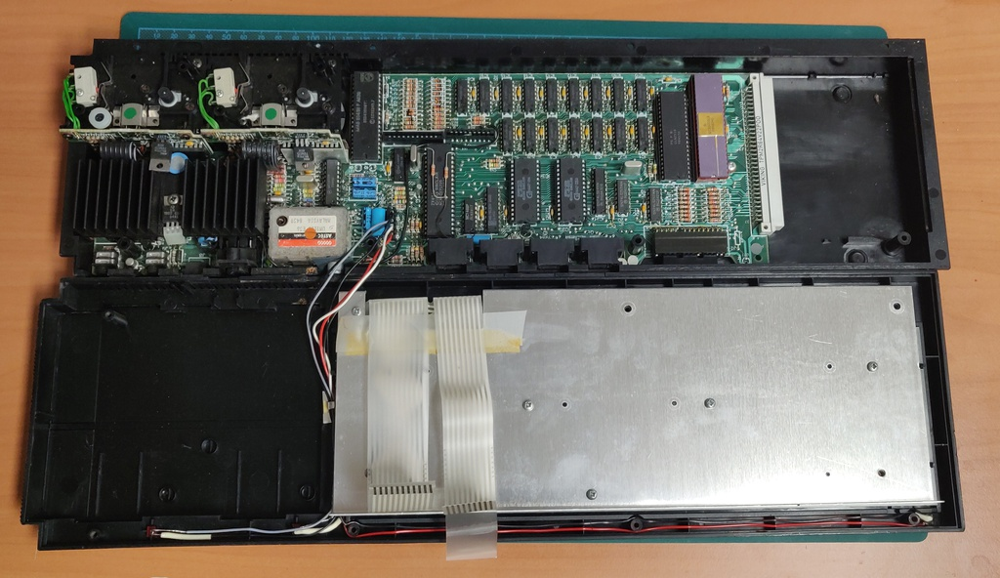

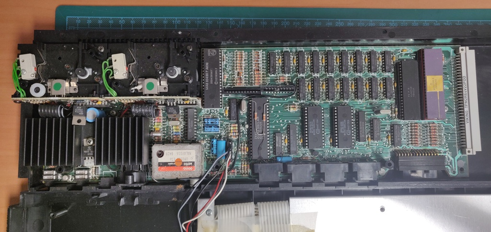

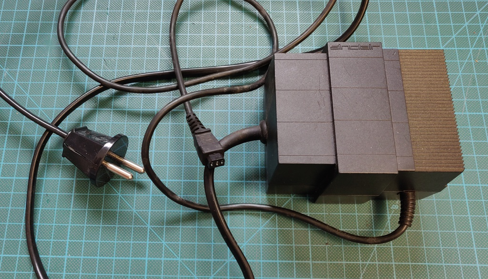

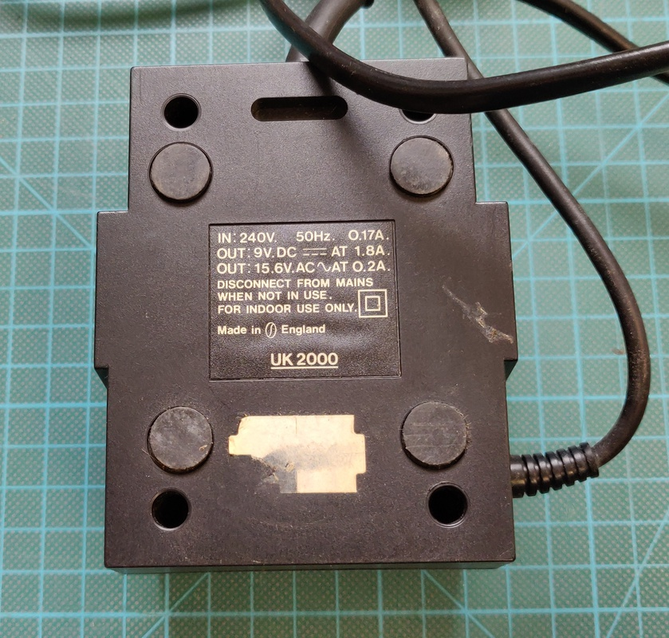

After verifying the voltages from the power supply were correct and having a quick look inside, I decided to power it up. Success on the first boot:

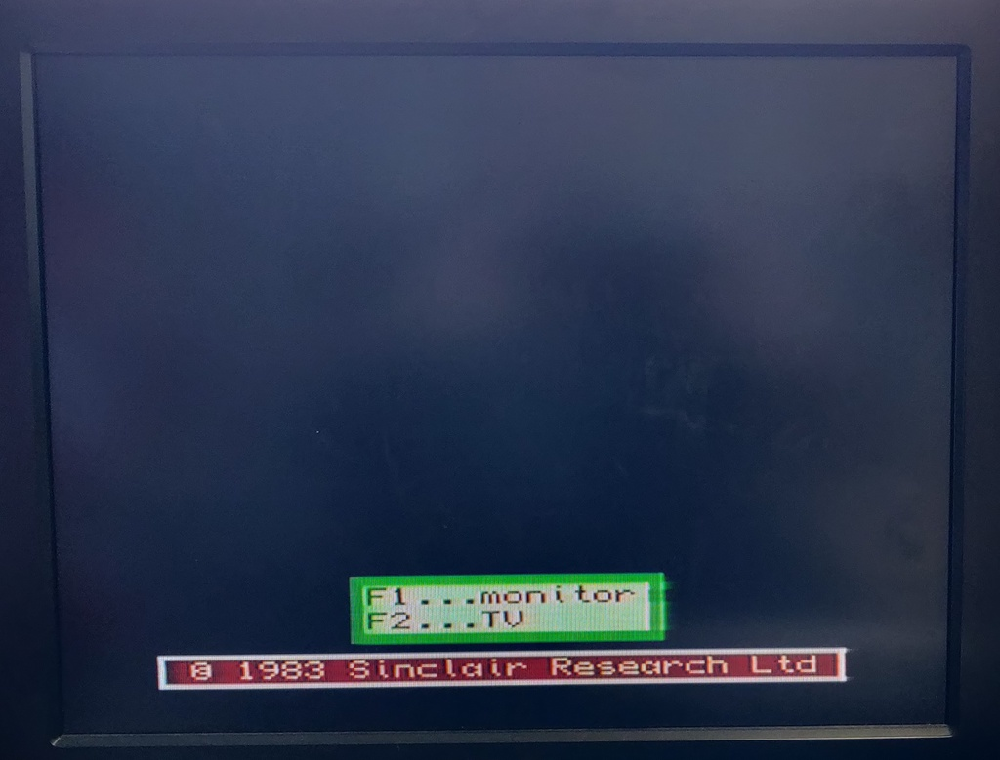

But straight away I noticed an issue, the keyboard was not responding. After checking the keyboard membrane, it was badly cracked around the connector. I attempted to cut off the worst section and reconnect the remaining part, but new cracks appeared straight away.

# Keyboard

While opening the case again to replace the keyboard membrane I found that in the mean time one of the connections had completely broken in half:

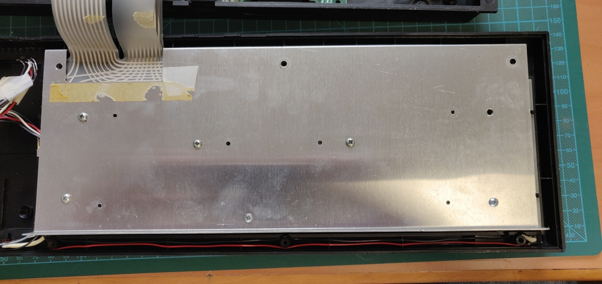

Here is the brand new keyboard membrane installed:

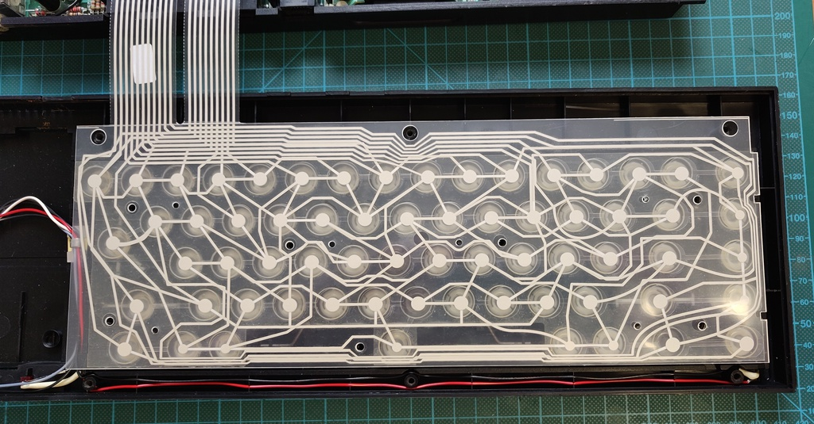

And lastly a picture of the old dried out and cracked membrane:

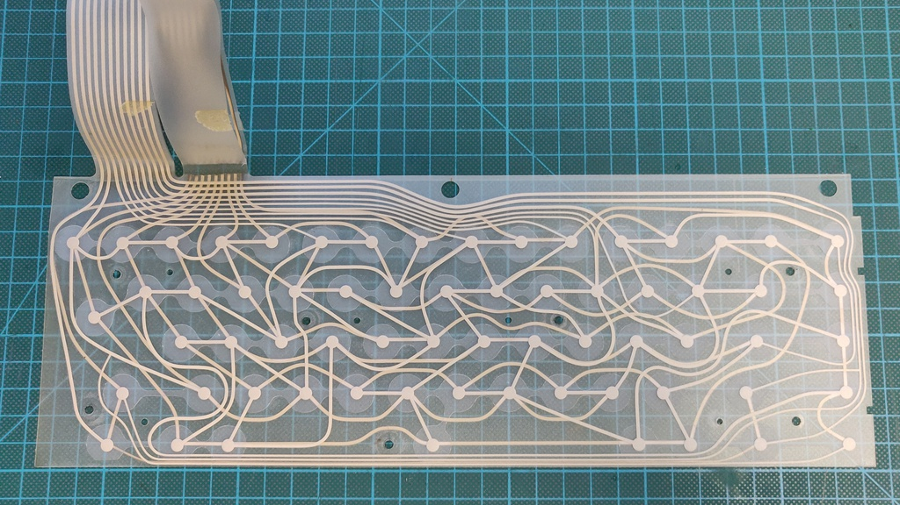

# Video cable

Up to this point I had been using the RF output, which doesn't produce great video quality. The next step was to create a SCART video cable using the RGB output.

One of the issues I ran into was that the sync signal wasn't strong enough to trigger the RGB selection on my TV, which appears to be a common issue. Because there is no 5V pin available on any of the outputs on the back of the QL, I aded an additional USB connector to the SCART cable which can be plugged into either a wall socket or the USB connections found on many modern TVs. 

Below is the schematic for the cable:

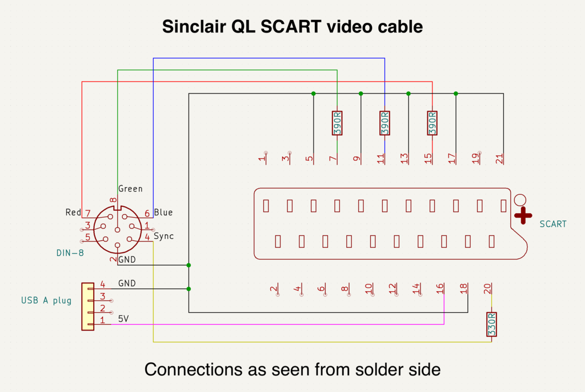