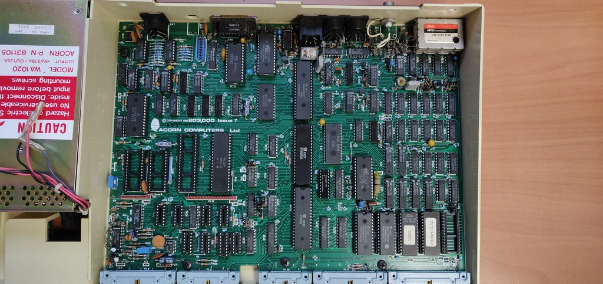
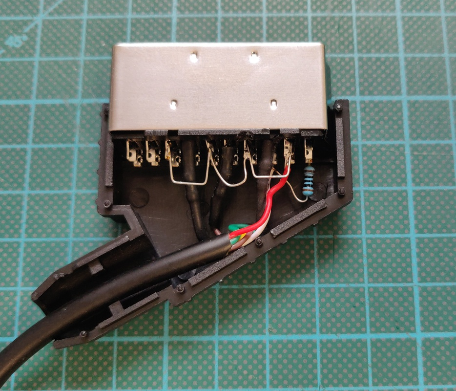

# Acorn BBC Micro model B
For a change I purchased this Acorn BBC Micro as a fully working machine. These are not very easy to find in the Netherlands and I really wanted a nice model to tinker with.

The BBC Micro will always be a special machine for me. I owned one in my early teens when they were already considered completely obsolete, but unlike our family computer, I could take it apart and try (unsuccessfully) to figure out how it worked. When I got my original machine it came with two floppy drives and several books on BASIC programming. It opened a new world for me, writing my own programs! 

Unfortunately it died after a few years of service and being already replaced by several other computers at that point and not having the necessary skills at the time, it sadly ended up like so many; at the recycling centre. 

Back to the computer on my bench today: It has an issue 7 board and came only with Econet components pre-installed, no disk controller. In addition to the regular OS 1.20, BASIC and DNFS ROMs it also came with a "Velonet 0.42" ROM, more on this to come.

## Planned work:

+ Installing one of the available SD card adapters, which will probably require installing the missing logic chips as well
+ Setting up an Econet
+ Adding a Raspberry Pi to emulate CPU expansions

# Initial inspection:

The computer has some slight yellowing, but is otherwise is great condition. Aside from some regular maintenance like replacing the capacitors and lubricating the keys it doesn't need any immediate work.

# Creating a video cable

The first step to get the computer up and running was creating a video cable. The Micro has a standard RF output, but as with most computers, the quality is quite poor. Luckily it also has an RGB output on a DIN 6 connector which does give a perfect image.

Here is the schematic for creating a SCART cable:

And here is the finished cable, but please note that the wire colours are mixed up in this example:

