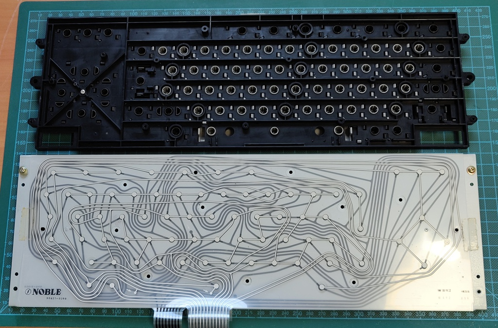
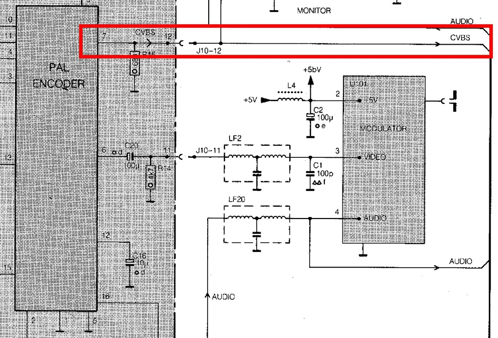
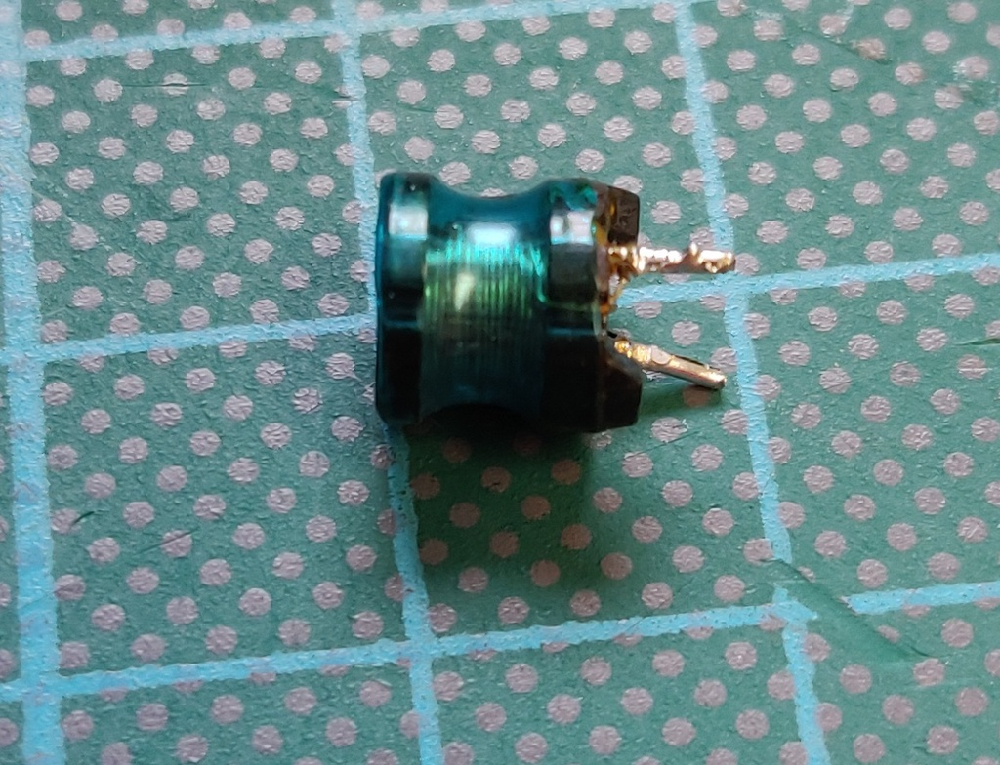

# Philips NMS 8220 MSX2
I purchased this Philips MSX2 computer locally as faulty, it was described as having continuously scrolling video. In addition, the ROM slot cover was missing. 

## Work done so far:
+ Repair video issue
+ Removed application ROM
+ Remove battery
+ Cleaning

## Planned work:
+ Replace cover with 3D printed model.
+ Possibly upgrade RAM

# Initial inspection:
When I received the computer I took the following pictures:

# Video repair
From the description I was already suspecting that there might be an issue with the (vertical) sync of the video output. When I checked the output of pin 19 of the SCART connector there was no output at all. This pin is supposed to carry either the full composite signal or in the case of RGB like this Philips computer outputs, the sync signal. 

Pins 7 (blue), 11 (green), 15 (red) were working correctly.

I found a [schematic](https://archive.org/details/philipsnms8220sm) and started tracing the signal around the board. Q5 was receiving 12v at the collector, but nothing at the base. Pin 12 of the encoder board connector was also not showing any activity. While probing the PAL encoder IC I found no activity at all, not even a 5V input.

At this point I knew that the likely cause was a lack of 5v supply to the encoder board. Again using the schematic I started probing around and found 5v going into inductor L1, but less than 1v coming out again, even with the encoder board completely disconnected.

This left 2 possible causes, either the inductor was bad or capacitor C15 was shorted to ground, but if that was the case I would have expected to see a lower voltage on the 5v rail. 

Just to be sure, I first removed C15 to isolate L1 completely, but the issue remained. I tested the capacitor and found it was still in great shape, but when I tested the inductor I found 4-5M ohm resistance. After removing the inductor, re-installing the capacitor and bridging the pads where the inductor used to be the issue was fully resolved and the computer booted normally.

# Application ROM

The NMS 8220 boots into a paint program called "MSX Designed". Although this can be skipped by holding ESC while booting I find this quite annoying, so I removed the application ROM from its socket. This has the effect of turning it into a standard MSX 2 computer which defaults to Microsoft Basic.

# Battery removal

The type of Ni-Cad battery installed in this machine is very prone to leakage after so many years, severely damaging the PCB in the process. I removed it proactively to avoid any issues in the future. 

# Cleaning

I cleaned the whole computer inside and out, starting with the keyboard. From the outside it didn't look too bad, but once I opened it up it was filled with dust and hair

Here is the fully cleaned result:

