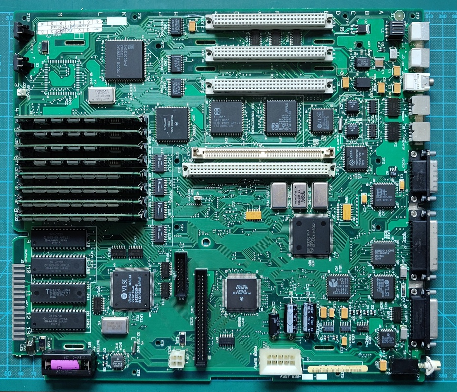

# Macintosh II/ci
This computer belongs to a customer who requested a full recap and floppy drive refurbishment.

#### Work done so far
+ Replace capacitors from main board and power supply
+ Clean main board and power supply

#### Planned work
+ Clean and lubricate floppy drive.

# Initial inspection
Here is the case opened up and the board removed:

There was already quite a mess from the leaking electrolytic capacitors:

# Main board
After removing the old capacitors I gave the board a thorough cleaning:

A few suspect traces were found, these will be cleaned, tinned and protected with new solder mask.

And here is the finished result, the old electrolytic capacitors have been replaced with tantalum versions, bad traces have been repaired, the whole board has been thoroughly cleaned and a new battery fitted:

Here is the machine powered:

# Power supply
Once the motherboard was done, it was time to move on to the power supply. 

Overall it was cleaner than I had expected, but the fan was pretty crusty:

After cleaning, I found it spun freely, so no need to replace it:

Here are all the capacitors removed:

Unfortunately I forgot to take a picture of the power supply with the new capacitors installed, I will add this later.

# Floppy drive
The floppy drive was particularly bad, there was a huge amount of caked on dirt inside:

Here is the drive fully disassembled:

And the same parts cleaned:

What is left is just re-assembling and fully lubricating the mechanism.