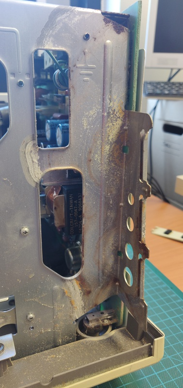

# Macintosh 128K
This computer belongs to a customer who dropped it off in parts. The case and analogue board belonged to an original 128K, but it was upgraded to a Plus at some point. The owner wants to convert it back using a replacement 128K board and 400K floppy drive.

#### Work done so far
+ Inspect boards
+ Start cleaning battery corrosion damage
+ Start cleaning and lubricating floppy drive

#### Planned work
+ Fully repair corrosion on the analogue board
+ Check capacitors and replace bad ones
+ Repair floppy drive

# Initial inspection
Here are some pictures of the computer while opening it up:

Here is the logic board, it seems to be in good condition. It's unknown what kind of work was done, but it looks like all the memory modules were socketed at some point.

# Cleaning and repairing the corrosion

Here are a few pictures after some initial clean up using vinegar to naturalize the base of the battery electrolyte:

The flyback was initially whining quite badly before adjusting the cut-off potentiometer. I checked the flyback itself and although it does appear quite discoloured, it's now working correctly:

Here it is on the first boot attempt, it wasn't able to boot off of the floppy. I will test with another floppy soon.

# Floppy drive:

The floppy drive was completely seized. After thoroughly cleaning it with alcohol I was able to get it to move smoothly again.

