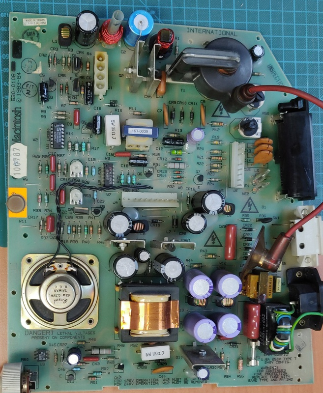

# Macintosh 512K
This computer belongs to a customer, the request was to check the overall machine and specifically low brightness / contrast and service the floppy drive.

#### Work done so far
+ Inspect boards
+ Test machine
+ Test capacitors

#### Planned work
+ Replace bad capacitors
+ Service floppy drive

# Inspection

# Capacitors:

Aside from 2 Rifa capacitors the blue axial capacitor tested bad, it looks out of place and was probably replaced at some point. All other capacitors tested good.

# Floppy drive

The floppy drive was a bit dirty and all the lubricant had dried up:

The ejection mechanism was still in good shape:

Fully disassembled:

All cleaned up and ready to go back together:

