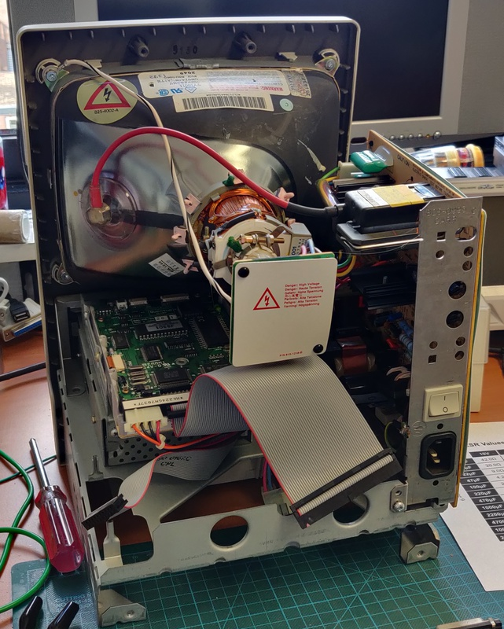
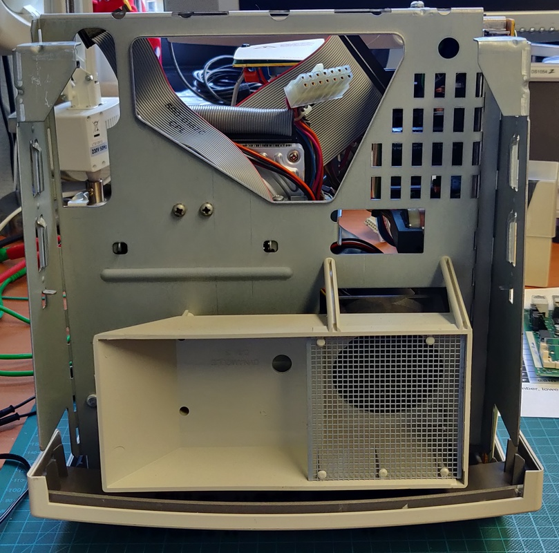

# Macintosh Classic II

I purchased this computer locally as faulty, when powered on it only showed white vertical lines. When I opened it up it turned out to be easily the cleanest example of a classic Mac I ever came across. 

##### Work done:

* Full inspection and testing
* Logic board capacitor replacement
* Analog board capacitors tested
* Keyboard and mouse fully cleaned
* Battery replacement

# Final pictures

Here are some pictures of the computer fully completed:

# Exterior inspection:

The case was in good condition, not just relatively clean, but also very little yellowing:

# Interior inspection:

Once I opened it, I was in for a big surprise, it was super clean inside. Initially I assumed that someone cleaned it before me, but on further inspection I noticed strings of the original glue used on the neck board across the case. It's possible that the logic board was removed at some point to upgrade the memory, but other than that this machine was like new!

Even the fan on the bottom was reasonably clean:

And here is a picture of the logic board:

# Capacitor replacement:

The first step in trying to repair this computer was to replace all the electrolytic capacitors on the logic board. Here is a picture of all of them removed:

And here are the new capacitors installed:

And it works again!

